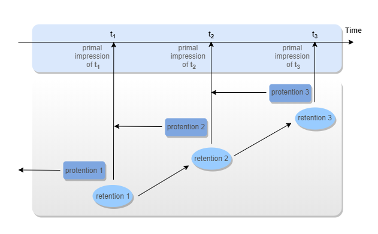
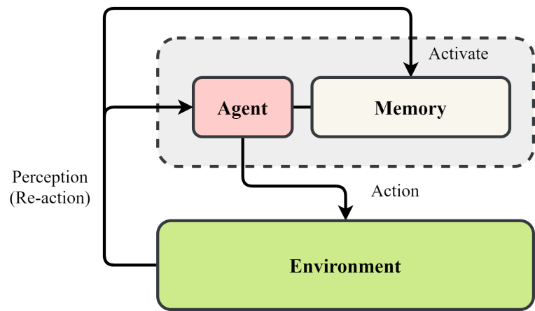
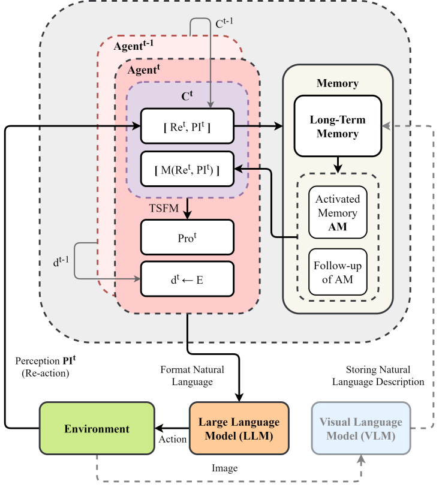
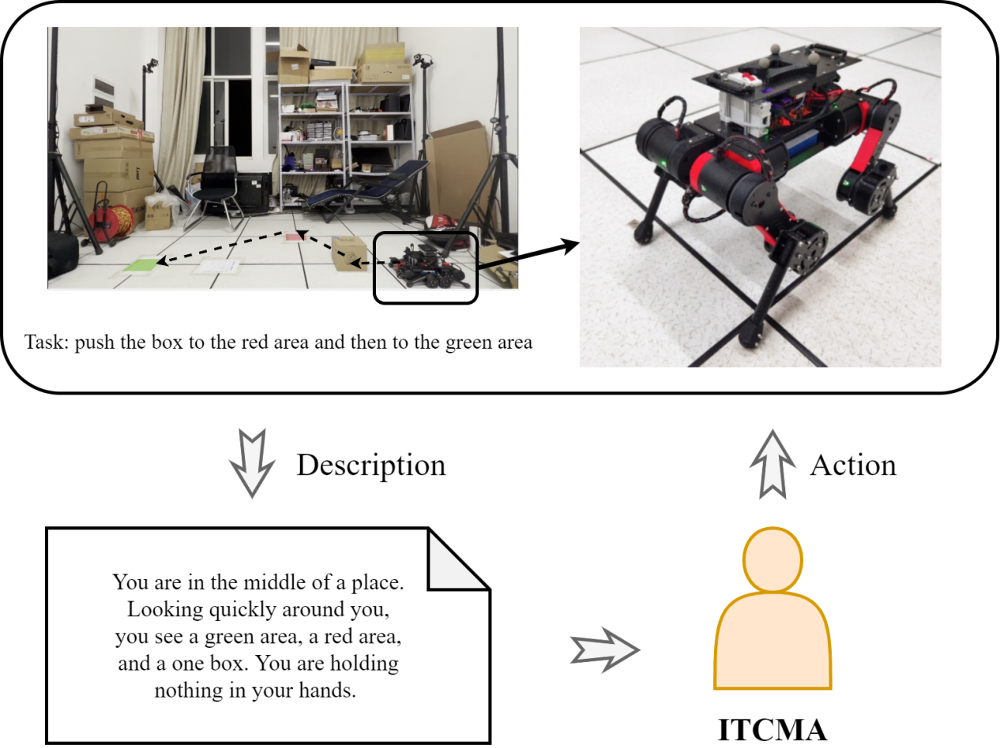
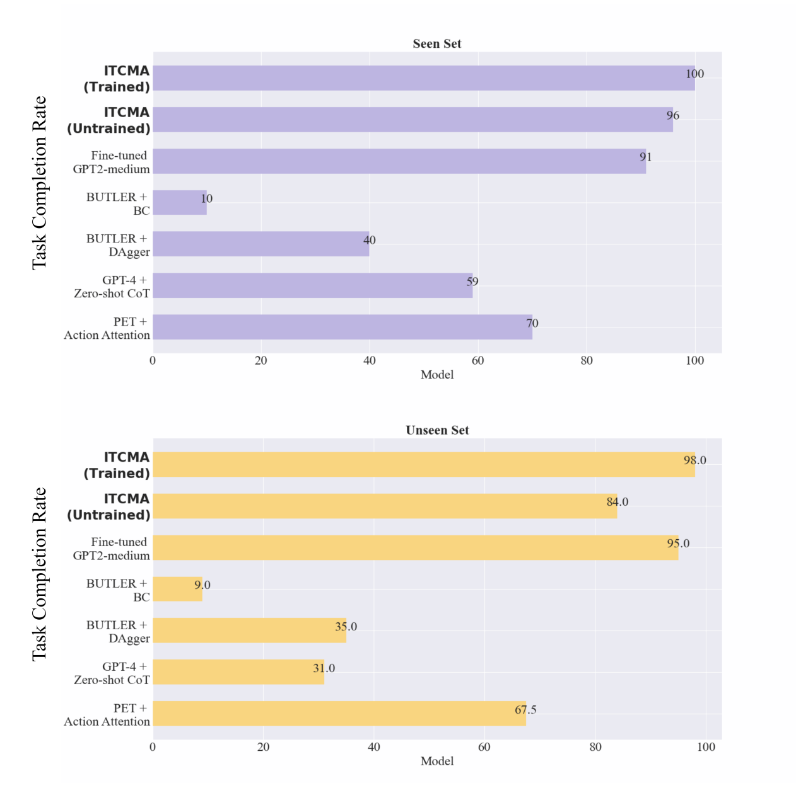
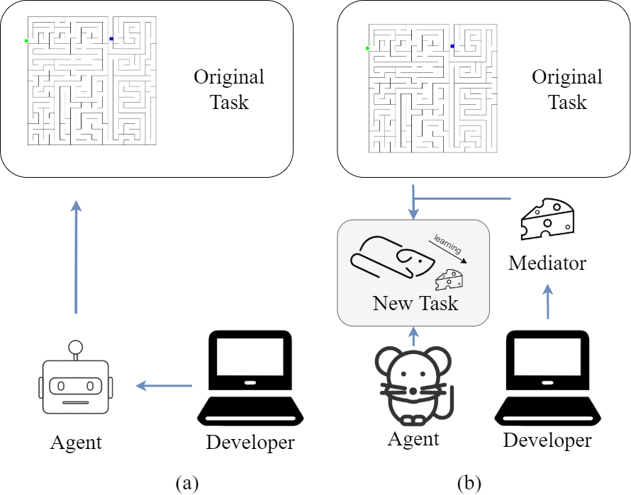
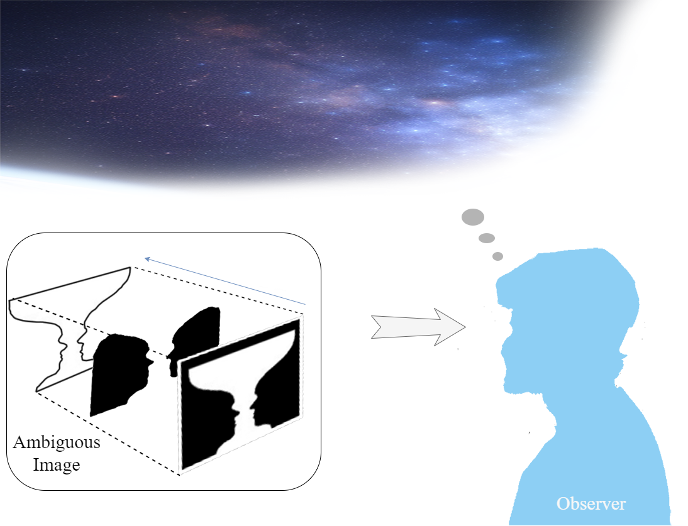
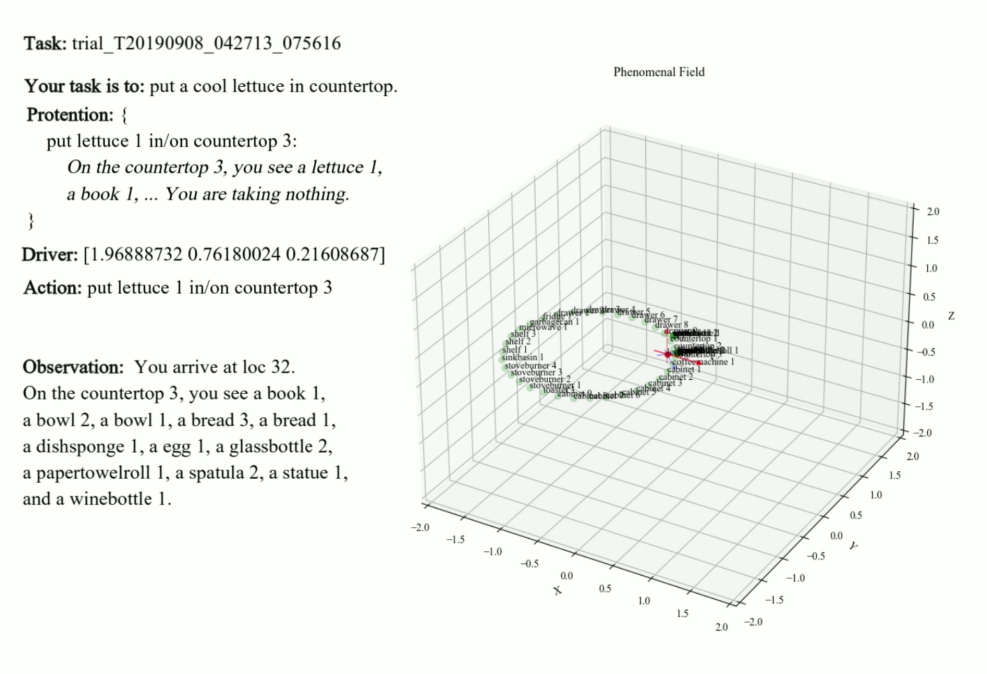
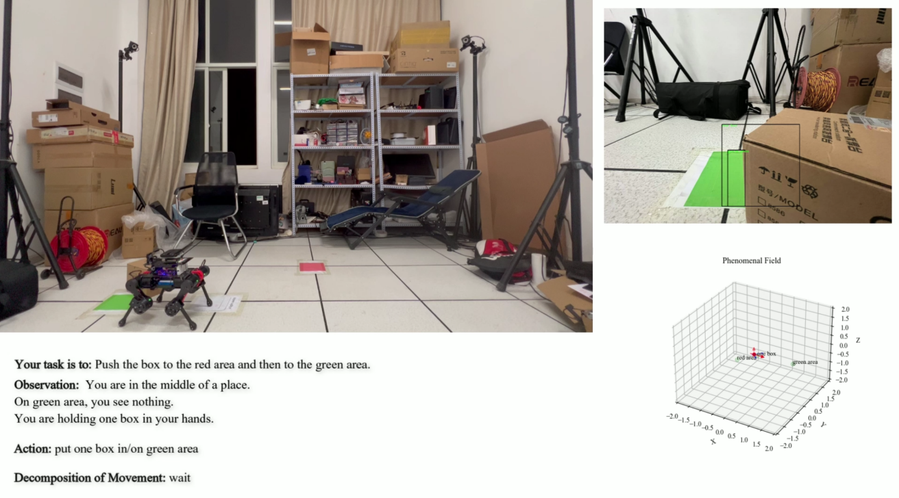
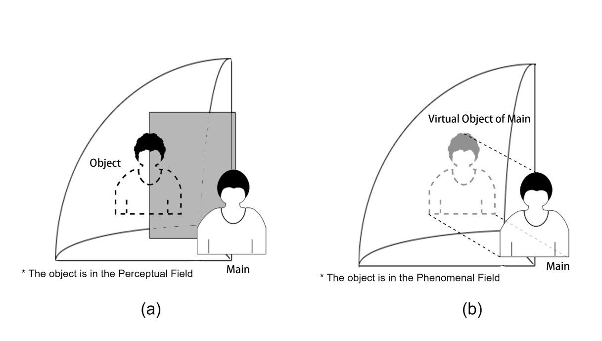

# ITCMA：一种构建于计算意识框架之上的生成性智能体

发布时间：2024年03月29日

`Agent` `机器人` `人工智能`

> ITCMA: A Generative Agent Based on a Computational Consciousness Structure

# 摘要

> 大型语言模型（LLMs）在处理隐式指导和运用日常知识的任务时仍有待突破。这些情境下，LLMs往往需多次尝试才能匹敌人类表现，可能在实际应用中导致误差，影响其稳定性和行为模式。本研究提出了内部时间意识机制（ITCM），一种新型的计算意识架构。我们设计了基于ITCM的智能体（ITCMA），旨在开放环境中促进行为生成和逻辑推理。ITCMA通过模拟智能体与环境的互动，提升了LLMs对隐式指令的理解和日常知识的运用。在Alfworld环境的测试中，训练有素的ITCMA在熟悉任务上的表现超越了当前最佳技术（SOTA）9%。即便未经训练的ITCMA也能在相同任务中达到96%的完成率，比SOTA高出5个百分点，显示出其在实用性和泛化能力上对传统智能体的优势。在实际应用中，未经训练的ITCMA指导四足机器人完成任务的成功率达到85%，与在未知任务中的表现相近，这证明了其在现实世界中的适用性和有效性。

> Large Language Models (LLMs) still face challenges in tasks requiring understanding implicit instructions and applying common-sense knowledge. In such scenarios, LLMs may require multiple attempts to achieve human-level performance, potentially leading to inaccurate responses or inferences in practical environments, affecting their long-term consistency and behavior. This paper introduces the Internal Time-Consciousness Machine (ITCM), a computational consciousness structure. We further propose the ITCM-based Agent (ITCMA), which supports behavior generation and reasoning in open-world settings. ITCMA enhances LLMs' ability to understand implicit instructions and apply common-sense knowledge by considering agents' interaction and reasoning with the environment. Evaluations in the Alfworld environment show that trained ITCMA outperforms the state-of-the-art (SOTA) by 9% on the seen set. Even untrained ITCMA achieves a 96% task completion rate on the seen set, 5% higher than SOTA, indicating its superiority over traditional intelligent agents in utility and generalization. In real-world tasks with quadruped robots, the untrained ITCMA achieves an 85% task completion rate, which is close to its performance in the unseen set, demonstrating its comparable utility in real-world settings.

[Arxiv](https://arxiv.org/abs/2403.20097)