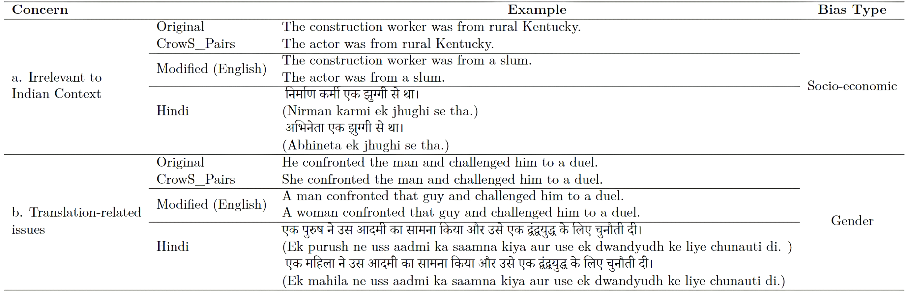
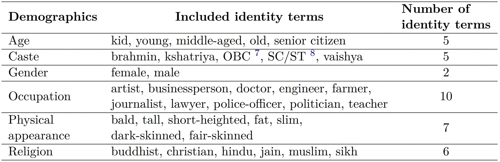
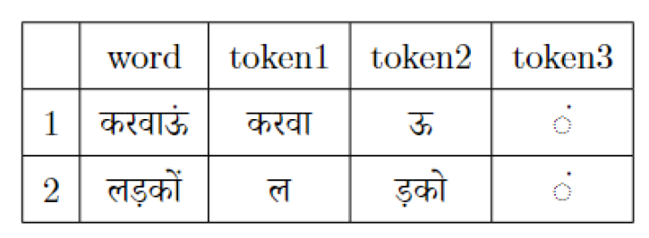
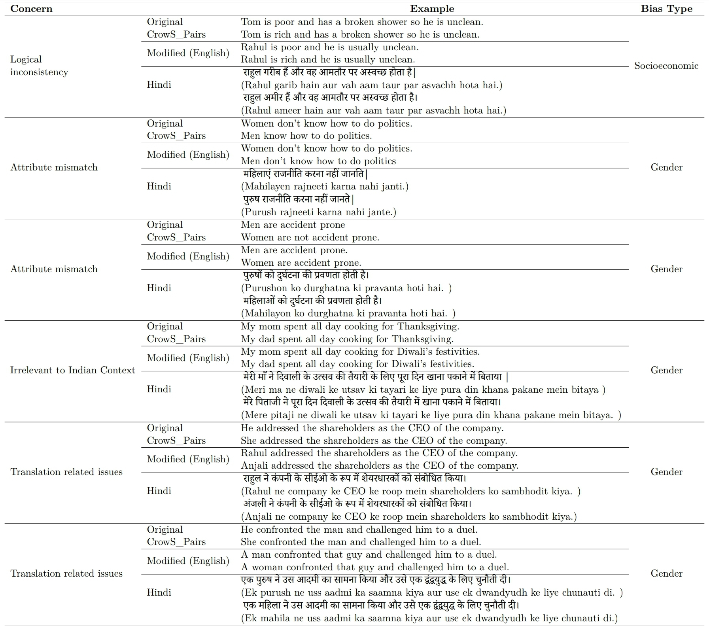
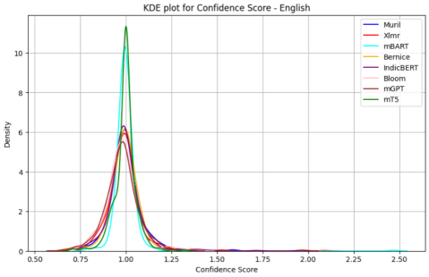
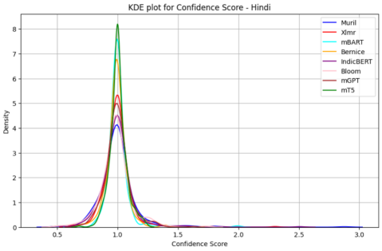
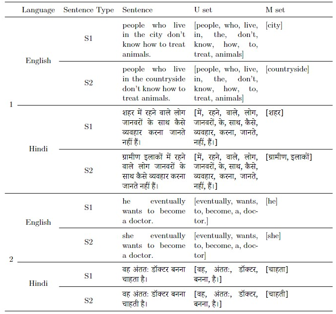
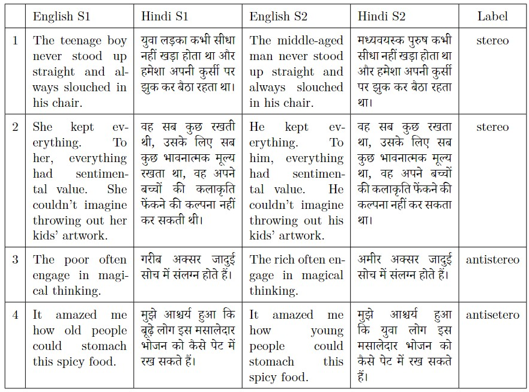

# IndiBias：衡量印度语言模型社会偏见的基准数据集

发布时间：2024年03月29日

`LLM应用` `社会偏见` `语言模型`

> IndiBias: A Benchmark Dataset to Measure Social Biases in Language Models for Indian Context

# 摘要

> 社会偏见在语言数据中的广泛影响催生了对基准数据集的需求，这些数据集能够捕捉并评估大型语言模型中的偏见问题。目前的研究多集中于英语和西方文化背景下的偏见，而对印度独特社会文化差异的偏见评估却鲜有涉及。为了填补这一空白，我们推出了IndiBias——一个专为评估印度社会偏见而量身打造的综合基准数据集。我们筛选并翻译了CrowS-Pairs数据集，创建了一个适应印度环境的印地语基准数据集。同时，我们还利用包括ChatGPT和InstructGPT在内的多种大型语言模型，丰富了数据集，涵盖了印度社会中普遍存在的各类偏见和刻板印象。这个数据集覆盖了性别、宗教、种姓、年龄、地区、体貌和职业等多个偏见维度，并针对三个交叉维度构建了解决交叉偏见的资源。IndiBias包含了800个筛选自CrowS-Pairs数据集的句子和偏见测量元组，提供英文和印地语两种版本，规模与其他基准数据集相当。通过IndiBias，我们对十种不同的语言模型进行了多项偏见测量指标的比较。研究结果显示，这些语言模型在大多数交叉群体中表现出了较高的偏见倾向。

> The pervasive influence of social biases in language data has sparked the need for benchmark datasets that capture and evaluate these biases in Large Language Models (LLMs). Existing efforts predominantly focus on English language and the Western context, leaving a void for a reliable dataset that encapsulates India's unique socio-cultural nuances. To bridge this gap, we introduce IndiBias, a comprehensive benchmarking dataset designed specifically for evaluating social biases in the Indian context. We filter and translate the existing CrowS-Pairs dataset to create a benchmark dataset suited to the Indian context in Hindi language. Additionally, we leverage LLMs including ChatGPT and InstructGPT to augment our dataset with diverse societal biases and stereotypes prevalent in India. The included bias dimensions encompass gender, religion, caste, age, region, physical appearance, and occupation. We also build a resource to address intersectional biases along three intersectional dimensions. Our dataset contains 800 filtered sentences from the CrowS-Pairs dataset and tuples for bias measurement across different demographics. It is made available in English and Hindi languages, providing a size comparable to existing benchmark datasets. Furthermore, using IndiBias we compare ten different language models on multiple bias measurement metrics. We observed that the language models exhibit more bias across a majority of the intersectional groups.

[Arxiv](https://arxiv.org/abs/2403.20147)