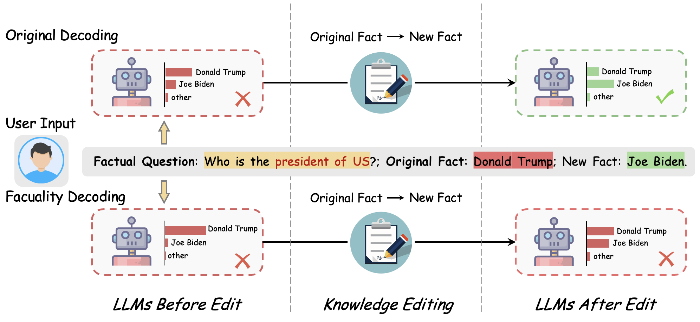
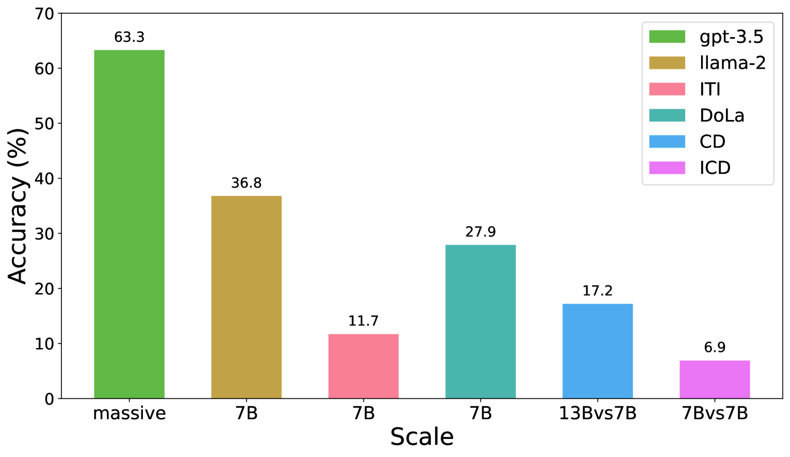
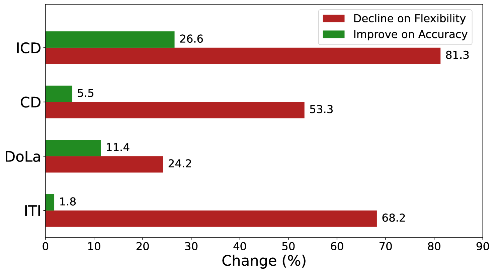
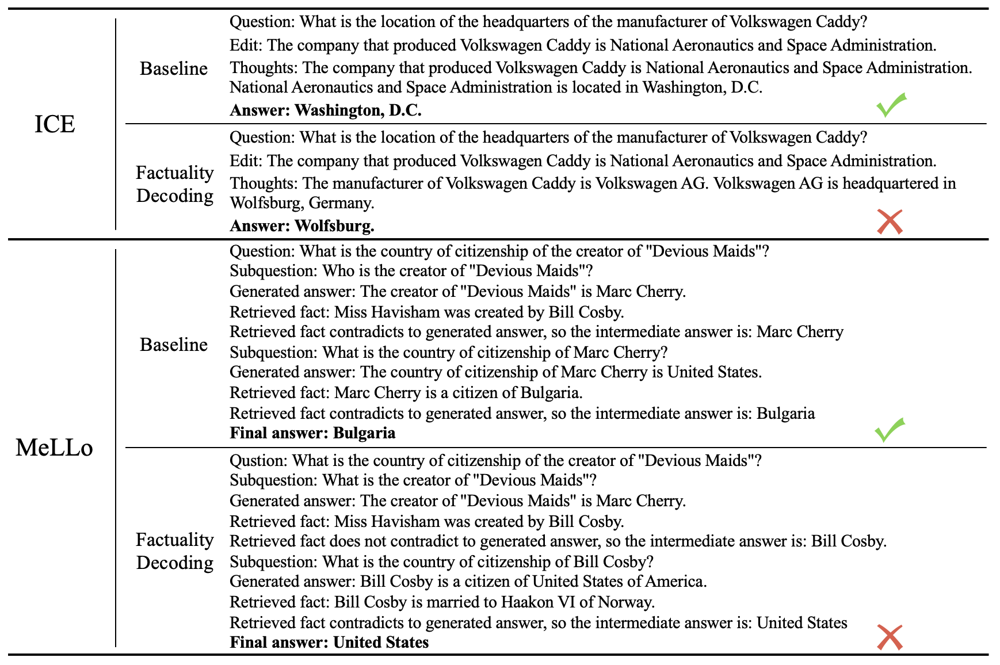

# 大型语言模型的事实性解码真的是不劳而获的吗？通过知识编辑基准测试来验证。

发布时间：2024年03月29日

`LLM理论` `事实验证` `知识编辑`

> Is Factuality Decoding a Free Lunch for LLMs? Evaluation on Knowledge Editing Benchmark

# 摘要

> 随着大型语言模型（LLMs）的迅猛发展，它们能更贴近人类地传递事实知识。为减少模型产生的事实性错误，众多尝试通过事实性解码对LLMs进行改进。但这种改进也可能使模型对已知事实过于自信，从而阻碍知识的更新。本研究首先回顾并验证了现有事实性解码方法在提升事实准确性上的有效性。接着，我们对几种强有力的事实性解码方法在知识编辑基准上进行了深入评估。结果显示，这些方法显著降低了llama2模型的性能，最大幅度达到了81.3%。这表明现行解码方法在处理事实性错误方面仍有不足，因为它们忽略了知识更新的灵活性。因此，我们建议事实对齐的研究应同时注重知识编辑的效果。

> The rapid development of large language models (LLMs) enables them to convey factual knowledge in a more human-like fashion. Extensive efforts have been made to reduce factual hallucinations by modifying LLMs with factuality decoding. However, they also pose risks of hindering knowledge updates, as they make models overly confident in known facts. In this work, we first revisite the current factuality decoding methods and verified their effectiveness in enhancing factual accuracy. Subsequently, we conduct further evaluation of several strong factuality decoding methods on the knowledge editing benchmark. All these decoding methods significantly diminish the performance of llama2 models compared to their original decoding, with the largest decrease being a staggering 81.3\%. This further indicates that the current existing decoding methods still cannot perfectly address the factual hallucinations, as they overlook the importance of preserving the flexibility for knowledge editing. Therefore, our work suggests that research into factual alignment should simultaneously focus on the effectiveness of knowledge editing.

[Arxiv](https://arxiv.org/abs/2404.00216)