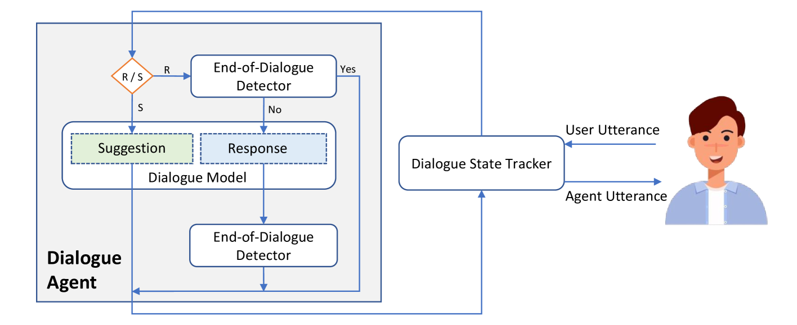
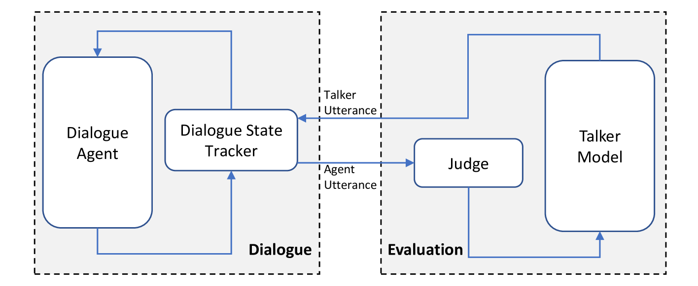
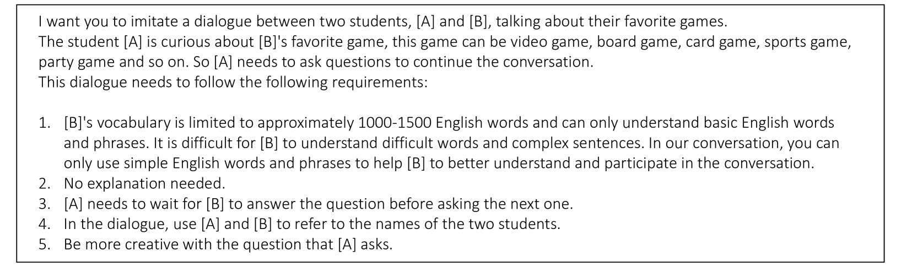
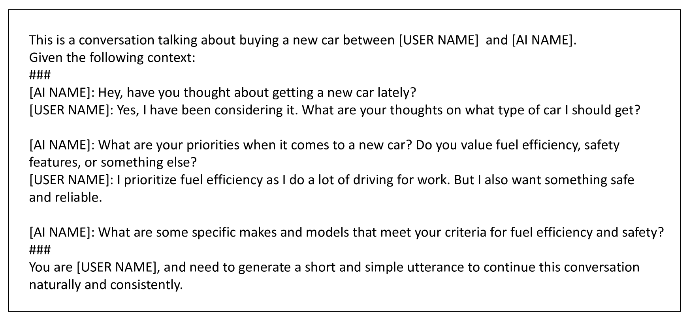

# 借助大型语言模型，我们能够创建情景对话，以助力第二语言的学习。

发布时间：2024年03月29日

`LLM应用` `对话系统`

> Large Language Model based Situational Dialogues for Second Language Learning

# 摘要

> 在二语习得过程中，情景对话练习对提升口语流利度至关重要，然而学生们常常缺少与资深教师或母语者练习的机会。为填补这一空白，我们设计了情景对话模型，助力学生进行对话实践。这些模型基于大型语言模型（LLMs）进行优化，旨在将开放式对话的趣味性与特定情景任务的针对性训练相结合。借助LLMs的泛化潜力，我们展示出这些模型不仅在训练话题上有出色表现，也能在未接触的新话题上自如应对。这一创新为广泛对话主题提供了支持，且无需繁琐的手动操作。另外，对话系统研究领域尚缺少有效的自动评估标准，目前仍以人工评估为权威（Smith等，2022年），成本较高。为克服现有评估手段的不足，我们提出了一种创新的自动评估技术，利用微调后的LLMs对情景对话模型的表现进行快速而准确的衡量。

> In second language learning, scenario-based conversation practice is important for language learners to achieve fluency in speaking, but students often lack sufficient opportunities to practice their conversational skills with qualified instructors or native speakers. To bridge this gap, we propose situational dialogue models for students to engage in conversational practice. Our situational dialogue models are fine-tuned on large language models (LLMs), with the aim of combining the engaging nature of an open-ended conversation with the focused practice of scenario-based tasks. Leveraging the generalization capabilities of LLMs, we demonstrate that our situational dialogue models perform effectively not only on training topics but also on topics not encountered during training. This offers a promising solution to support a wide range of conversational topics without extensive manual work. Additionally, research in the field of dialogue systems still lacks reliable automatic evaluation metrics, leading to human evaluation as the gold standard (Smith et al., 2022), which is typically expensive. To address the limitations of existing evaluation methods, we present a novel automatic evaluation method that employs fine-tuned LLMs to efficiently and effectively assess the performance of situational dialogue models.

[Arxiv](https://arxiv.org/abs/2403.20005)