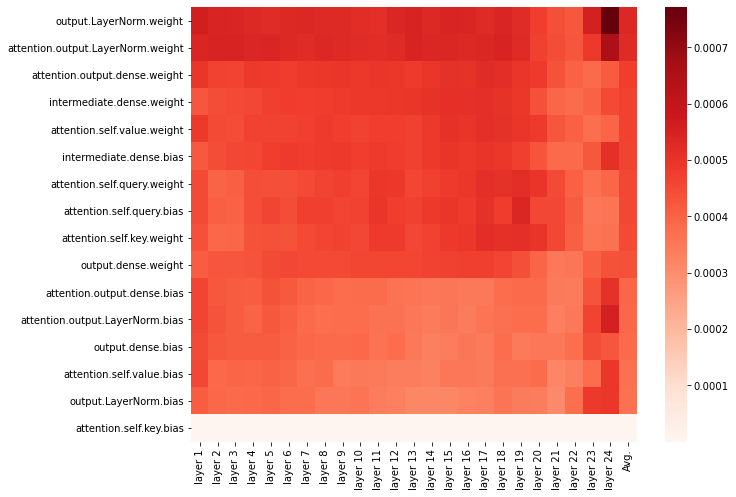
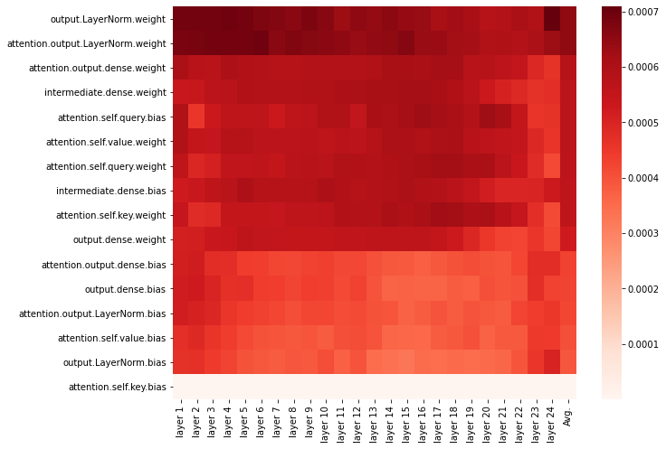
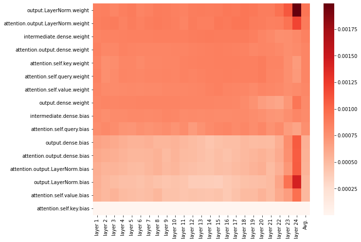
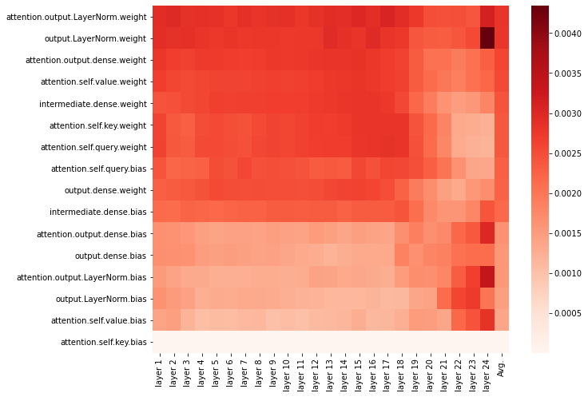
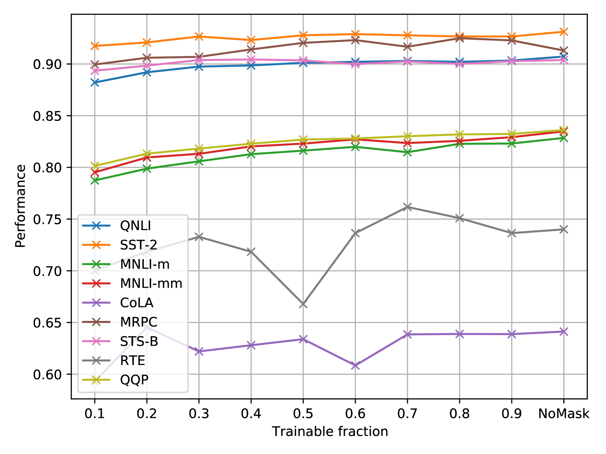
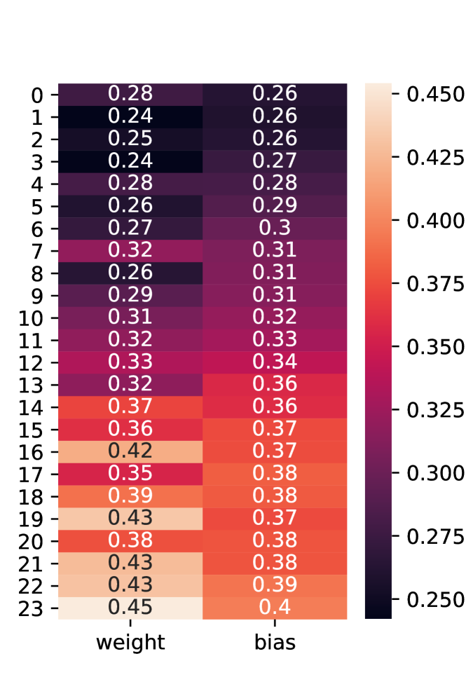
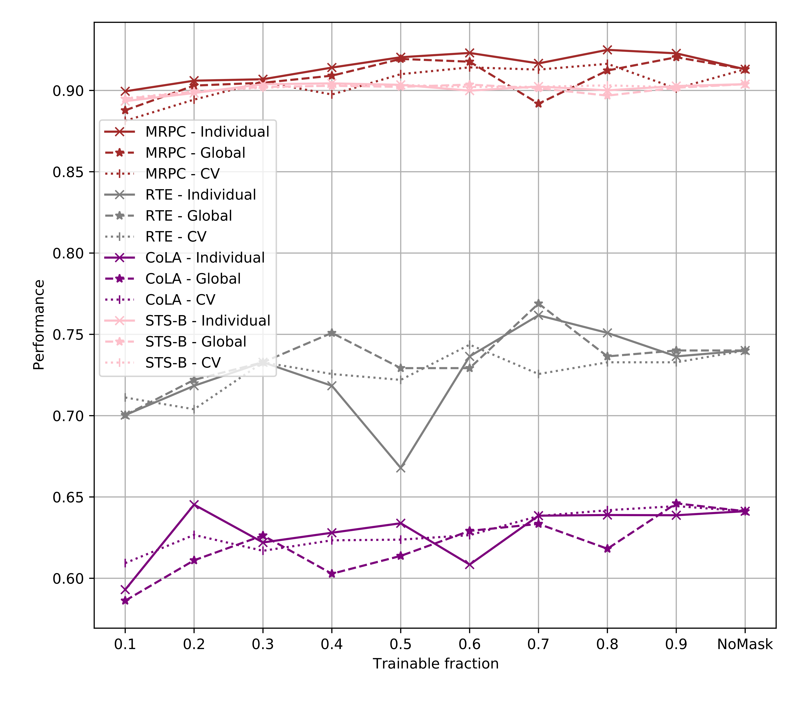
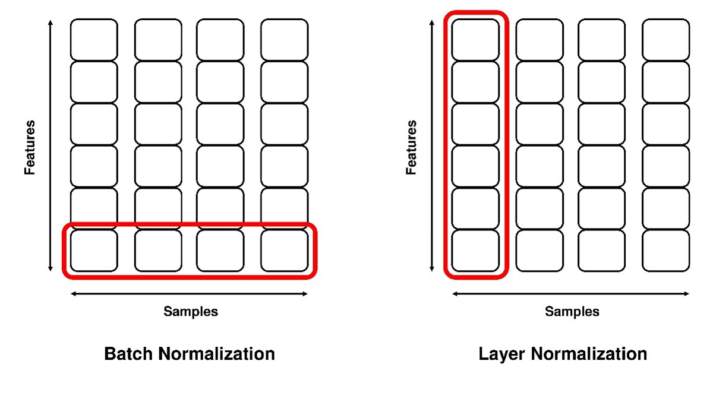

# LayerNorm 是在进行参数高效微调时的一个核心要素。

发布时间：2024年03月29日

`LLM理论` `NLP` `模型优化`

> LayerNorm: A key component in parameter-efficient fine-tuning

# 摘要

> 微调预训练模型，如BERT，对解决众多NLP任务极为有效。但鉴于BERT等先进模型参数众多，微调过程计算成本高昂。一种节省参数的微调方法，即只对模型的一小部分进行修改，其余保持原状，成为解决之道。然而，BERT中哪一环节对微调至关重要尚不明确。本文首先剖析BERT的各个组件，锁定微调后变化最显著的部分。研究发现，针对GLUE任务微调时，输出LayerNorm的变化最为显著。我们进一步证实，仅对LayerNorm进行微调，就能达到甚至超越全面微调及其他省参数方法的性能。此外，借助费舍尔信息，我们找出了LayerNorm中最关键的子集，并展示仅对这一小部分LayerNorm进行微调，就能在GLUE测试中解决多数NLP任务，且几乎不影响性能。

> Fine-tuning a pre-trained model, such as Bidirectional Encoder Representations from Transformers (BERT), has been proven to be an effective method for solving many natural language processing (NLP) tasks. However, due to the large number of parameters in many state-of-the-art NLP models, including BERT, the process of fine-tuning is computationally expensive. One attractive solution to this issue is parameter-efficient fine-tuning, which involves modifying only a minimal segment of the model while keeping the remainder unchanged. Yet, it remains unclear which segment of the BERT model is crucial for fine-tuning. In this paper, we first analyze different components in the BERT model to pinpoint which one undergoes the most significant changes after fine-tuning. We find that output LayerNorm changes more than any other components when fine-tuned for different General Language Understanding Evaluation (GLUE) tasks. Then we show that only fine-tuning the LayerNorm can reach comparable, or in some cases better, performance to full fine-tuning and other parameter-efficient fine-tuning methods. Moreover, we use Fisher information to determine the most critical subset of LayerNorm and demonstrate that many NLP tasks in the GLUE benchmark can be solved by fine-tuning only a small portion of LayerNorm with negligible performance degradation.

[Arxiv](https://arxiv.org/abs/2403.20284)