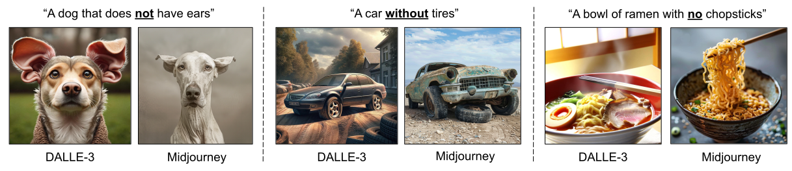
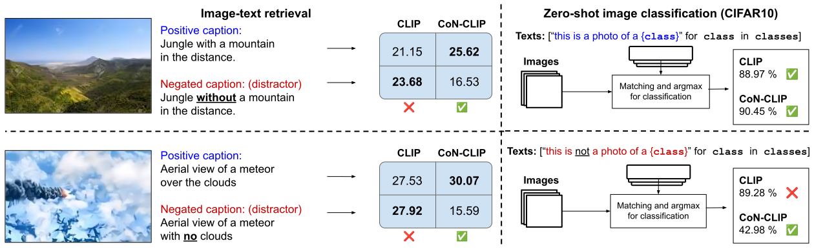
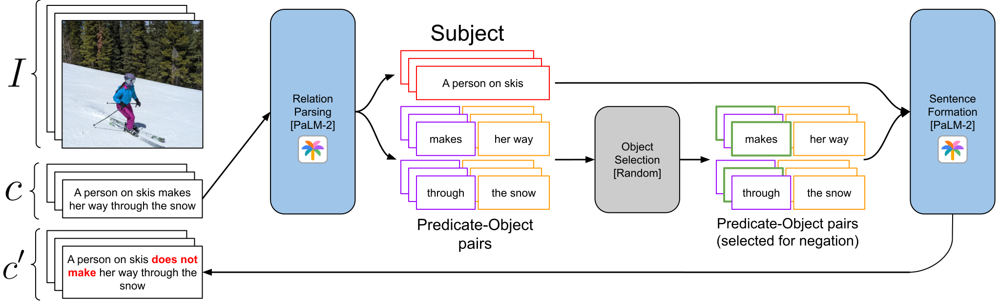
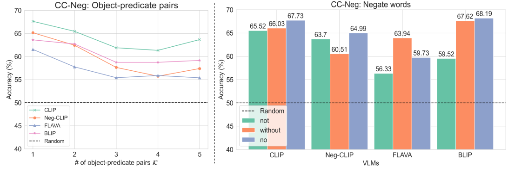
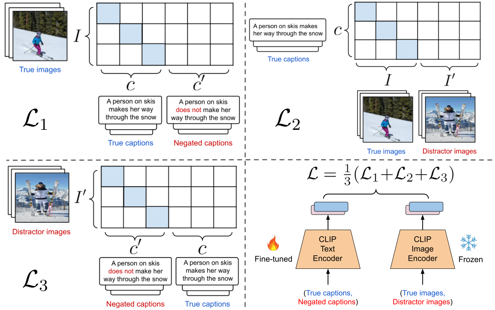
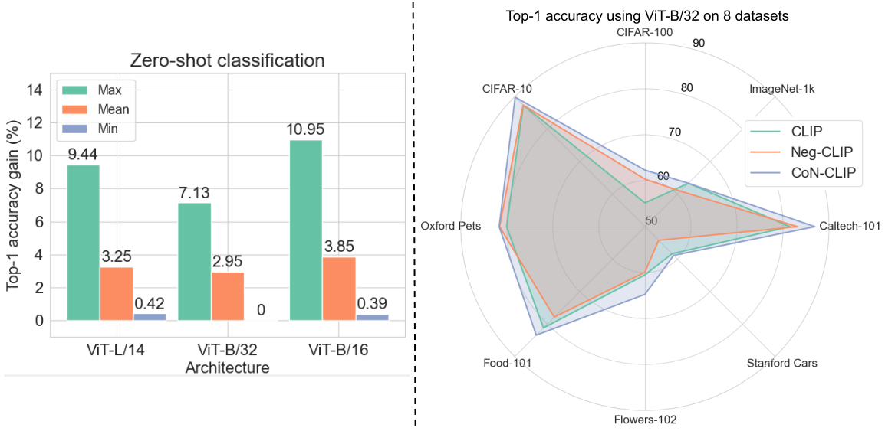
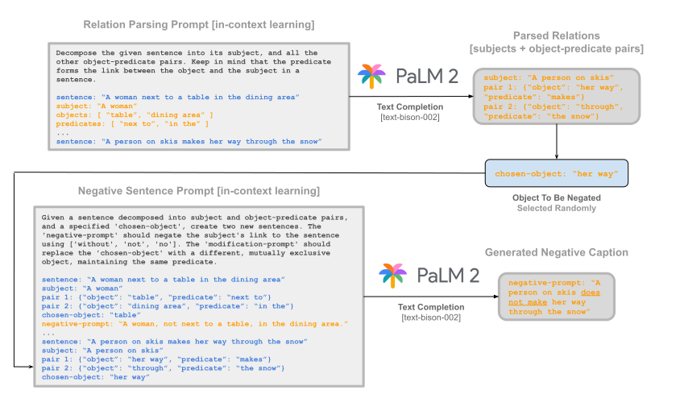
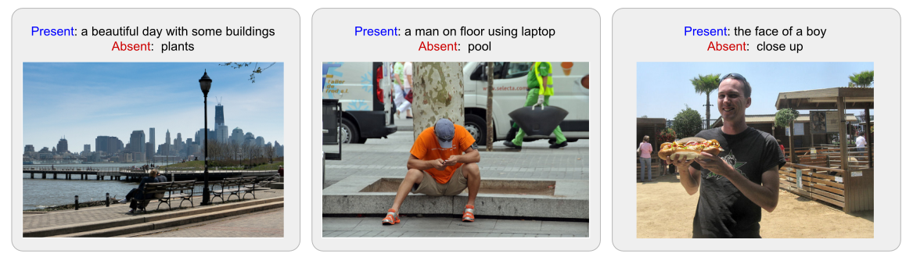

# 掌握拒绝，优化应允：利用否定策略提升视觉-语言模型性能

发布时间：2024年03月29日

`LLM应用` `计算机视觉`

> Learn "No" to Say "Yes" Better: Improving Vision-Language Models via Negations

# 摘要

> 目前的视觉-语言模型（VLMs）将文本描述统一视作一个整体，这混淆了提示中的单独概念，影响了视觉语义的匹配和逻辑推理。在逻辑和语言推理中，否定是一个关键要素。本研究揭示了如CLIP等主流VLMs在理解否定含义——即提示中“非”字的影响——方面的不足。我们推出了CC-Neg数据集，内含超过22万张图像及其真实和否定描述，旨在评估VLMs对含有否定的流畅提示的处理能力。结合对CLIP对比损失的改进，我们提出的CoN-CLIP框架在理解否定方面取得了进步。这一训练模式增强了CoN-CLIP对语义的稳定编码能力，实现了在8个数据集上零样本图像分类准确率的3.85%平均提升。此外，CoN-CLIP在SugarCREPE等复杂组合性测试中以4.4%的优势超越了CLIP，表现出对文本中对象、关系和属性的组合理解能力。总体而言，我们的研究通过引入新的数据集和框架，强化了图像与文本间的语义联系，实现了在大幅降低计算成本的同时提升基础模型的性能，增强了效率与易用性。

> Existing vision-language models (VLMs) treat text descriptions as a unit, confusing individual concepts in a prompt and impairing visual semantic matching and reasoning. An important aspect of reasoning in logic and language is negations. This paper highlights the limitations of popular VLMs such as CLIP, at understanding the implications of negations, i.e., the effect of the word "not" in a given prompt. To enable evaluation of VLMs on fluent prompts with negations, we present CC-Neg, a dataset containing 228,246 images, true captions and their corresponding negated captions. Using CC-Neg along with modifications to the contrastive loss of CLIP, our proposed CoN-CLIP framework, has an improved understanding of negations. This training paradigm improves CoN-CLIP's ability to encode semantics reliably, resulting in 3.85% average gain in top-1 accuracy for zero-shot image classification across 8 datasets. Further, CoN-CLIP outperforms CLIP on challenging compositionality benchmarks such as SugarCREPE by 4.4%, showcasing emergent compositional understanding of objects, relations, and attributes in text. Overall, our work addresses a crucial limitation of VLMs by introducing a dataset and framework that strengthens semantic associations between images and text, demonstrating improved large-scale foundation models with significantly reduced computational cost, promoting efficiency and accessibility.

[Arxiv](https://arxiv.org/abs/2403.20312)