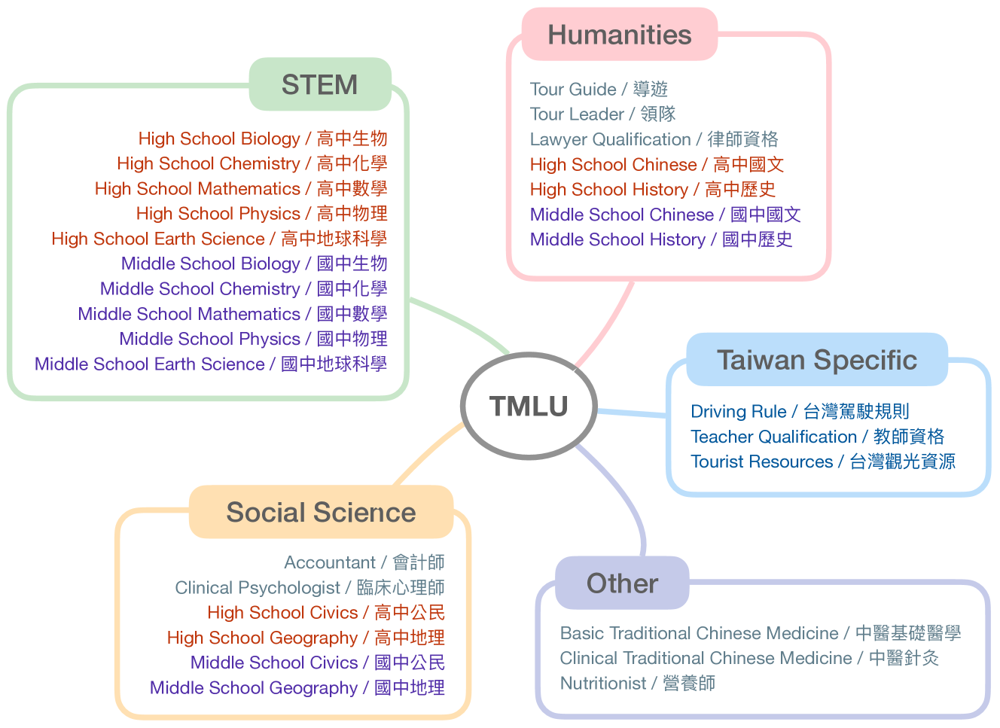
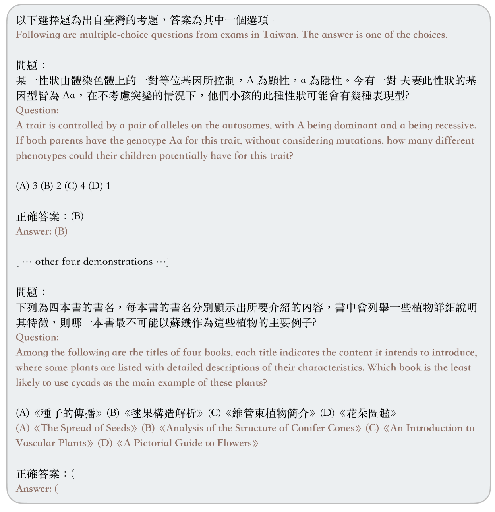
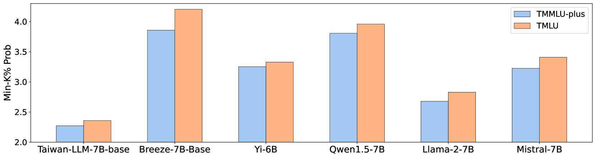
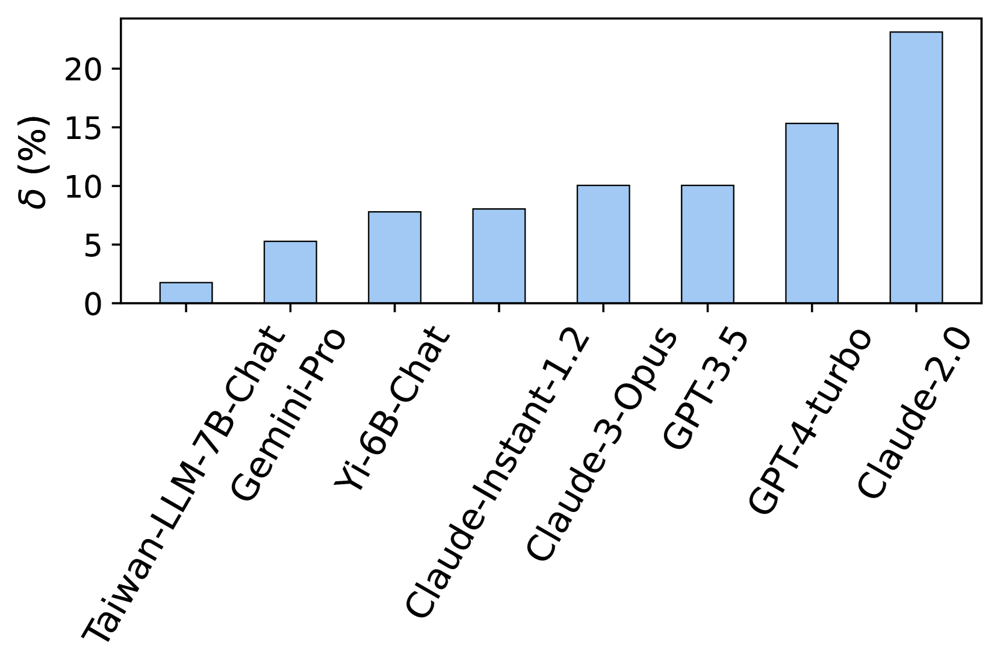
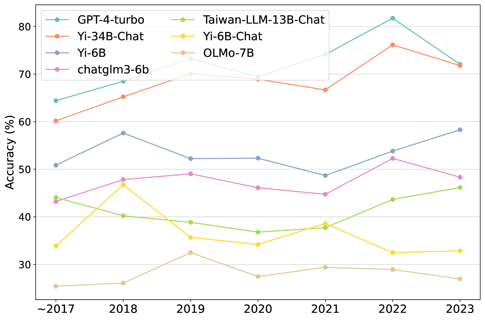
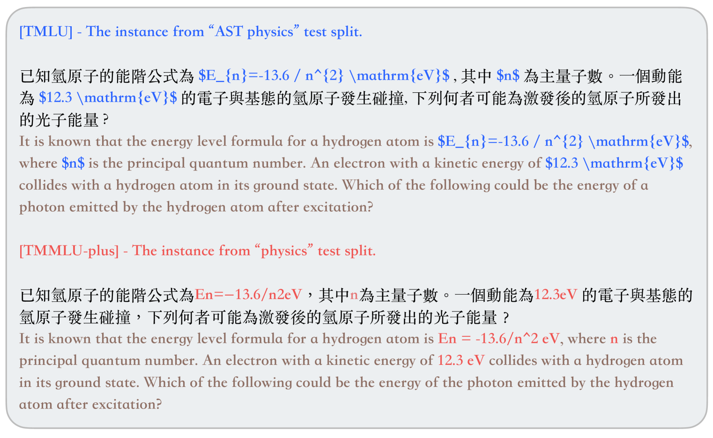
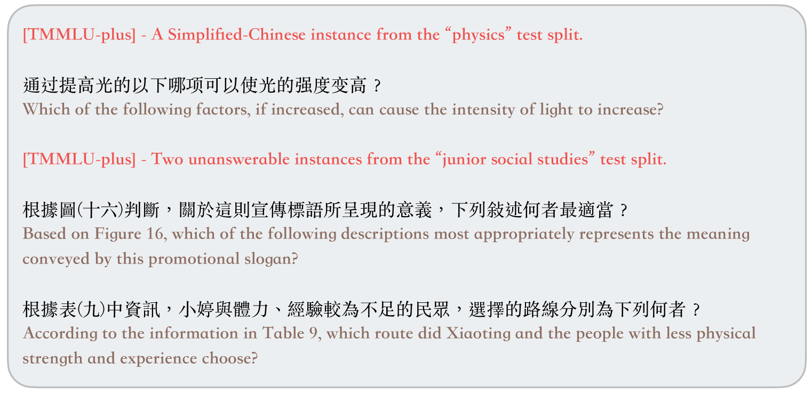
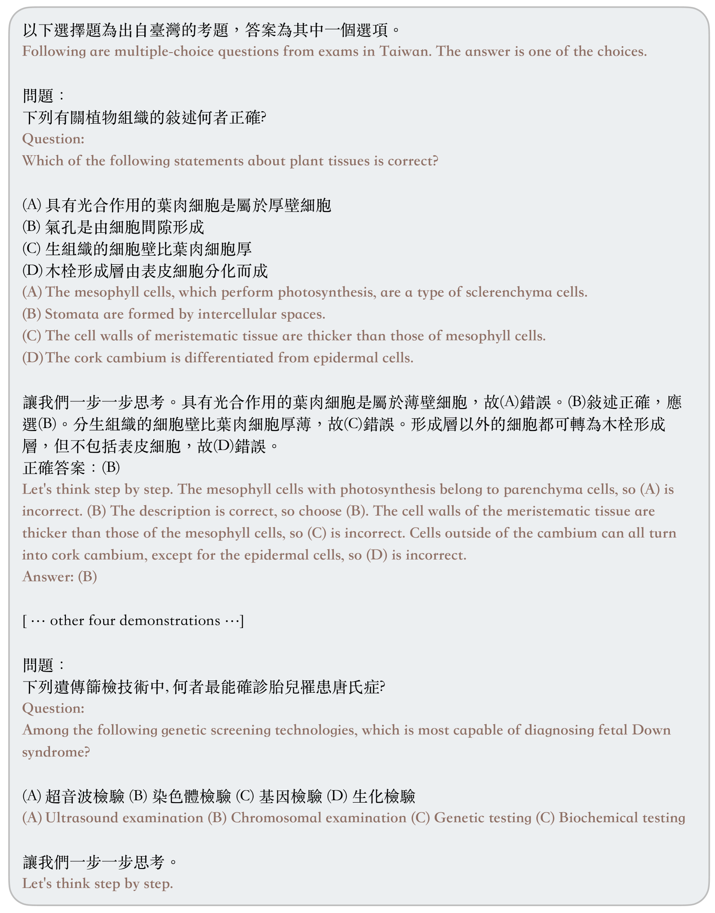

# 探究台湾普通话的语言理解能力

发布时间：2024年03月29日

`LLM应用` `语言评估` `人工智能`

> Measuring Taiwanese Mandarin Language Understanding

# 摘要

> 近期，大型语言模型（LLMs）的评估成为业界焦点。本项工作着眼于中文环境下LLMs的评估，尤其是传统中文领域，在先前的基准测试中鲜有涉及。我们推出了TMLU——一套为评估台湾普通话环境下LLMs的深厚知识与推理能力而量身定制的综合评估体系。TMLU涵盖了从社会科学到STEM领域，从人文学科到台湾特有内容，共37个不同主题，难度横跨中学至专业级别。我们还为每个主题准备了链式思维的少量样本解释，以便更好地评估复杂推理技能。为确立行业标准，我们对24款顶尖LLMs进行了深入实验与分析。研究发现，相较于多语言专有模型，中文开放模型的表现不尽人意，尤其是针对台湾普通话的模型，与针对简体中文的模型相比仍有不小差距。这一发现突显了提升空间，并凸显了TMLU推动本土化台湾普通话LLMs发展的目标。我们公开了基准测试和评估工具，以助力未来研究。

> The evaluation of large language models (LLMs) has drawn substantial attention in the field recently. This work focuses on evaluating LLMs in a Chinese context, specifically, for Traditional Chinese which has been largely underrepresented in existing benchmarks. We present TMLU, a holistic evaluation suit tailored for assessing the advanced knowledge and reasoning capability in LLMs, under the context of Taiwanese Mandarin. TMLU consists of an array of 37 subjects across social science, STEM, humanities, Taiwan-specific content, and others, ranging from middle school to professional levels. In addition, we curate chain-of-thought-like few-shot explanations for each subject to facilitate the evaluation of complex reasoning skills. To establish a comprehensive baseline, we conduct extensive experiments and analysis on 24 advanced LLMs. The results suggest that Chinese open-weight models demonstrate inferior performance comparing to multilingual proprietary ones, and open-weight models tailored for Taiwanese Mandarin lag behind the Simplified-Chinese counterparts. The findings indicate great headrooms for improvement, and emphasize the goal of TMLU to foster the development of localized Taiwanese-Mandarin LLMs. We release the benchmark and evaluation scripts for the community to promote future research.

[Arxiv](https://arxiv.org/abs/2403.20180)