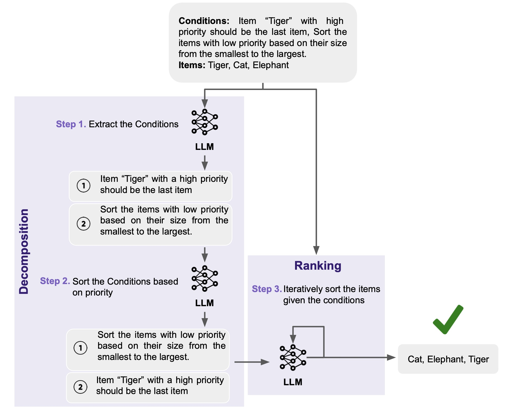
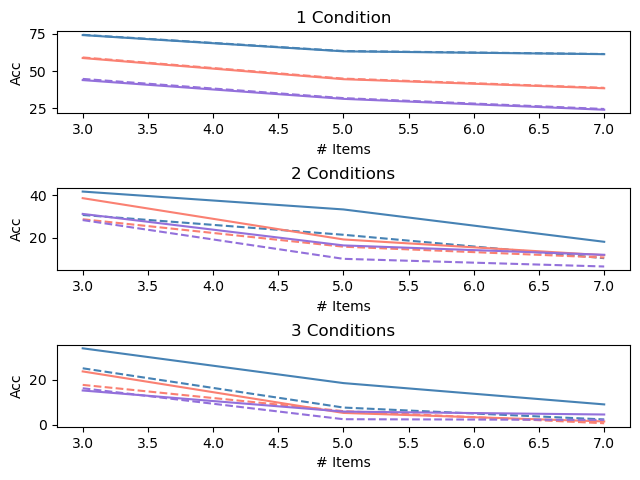
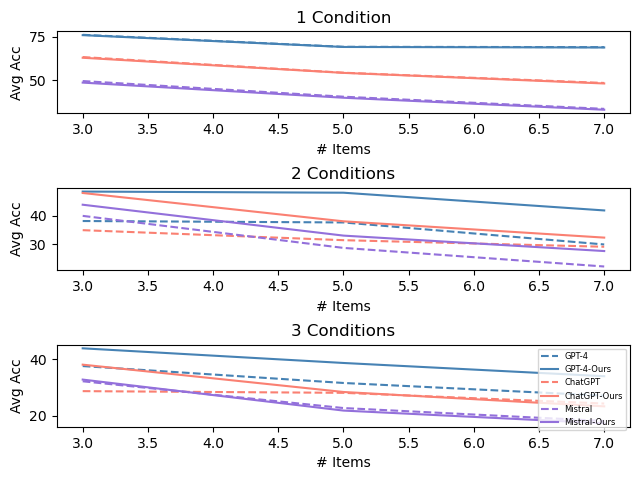
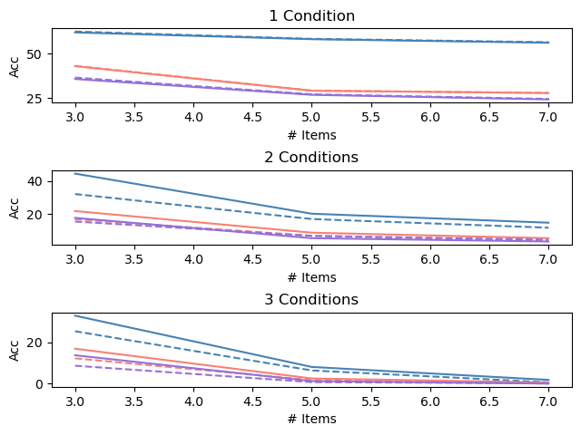
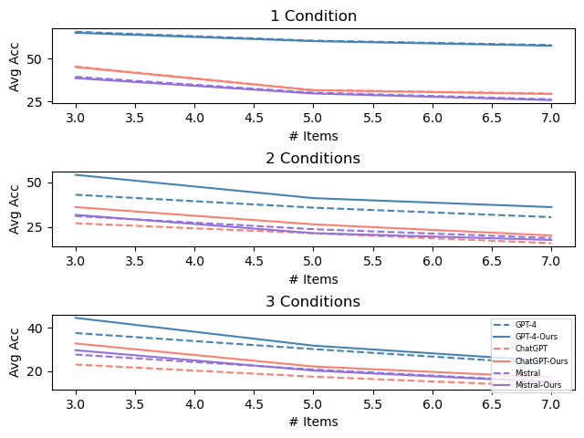
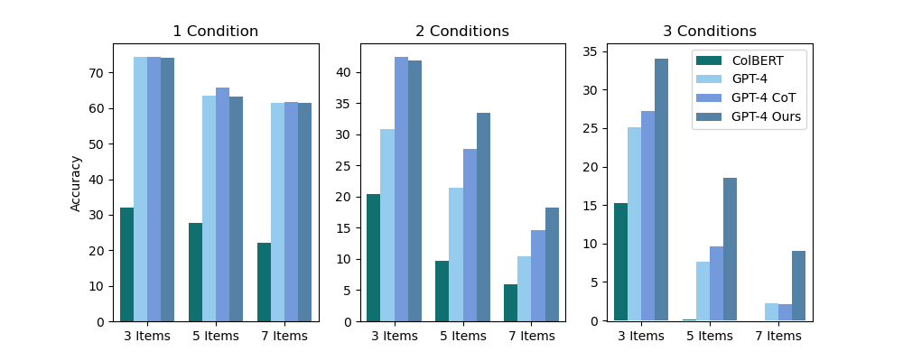
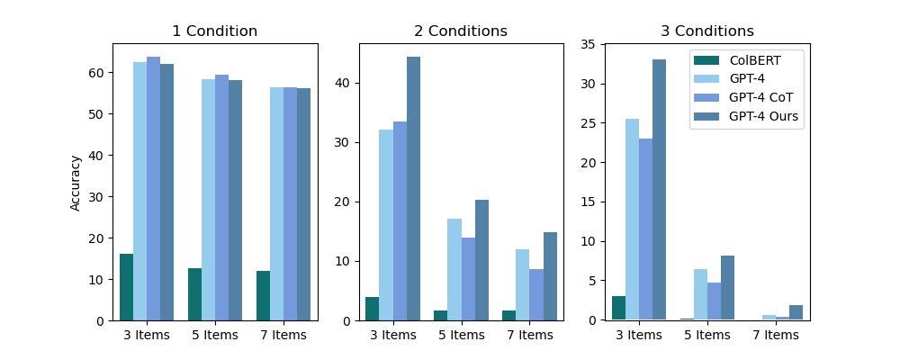

# 在大型语言模型中实现多条件排序

发布时间：2024年03月29日

`LLM应用` `推荐系统` `排序算法`

> Multi-Conditional Ranking with Large Language Models

# 摘要

> 在推荐系统里，用大型语言模型（LLMs）来给项目排序已经变得越来越普遍。这些系统通常的任务是根据用户的查询，将大量文档进行简单排序。但现实情况往往更加复杂：需要在多种不同甚至相互矛盾的条件下，对较少的项目进行精准排序。本文提出了一个新的任务——多条件排名，并介绍了一个为此设计的评估基准MCRank，它能够适用于不同类型的项目和条件。我们通过MCRank对LLMs进行评估后发现，随着项目和条件的增多及复杂度的提升，模型的性能显著下降。为了解决这个问题，我们设计了一种新的分解推理方法EXSIR，它先提取和排序条件，再迭代地对项目进行排名。大量实验证明，这种方法能显著提升LLMs的性能，相比现有模型提高了12%。我们还深入分析了LLMs在不同条件下的表现，并验证了分解步骤的有效性。此外，我们还将EXSIR与思维链和编码器排名模型等现有方法进行了比较，证明了其在多条件排名任务中的优越性和复杂度。相关数据集和代码已经公开发布。

> Utilizing large language models (LLMs) to rank a set of items has become a common approach in recommendation and retrieval systems. Typically, these systems focus on ordering a substantial number of documents in a monotonic order based on a given query. However, real-world scenarios often present a different challenge: ranking a comparatively smaller set of items, but according to a variety of diverse and occasionally conflicting conditions. In this paper, we define and explore the task of multi-conditional ranking by introducing MCRank, a benchmark tailored for assessing multi-conditional ranking across various item types and conditions. Our analysis of LLMs using MCRank indicates a significant decrease in performance as the number and complexity of items and conditions grow. To overcome this limitation, we propose a novel decomposed reasoning method, consisting of EXtracting and Sorting the conditions, and then Iterativly Ranking the items (EXSIR). Our extensive experiments show that this decomposed reasoning method enhances LLMs' performance significantly, achieving up to a 12% improvement over existing LLMs. We also provide a detailed analysis of LLMs performance across various condition categories, and examine the effectiveness of decomposition step. Furthermore, we compare our method with existing approaches such as Chain-of-Thought and an encoder-type ranking model, demonstrating the superiority of our approach and complexity of MCR task. We released our dataset and code.

[Arxiv](https://arxiv.org/abs/2404.00211)