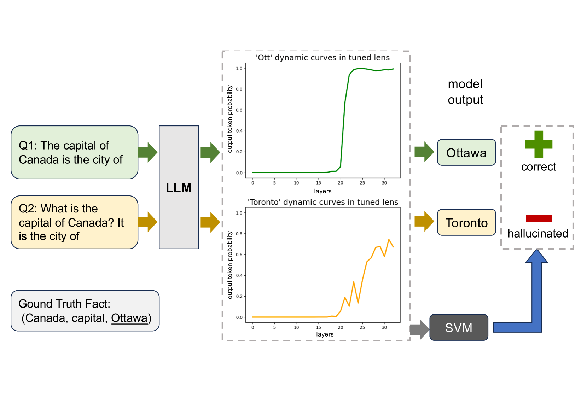
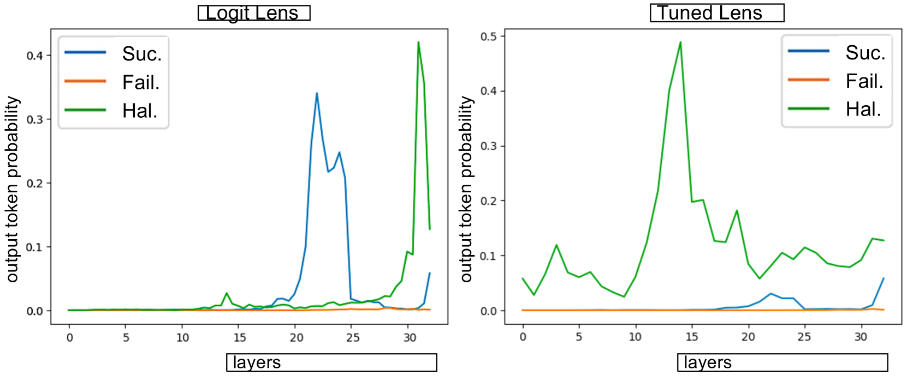
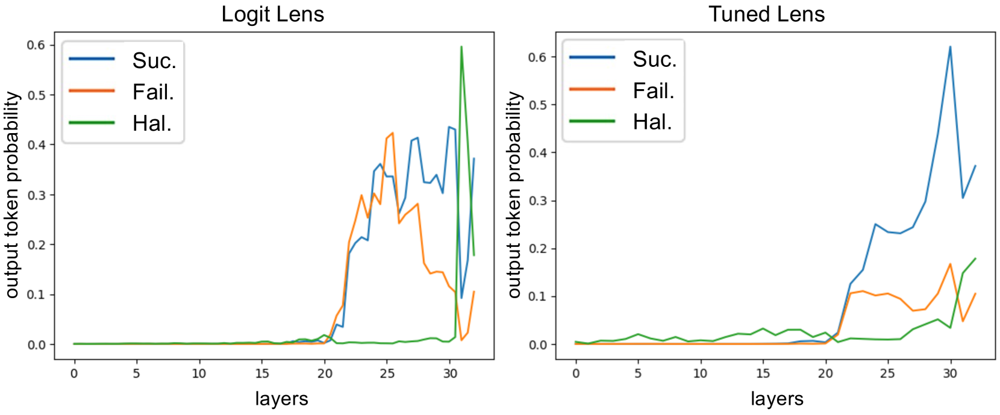
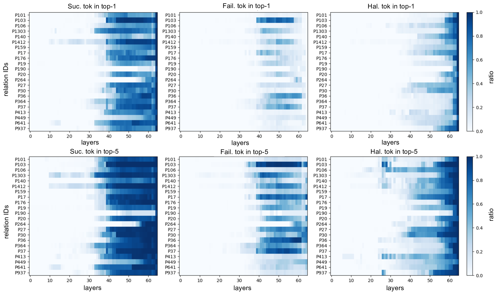
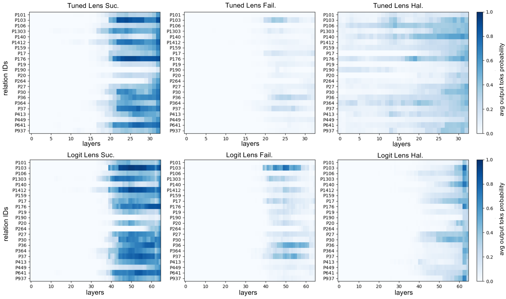
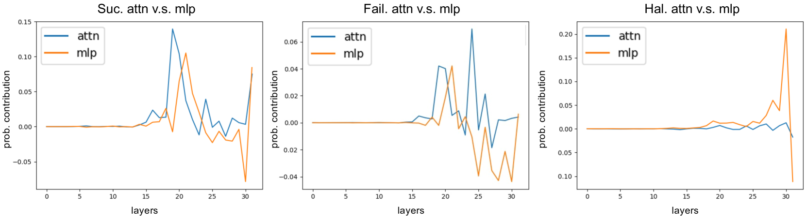
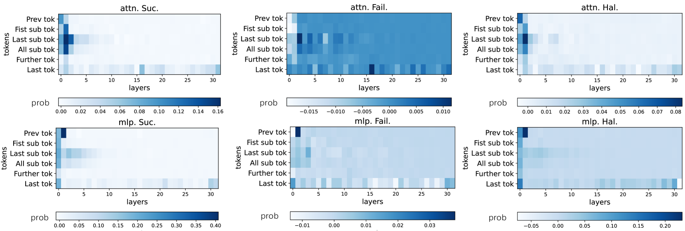
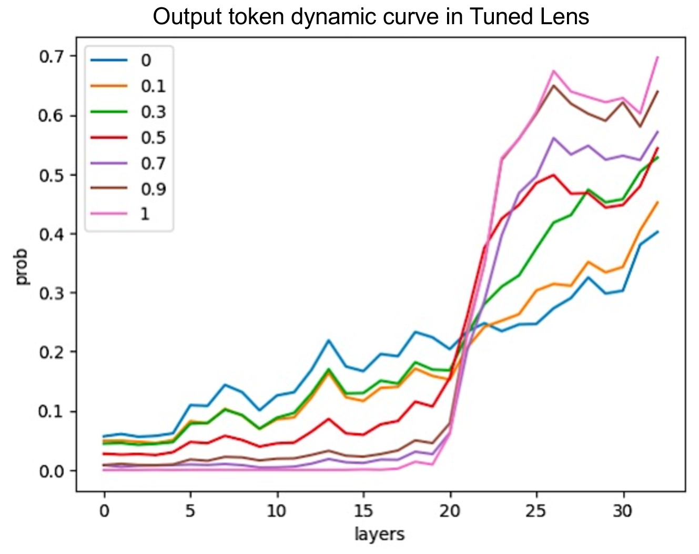
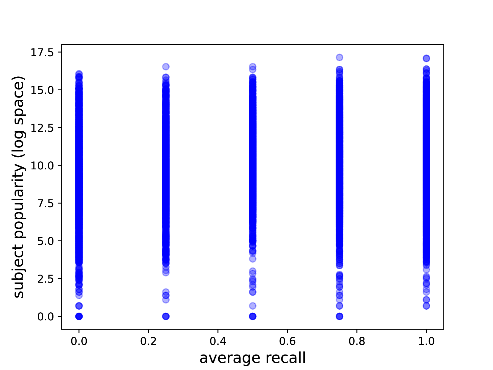

# 大型语言模型在处理已知事实时的幻想现象

发布时间：2024年03月29日

`LLM理论` `人工智能` `模型分析`

> On Large Language Models' Hallucination with Regard to Known Facts

# 摘要

> 大型语言模型擅长回答事实问题，但容易引发幻觉。我们首次从推理机制的角度探讨了这些模型即便知晓正确答案，却仍会产生幻觉的现象。通过分析那些查询相同知识点却得出不同答案的事实问题，我们发现了幻觉出现的模式。此外，我们通过将残差流映射到词汇空间来量化这些模式。研究发现，在幻觉情形下，输出标记的信息在模型后期很少急剧上升或保持明显优势。基于这些动态特征，我们开发了一个分类器，能以88%的准确率识别出幻觉预测。本研究不仅阐明了大型语言模型在已知事实上产生幻觉的原因，还有助于我们准确预测它们的幻觉时刻。

> Large language models are successful in answering factoid questions but are also prone to hallucination.We investigate the phenomenon of LLMs possessing correct answer knowledge yet still hallucinating from the perspective of inference dynamics, an area not previously covered in studies on hallucinations.We are able to conduct this analysis via two key ideas.First, we identify the factual questions that query the same triplet knowledge but result in different answers. The difference between the model behaviors on the correct and incorrect outputs hence suggests the patterns when hallucinations happen. Second, to measure the pattern, we utilize mappings from the residual streams to vocabulary space. We reveal the different dynamics of the output token probabilities along the depths of layers between the correct and hallucinated cases. In hallucinated cases, the output token's information rarely demonstrates abrupt increases and consistent superiority in the later stages of the model. Leveraging the dynamic curve as a feature, we build a classifier capable of accurately detecting hallucinatory predictions with an 88\% success rate. Our study shed light on understanding the reasons for LLMs' hallucinations on their known facts, and more importantly, on accurately predicting when they are hallucinating.

[Arxiv](https://arxiv.org/abs/2403.20009)