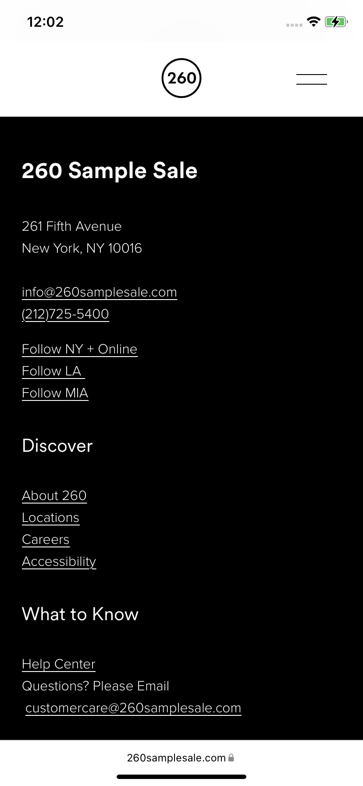
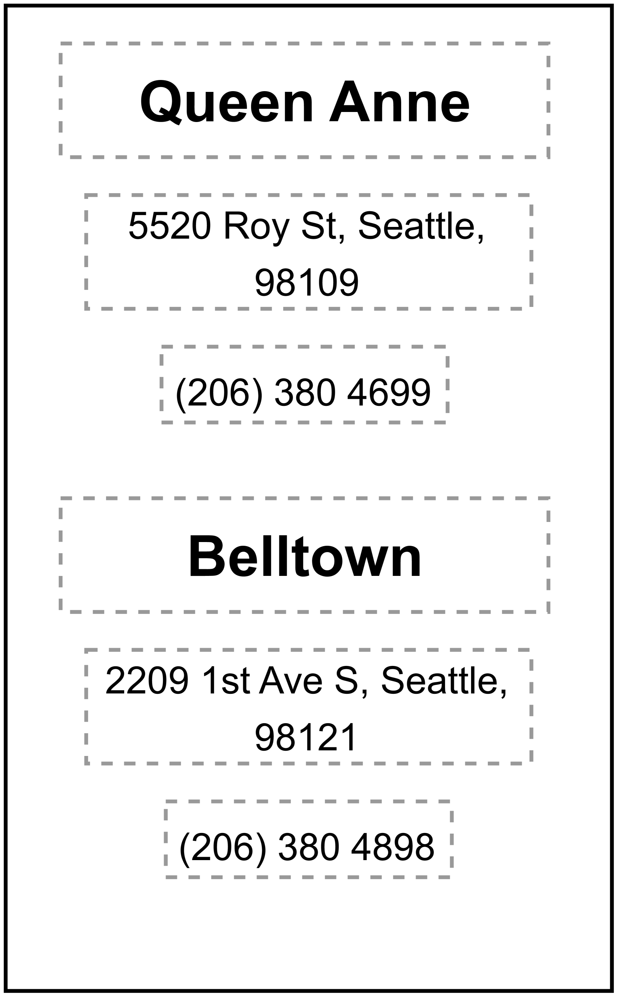
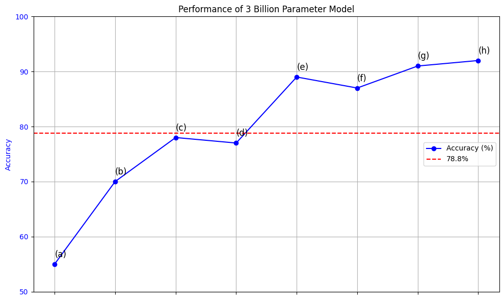

# ReALM：把参考解析视作语言建模的一部分

发布时间：2024年03月29日

`LLM应用` `信息检索`

> ReALM: Reference Resolution As Language Modeling

# 摘要

> 文献引用解析是理解并妥善处理各类上下文的关键问题，这包括对话历史和用户界面或后台运行的非对话实体。尽管大型语言模型（LLM）在众多任务中展现出强大能力，但在文献引用解析方面的应用，尤其是针对非对话实体，尚未充分挖掘。本文阐述了如何将LLM用于构建高效的文献引用解析系统，将其转化为语言建模问题，即便涉及的实体如屏幕上的元素，通常不易简化为纯文本。我们的最小模型在处理屏幕引用时，相比现有系统实现了超过5%的显著提升。在与GPT-3.5和GPT-4的比较中，我们的最小模型表现堪比GPT-4，而更大型的模型表现则远超它们。

> Reference resolution is an important problem, one that is essential to understand and successfully handle context of different kinds. This context includes both previous turns and context that pertains to non-conversational entities, such as entities on the user's screen or those running in the background. While LLMs have been shown to be extremely powerful for a variety of tasks, their use in reference resolution, particularly for non-conversational entities, remains underutilized. This paper demonstrates how LLMs can be used to create an extremely effective system to resolve references of various types, by showing how reference resolution can be converted into a language modeling problem, despite involving forms of entities like those on screen that are not traditionally conducive to being reduced to a text-only modality. We demonstrate large improvements over an existing system with similar functionality across different types of references, with our smallest model obtaining absolute gains of over 5% for on-screen references. We also benchmark against GPT-3.5 and GPT-4, with our smallest model achieving performance comparable to that of GPT-4, and our larger models substantially outperforming it.

[Arxiv](https://arxiv.org/abs/2403.20329)