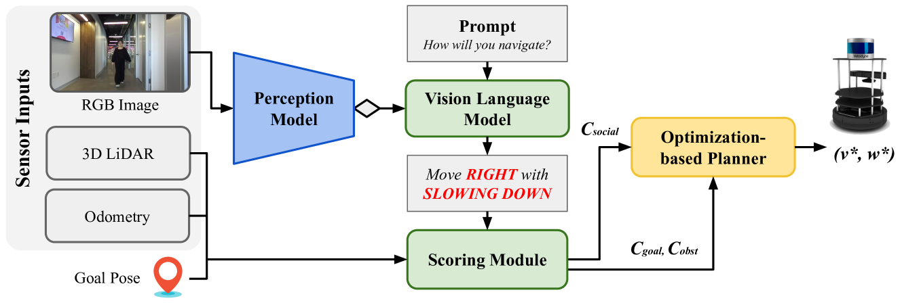
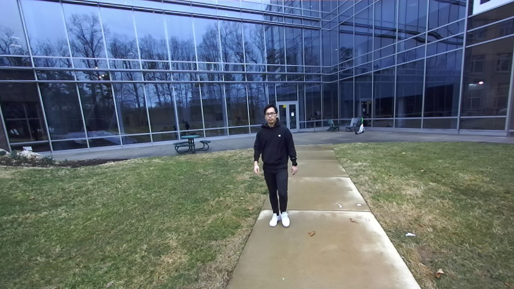
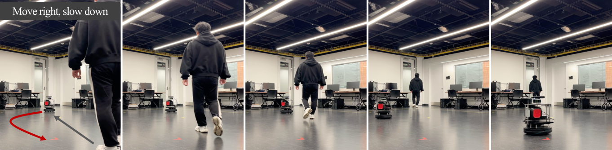
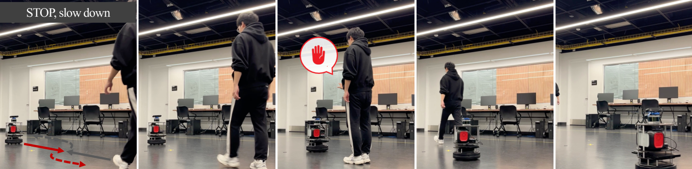
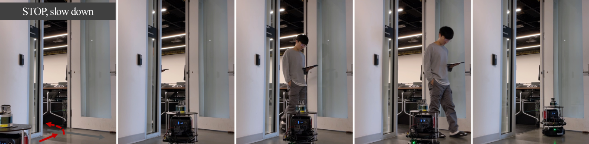
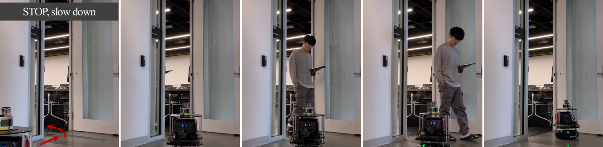
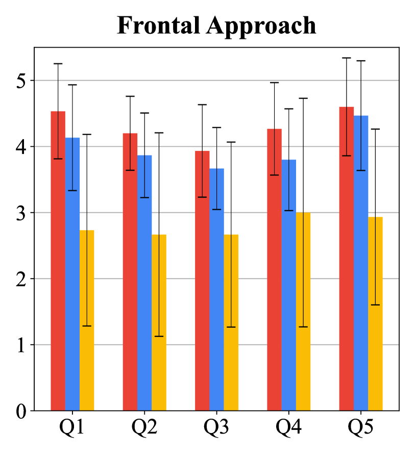
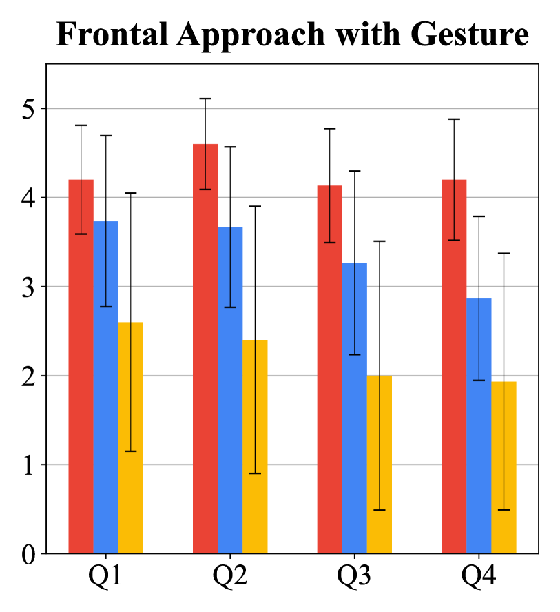
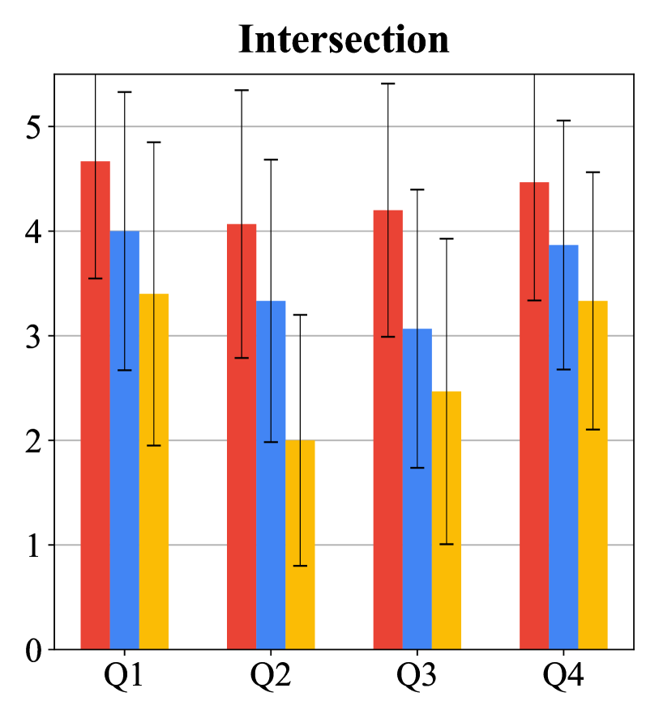
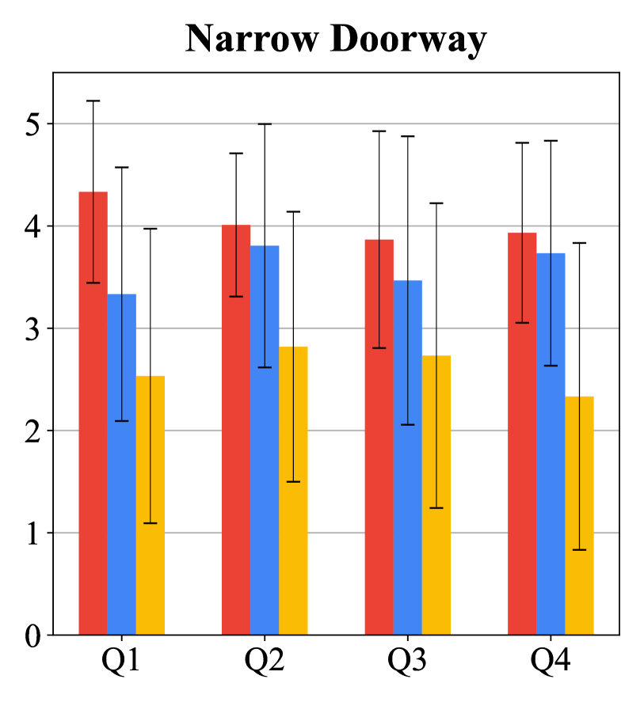

# 利用视觉-语言模型进行评分，实现机器人的社交意识导航。

发布时间：2024年03月29日

`Agent` `机器人` `社交导航`

> Socially Aware Robot Navigation through Scoring Using Vision-Language Models

# 摘要

> 我们创新性地推出了VLM-Social-Nav，这是一种基于视觉-语言模型（VLM）的导航新策略，旨在为机器人在以人为中心的环境中规划轨迹。我们的目标是在实时决策中确保机器人的行为既符合社交规范，又满足人类的期望。通过感知模型识别关键社交元素，并引导VLM为机器人提供行为指导，VLM-Social-Nav采用VLM评分机制，计算成本，确保机器人行为既得体又有效。这种方法减少了对大规模训练数据集的依赖，提高了决策的灵活性。实际应用中，我们通过Turtlebot机器人在四种真实社交场景下的测试，实现了至少36.37%的成功率提升和20.00%的碰撞率降低。用户研究结果也显示，VLM-Social-Nav能够产生最为社会所接受的导航行为。

> We propose VLM-Social-Nav, a novel Vision-Language Model (VLM) based navigation approach to compute a robot's trajectory in human-centered environments. Our goal is to make real-time decisions on robot actions that are socially compliant with human expectations. We utilize a perception model to detect important social entities and prompt a VLM to generate guidance for socially compliant robot behavior. VLM-Social-Nav uses a VLM-based scoring module that computes a cost term that ensures socially appropriate and effective robot actions generated by the underlying planner. Our overall approach reduces reliance on large datasets (for training) and enhances adaptability in decision-making. In practice, it results in improved socially compliant navigation in human-shared environments. We demonstrate and evaluate our system in four different real-world social navigation scenarios with a Turtlebot robot. We observe at least 36.37% improvement in average success rate and 20.00% improvement in average collision rate in the four social navigation scenarios. The user study score shows that VLM-Social-Nav generates the most socially compliant navigation behavior.

[Arxiv](https://arxiv.org/abs/2404.00210)