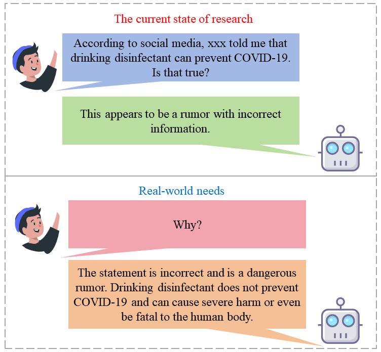
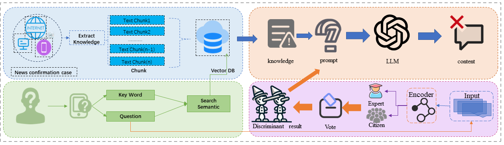
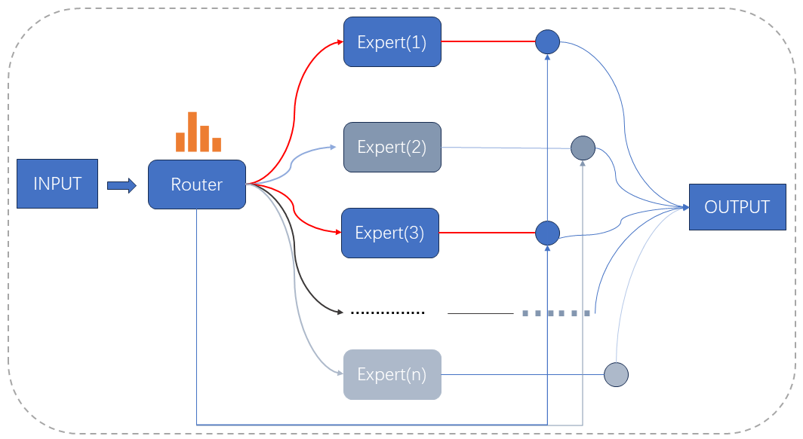
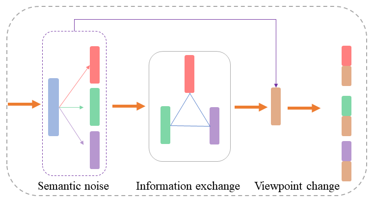

# 未来如何对抗谣言？通过检索、辨识和生成技术来实现。

发布时间：2024年03月29日

`LLM应用` `社会媒体` `信息识别`

> The Future of Combating Rumors? Retrieval, Discrimination, and Generation

# 摘要

> 人工智能生成内容（AIGC）技术的进步让谣言和虚假信息的制造变得轻而易举，这不仅对社会、经济和政治生态造成了冲击，也对民主制度构成了挑战。现行的谣言识别措施仅停留在给潜在的虚假信息打标签阶段，远远不足以应对这一问题，毕竟我们不能指望权威机构去一一核实社交媒体上的每一条信息。为此，我们提出了一种全面的揭谣流程，它不仅能识别谣言，还能生成有说服力的内容来质疑信息的真实性。我们打造的专家-公民集体智慧（ECCW）模块能够精确评估信息的可信度，而检索模块则能够根据关键词从实时更新的揭谣数据库中提取相关信息。利用提示工程技巧，我们将结果和知识输入到大型语言模型（LLM），在无需微调的情况下，实现了有效的辨别和阐释效果，既节省了计算资源，也为揭穿谣言做出了实质性的贡献。

> Artificial Intelligence Generated Content (AIGC) technology development has facilitated the creation of rumors with misinformation, impacting societal, economic, and political ecosystems, challenging democracy. Current rumor detection efforts fall short by merely labeling potentially misinformation (classification task), inadequately addressing the issue, and it is unrealistic to have authoritative institutions debunk every piece of information on social media. Our proposed comprehensive debunking process not only detects rumors but also provides explanatory generated content to refute the authenticity of the information. The Expert-Citizen Collective Wisdom (ECCW) module we designed aensures high-precision assessment of the credibility of information and the retrieval module is responsible for retrieving relevant knowledge from a Real-time updated debunking database based on information keywords. By using prompt engineering techniques, we feed results and knowledge into a LLM (Large Language Model), achieving satisfactory discrimination and explanatory effects while eliminating the need for fine-tuning, saving computational costs, and contributing to debunking efforts.

[Arxiv](https://arxiv.org/abs/2403.20204)