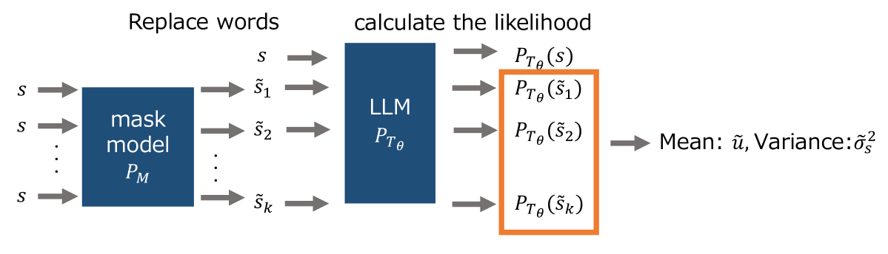
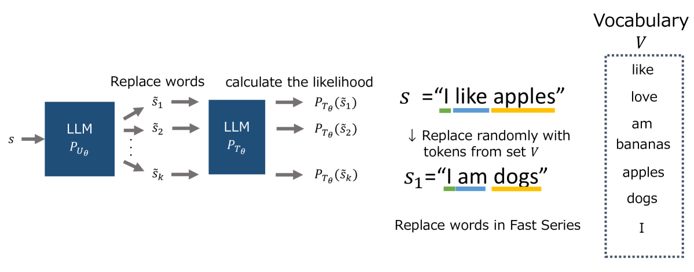
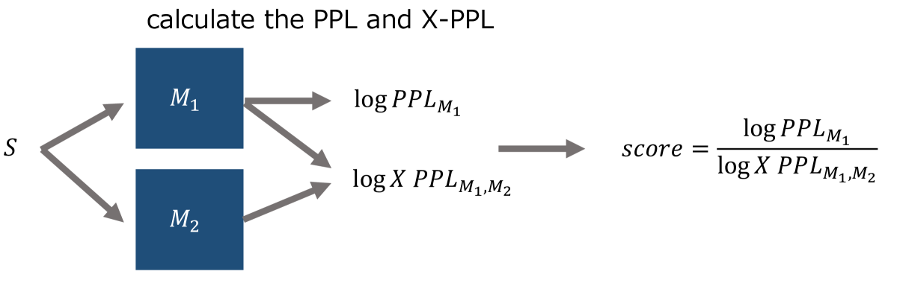
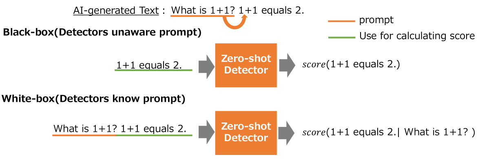

# 在零-shot检测AI生成文本的过程中，提示的作用不容忽视。本文将探讨不同提示对检测效果的具体影响，以及如何优化提示以提高检测准确性。

发布时间：2024年03月29日

`LLM应用` `信息安全` `文本生成`

> The Impact of Prompts on Zero-Shot Detection of AI-Generated Text

# 摘要

> 近年来，大型语言模型（LLMs）取得了飞速进展，广泛应用于各种场景。然而，它们也存在被滥用的风险，比如制造虚假新闻和抄袭，这引发了人们的深切担忧。为此，研究者们开发了检测器来辨别文本是由人类还是AI生成的。其中，零-shot检测器因其无需额外训练数据且通常基于可能性判断而受到青睐。在聊天应用中，用户习惯输入提示并利用AI生成的文本。但现有的零-shot检测器往往忽略了原始提示对文本的影响，这可能导致生成和检测阶段的判断出现偏差。目前，关于提示是否存在对零-shot检测器准确性的影响尚无定论。本文提出了一个评估框架，通过实证分析来探究提示对AI生成文本检测准确性的作用。我们对不同的零-shot检测器进行了白盒和黑盒检测的评估，结果显示提示对检测准确性有着显著影响。特别是，使用提示的白盒方法相较于不使用提示的黑盒检测，AUC值普遍提高了至少0.1。相关代码已公开：\url{https://github.com/kaito25atugich/Detector}。

> In recent years, there have been significant advancements in the development of Large Language Models (LLMs). While their practical applications are now widespread, their potential for misuse, such as generating fake news and committing plagiarism, has posed significant concerns. To address this issue, detectors have been developed to evaluate whether a given text is human-generated or AI-generated. Among others, zero-shot detectors stand out as effective approaches that do not require additional training data and are often likelihood-based. In chat-based applications, users commonly input prompts and utilize the AI-generated texts. However, zero-shot detectors typically analyze these texts in isolation, neglecting the impact of the original prompts. It is conceivable that this approach may lead to a discrepancy in likelihood assessments between the text generation phase and the detection phase. So far, there remains an unverified gap concerning how the presence or absence of prompts impacts detection accuracy for zero-shot detectors. In this paper, we introduce an evaluative framework to empirically analyze the impact of prompts on the detection accuracy of AI-generated text. We assess various zero-shot detectors using both white-box detection, which leverages the prompt, and black-box detection, which operates without prompt information. Our experiments reveal the significant influence of prompts on detection accuracy. Remarkably, compared with black-box detection without prompts, the white-box methods using prompts demonstrate an increase in AUC of at least $0.1$ across all zero-shot detectors tested. Code is available: \url{https://github.com/kaito25atugich/Detector}.

[Arxiv](https://arxiv.org/abs/2403.20127)