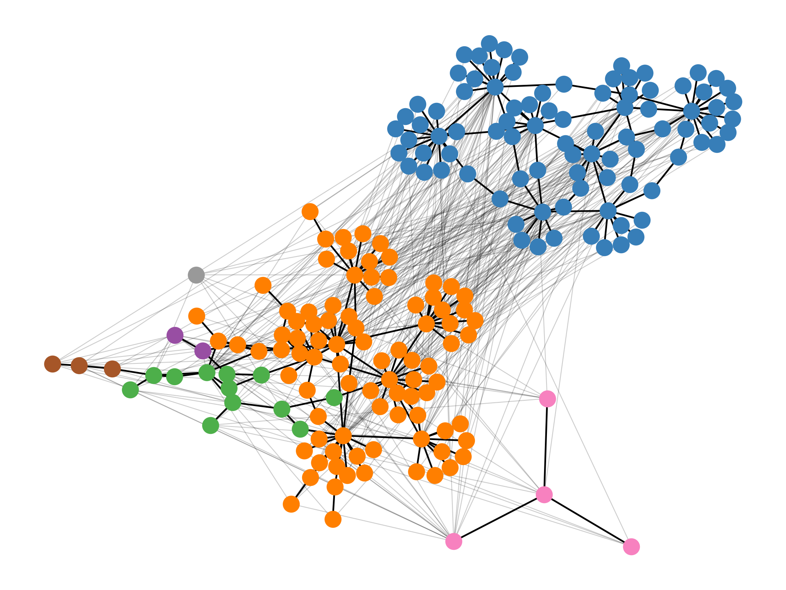
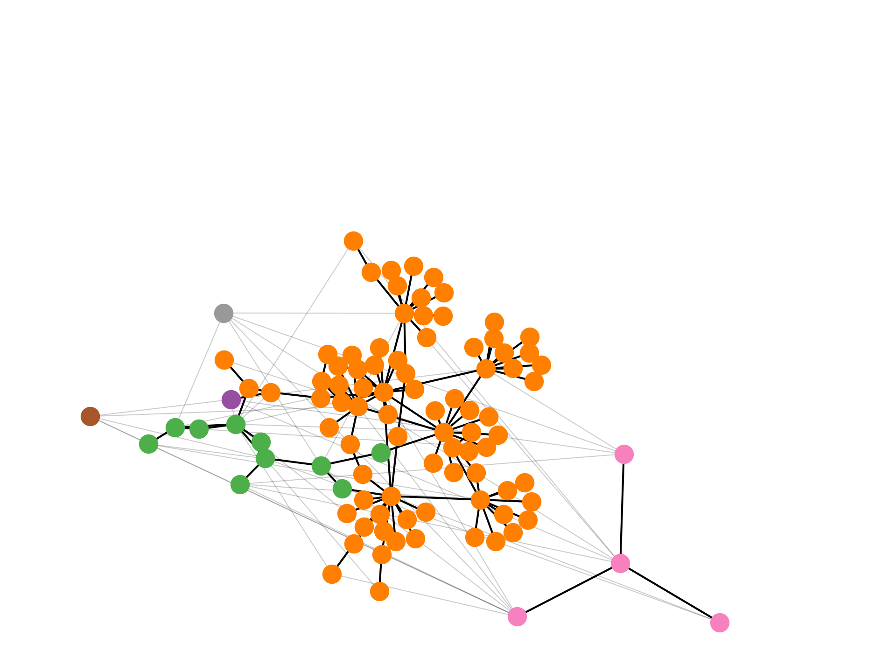
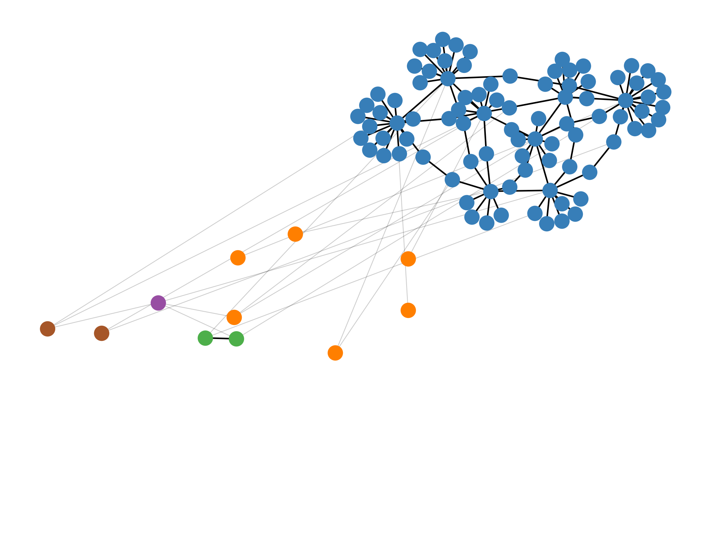

# LSCD 基准：探究词义演变的理想试验场

发布时间：2024年03月29日

`Agent` `评估基准库`

> The LSCD Benchmark: a Testbed for Diachronic Word Meaning Tasks

# 摘要

> 词汇语义变化检测（LSCD）是一项复杂的任务，通常通过两个连续的应用层任务来执行：先为词组生成上下文标签，再通过词义归纳得到词义聚类，并最终通过比较词义聚类的变化来确定LSCD标签。这种模块化设计在多数LSCD数据集和模型中都有所体现，也造成了模型选择和任务定义的多样性，加之不同版本的数据集、预处理方式和评估标准，使得模型评估和结果复现变得复杂。为此，我们建立了一个标准化的LSCD评估基准库，通过透明的实现确保结果的可复制性，并通过标准化让不同组件能够灵活组合。该库不仅支持WiC、WSI和LSCD的独立评估，还有助于对模型组件进行细致的评估和优化。

> Lexical Semantic Change Detection (LSCD) is a complex, lemma-level task, which is usually operationalized based on two subsequently applied usage-level tasks: First, Word-in-Context (WiC) labels are derived for pairs of usages. Then, these labels are represented in a graph on which Word Sense Induction (WSI) is applied to derive sense clusters. Finally, LSCD labels are derived by comparing sense clusters over time. This modularity is reflected in most LSCD datasets and models. It also leads to a large heterogeneity in modeling options and task definitions, which is exacerbated by a variety of dataset versions, preprocessing options and evaluation metrics. This heterogeneity makes it difficult to evaluate models under comparable conditions, to choose optimal model combinations or to reproduce results. Hence, we provide a benchmark repository standardizing LSCD evaluation. Through transparent implementation results become easily reproducible and by standardization different components can be freely combined. The repository reflects the task's modularity by allowing model evaluation for WiC, WSI and LSCD. This allows for careful evaluation of increasingly complex model components providing new ways of model optimization.

[Arxiv](https://arxiv.org/abs/2404.00176)