# 迈向绿色LLM：将能效置于LLM推理的核心。

发布时间：2024年03月29日

`LLM应用` `能源效率` `数据中心`

> Towards Greener LLMs: Bringing Energy-Efficiency to the Forefront of LLM Inference

# 摘要

> 在现代大型语言模型（LLMs）被各行各业广泛采纳的今天，相应的推理服务需求也在不断增长。面对LLMs对计算能力和内存的高需求，高端GPU纷纷投入使用以支撑这些模型。然而，能源供应问题逐渐凸显，成为数据中心扩展的最大瓶颈。本文探讨了将能源效率置于性能服务水平协议（SLOs）之上时所面临的权衡问题。我们发现，依据不同的输入条件、模型类型和服务协议，LLM推理服务提供商可以调整多种参数以提高能源效率。文章分析了这些参数调整对延迟、吞吐量和能源消耗的具体影响。通过深入研究这些权衡，我们为在不降低性能的前提下优化能源消耗提供了实用见解，为实现数据中心环境中LLM的可持续、经济高效部署开辟了新路径。

> With the ubiquitous use of modern large language models (LLMs) across industries, the inference serving for these models is ever expanding. Given the high compute and memory requirements of modern LLMs, more and more top-of-the-line GPUs are being deployed to serve these models. Energy availability has come to the forefront as the biggest challenge for data center expansion to serve these models. In this paper, we present the trade-offs brought up by making energy efficiency the primary goal of LLM serving under performance SLOs. We show that depending on the inputs, the model, and the service-level agreements, there are several knobs available to the LLM inference provider to use for being energy efficient. We characterize the impact of these knobs on the latency, throughput, as well as the energy. By exploring these trade-offs, we offer valuable insights into optimizing energy usage without compromising on performance, thereby paving the way for sustainable and cost-effective LLM deployment in data center environments.

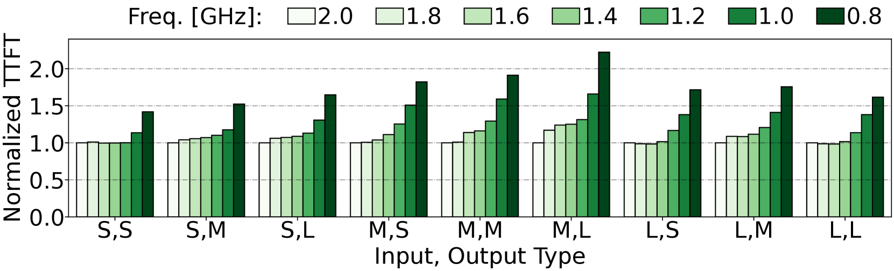

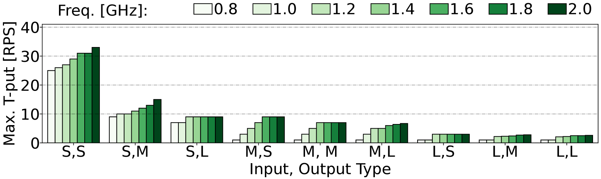

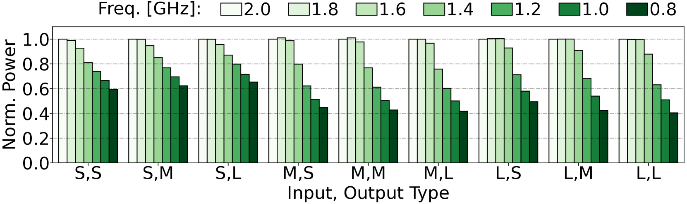

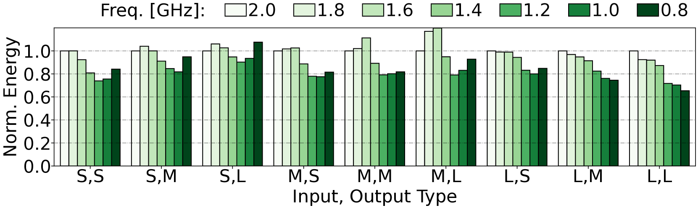

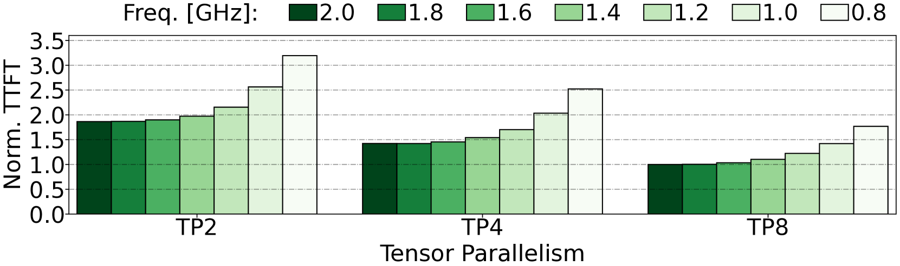

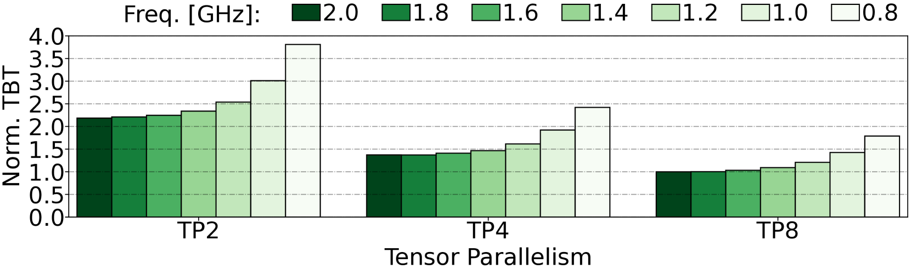

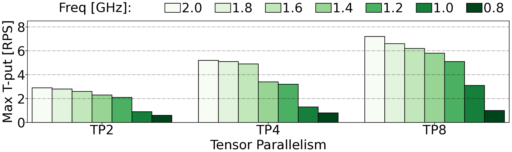

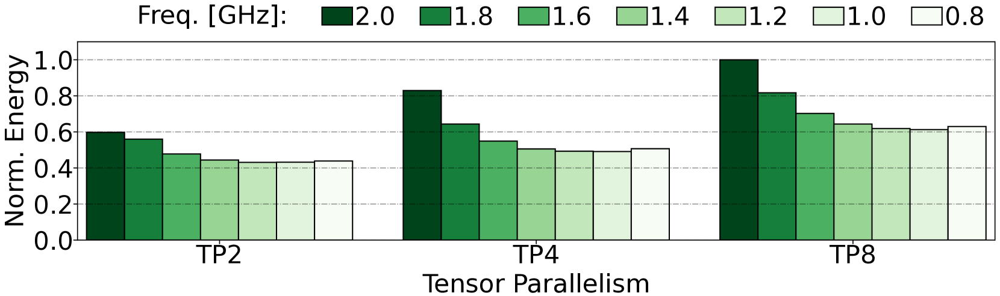

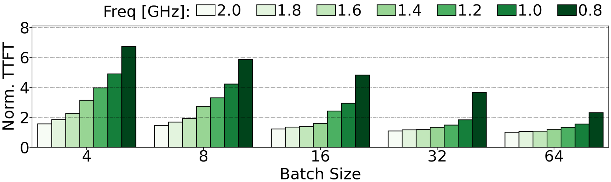

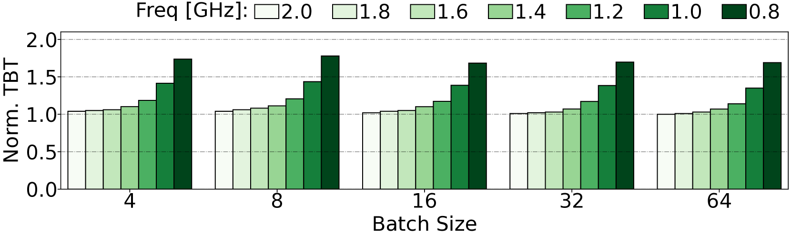

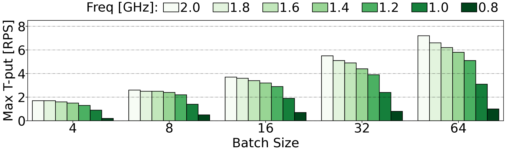

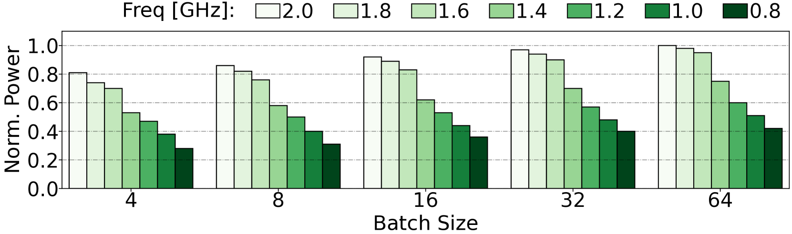

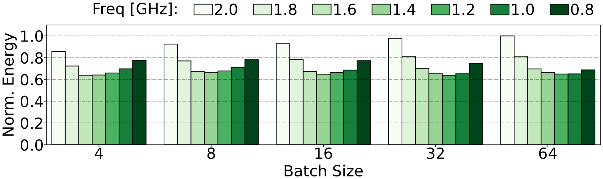

[Arxiv](https://arxiv.org/abs/2403.20306)