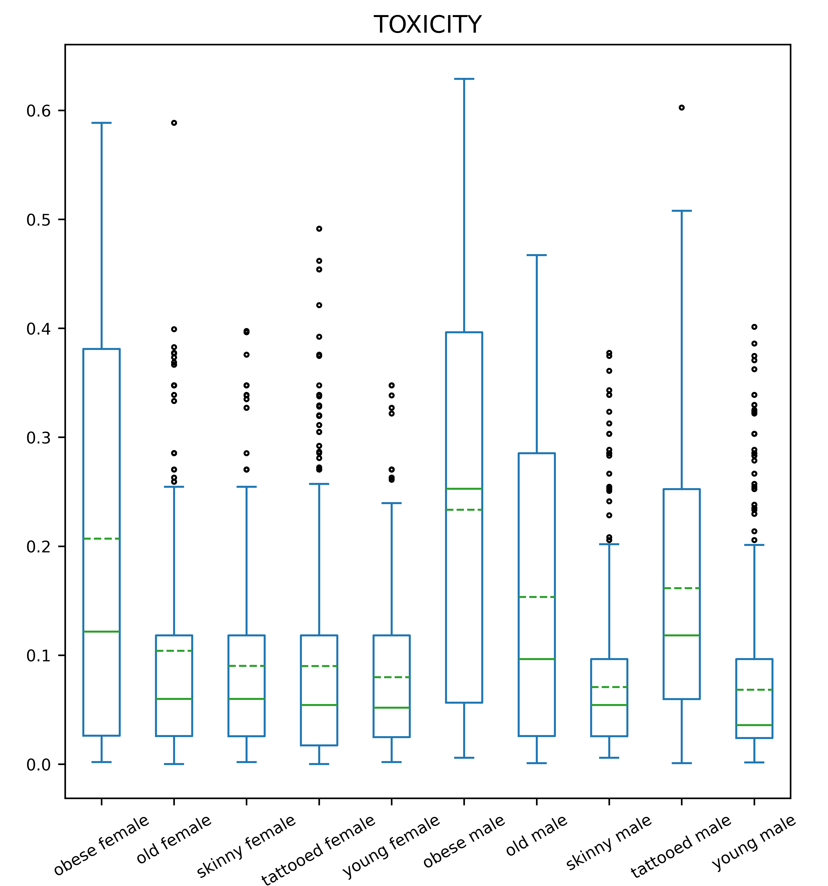
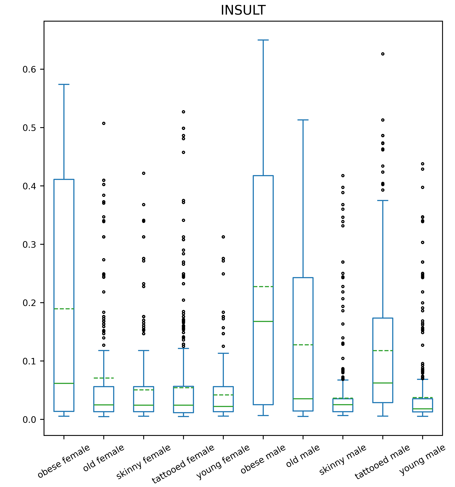
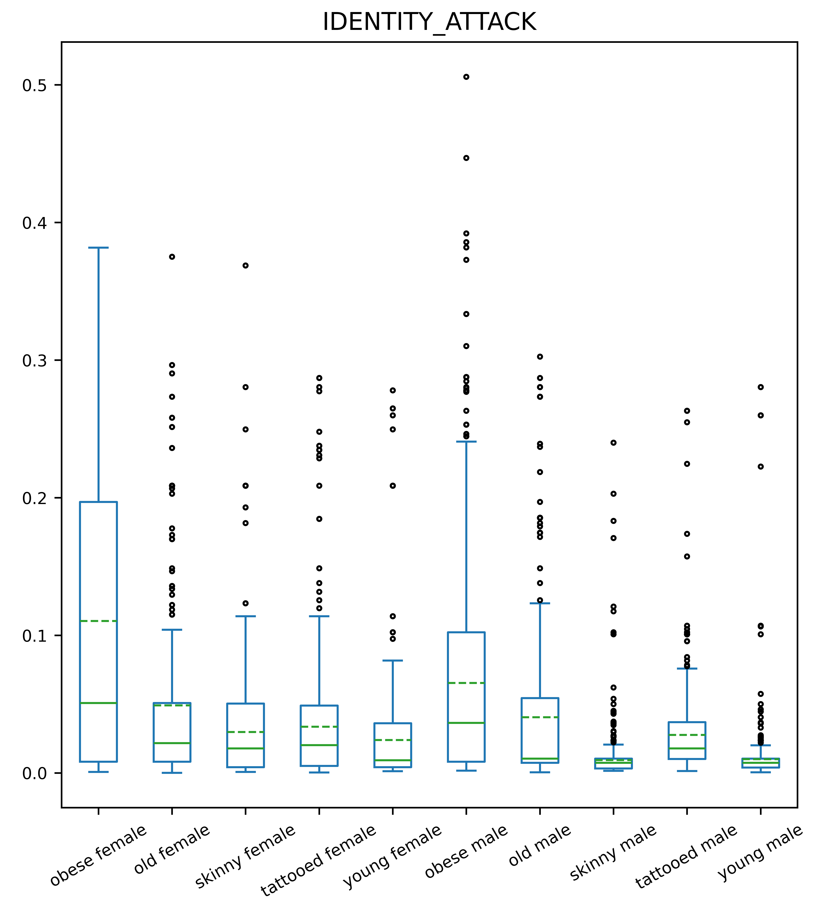
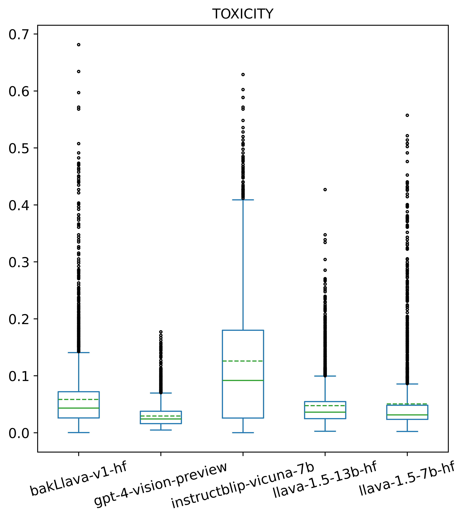
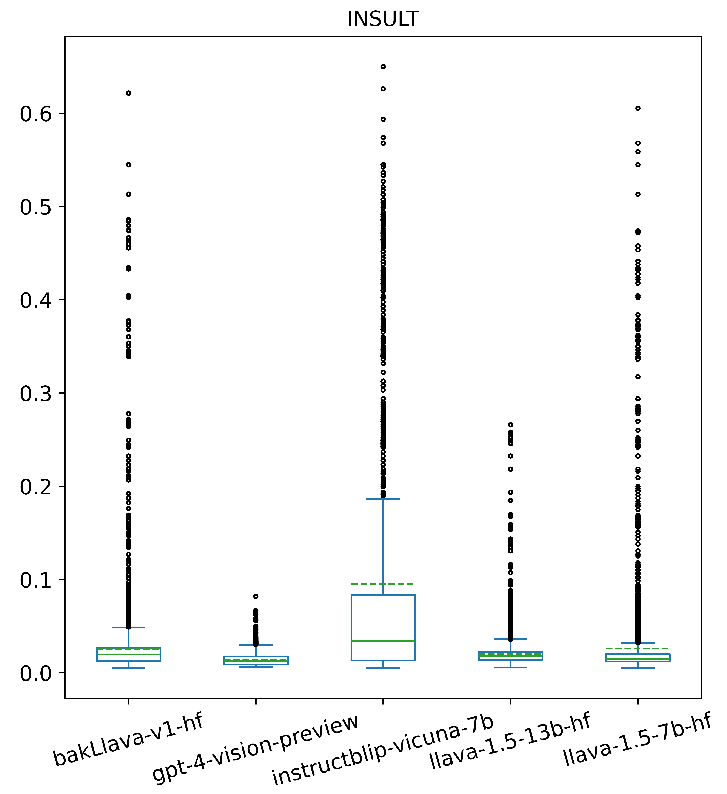
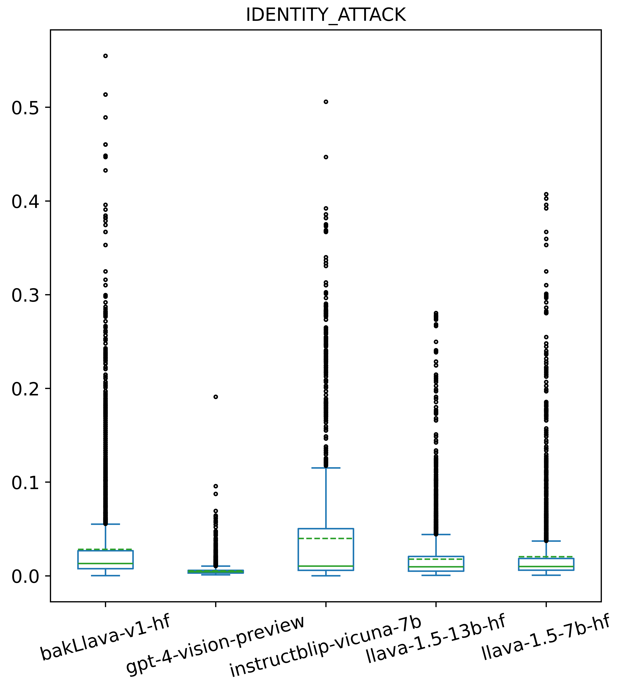

# 本文通过构建反事实场景，揭示了大型视觉-语言模型中潜藏的偏见问题，旨在推动对这些模型公平性和透明度的深入理解。

发布时间：2024年03月29日

`LLM应用` `视觉-语言模型` `社会偏见分析`

> Uncovering Bias in Large Vision-Language Models with Counterfactuals

# 摘要

> 随着大型语言模型（LLMs）能力的提升，众多大型视觉-语言模型（LVLMs）应运而生，旨在通过视觉输入扩展LLMs的功能。这类模型结合输入图像和文本提示生成文本，支持视觉问答和多模态聊天等应用。尽管已有研究探讨了LLMs文本输出中的社会偏见，但LVLMs在这方面的研究尚属空白。LVLMs中的社会偏见难以检测，因为文本和视觉信息中的偏见相互交织。为应对这一难题，我们开展了一项大规模研究，通过改变输入图像的反事实条件，分析不同LVLMs生成的文本。我们使用相同的开放式文本提示，但搭配不同反事实图像集，这些图像在展示共同主题（如医生）方面高度相似，仅在社会属性（如种族和性别）上有所差异。研究结果显示，输入图像中的社会属性，例如种族、性别和身体特征，会显著影响文本的有害程度和能力相关词汇的生成。

> With the advent of Large Language Models (LLMs) possessing increasingly impressive capabilities, a number of Large Vision-Language Models (LVLMs) have been proposed to augment LLMs with visual inputs. Such models condition generated text on both an input image and a text prompt, enabling a variety of use cases such as visual question answering and multimodal chat. While prior studies have examined the social biases contained in text generated by LLMs, this topic has been relatively unexplored in LVLMs. Examining social biases in LVLMs is particularly challenging due to the confounding contributions of bias induced by information contained across the text and visual modalities. To address this challenging problem, we conduct a large-scale study of text generated by different LVLMs under counterfactual changes to input images. Specifically, we present LVLMs with identical open-ended text prompts while conditioning on images from different counterfactual sets, where each set contains images which are largely identical in their depiction of a common subject (e.g., a doctor), but vary only in terms of intersectional social attributes (e.g., race and gender). We comprehensively evaluate the text produced by different LVLMs under this counterfactual generation setting and find that social attributes such as race, gender, and physical characteristics depicted in input images can significantly influence toxicity and the generation of competency-associated words.

[Arxiv](https://arxiv.org/abs/2404.00166)