# 借助大型语言模型，捕捉目标群体的信念与偏好。

发布时间：2024年03月29日

`LLM应用` `消费者行为` `市场研究`

> Using LLMs to Model the Beliefs and Preferences of Targeted Populations

# 摘要

> 本文探讨了如何使大型语言模型（LLM）准确反映人类群体的偏好。通过建模特定人群的信念、偏好和行为，可以为新产品的模拟焦点小组、虚拟调查以及行为干预测试等多样化应用提供支持，尤其适用于成本高、难以实施或存在道德争议的干预措施。现有研究在利用LLMs精确模拟人类在不同情境下的行为上取得了不同程度的成果。我们对两种流行的微调技术进行了基准测试，并针对它们在一项关于电池电动汽车偏好的调查中，与真实人类受访者偏好的匹配程度进行了评估。我们从模型在整体统计数据匹配和个体响应匹配两个层面进行了评估，并探讨了温度参数在平衡这两方面权衡中的作用。同时，我们还提出了并验证了一个新的损失函数，旨在提升模型在处理需要数值回答的问题时的表现。

> We consider the problem of aligning a large language model (LLM) to model the preferences of a human population. Modeling the beliefs, preferences, and behaviors of a specific population can be useful for a variety of different applications, such as conducting simulated focus groups for new products, conducting virtual surveys, and testing behavioral interventions, especially for interventions that are expensive, impractical, or unethical. Existing work has had mixed success using LLMs to accurately model human behavior in different contexts. We benchmark and evaluate two well-known fine-tuning approaches and evaluate the resulting populations on their ability to match the preferences of real human respondents on a survey of preferences for battery electric vehicles (BEVs). We evaluate our models against their ability to match population-wide statistics as well as their ability to match individual responses, and we investigate the role of temperature in controlling the trade-offs between these two. Additionally, we propose and evaluate a novel loss term to improve model performance on responses that require a numeric response.

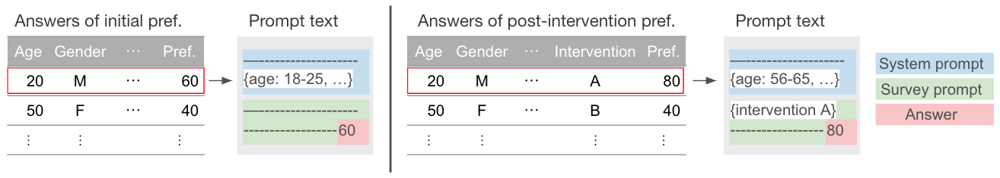

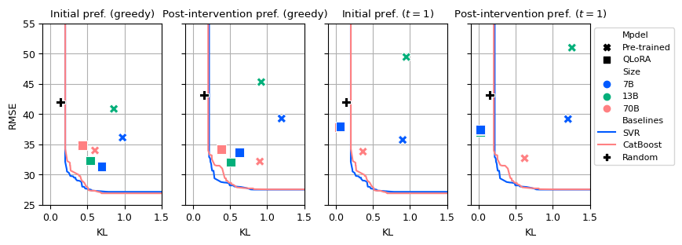

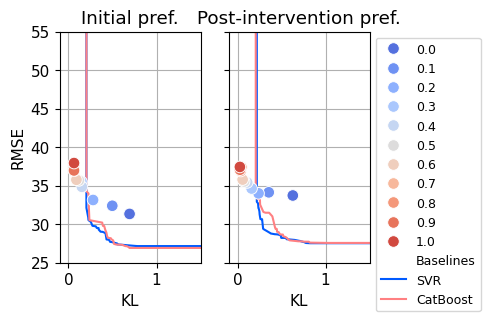

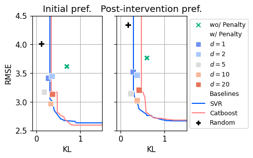

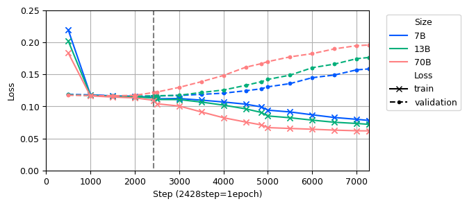

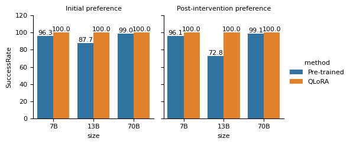

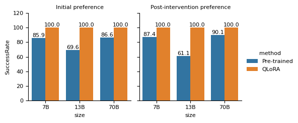

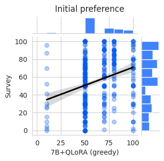

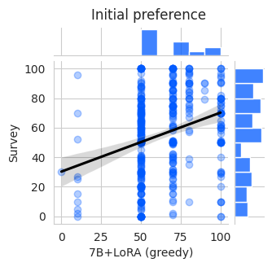

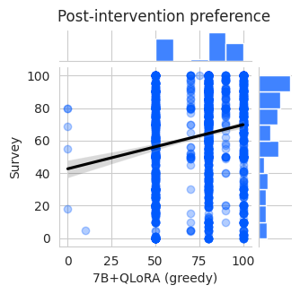

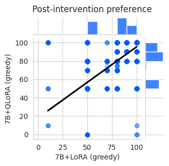

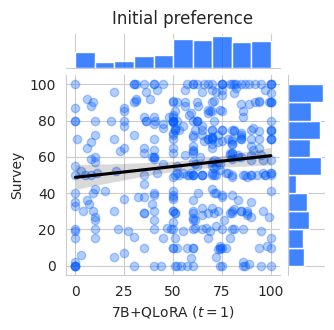

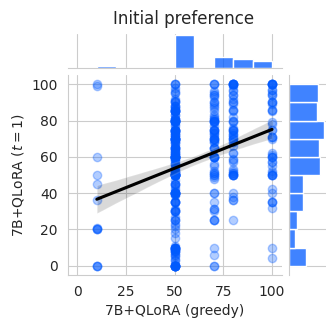

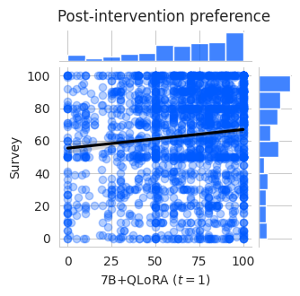

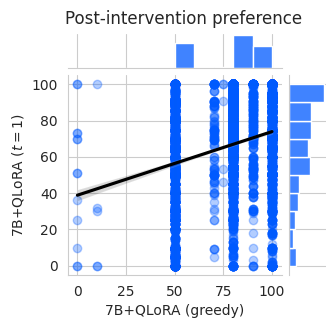

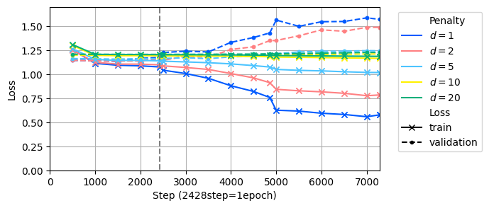

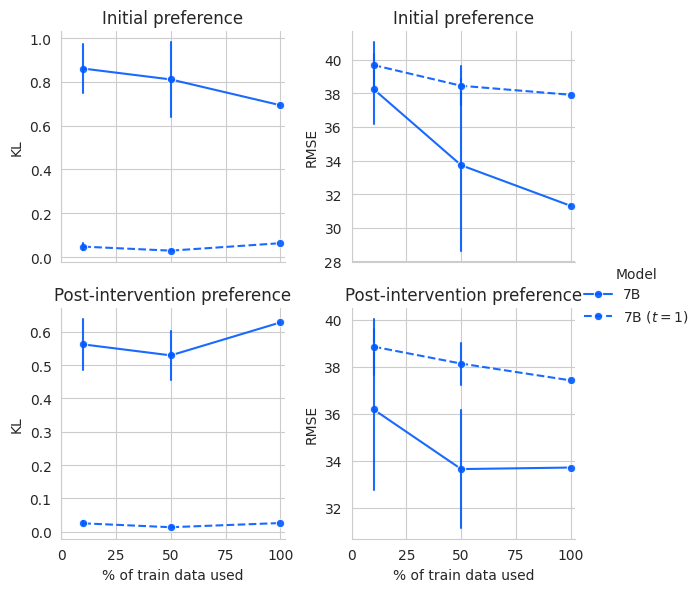

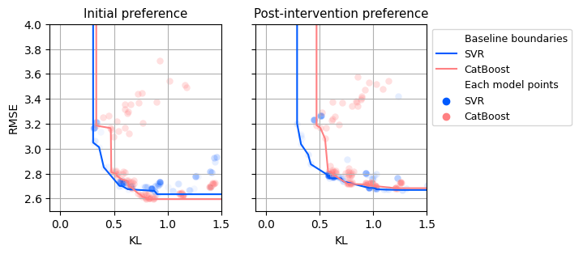

[Arxiv](https://arxiv.org/abs/2403.20252)