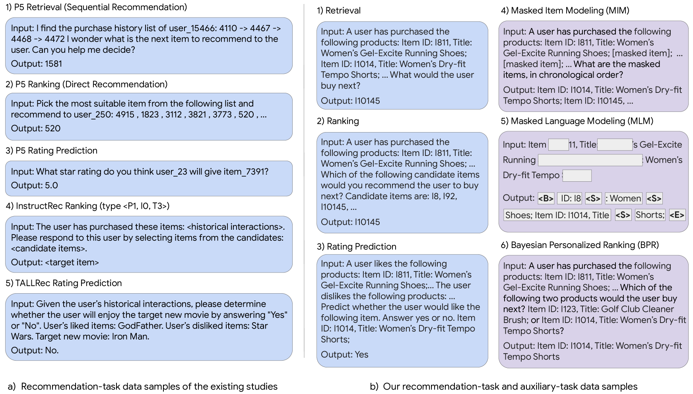
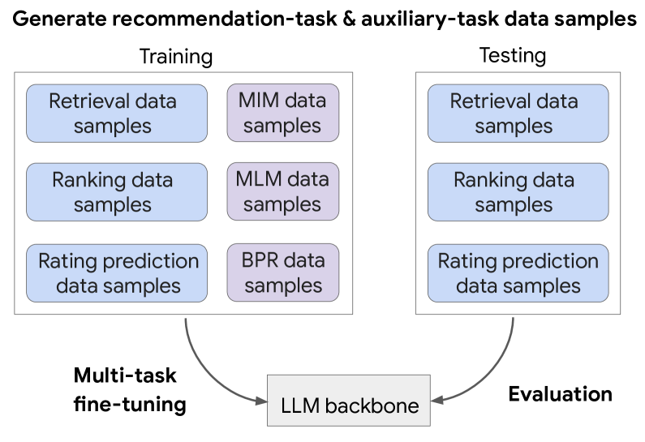
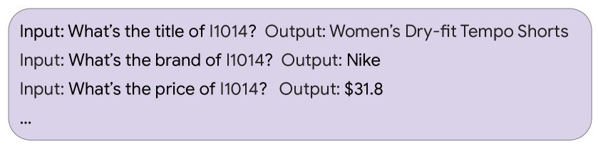

# 大型语言模型与推荐知识的融合

发布时间：2024年03月30日

`LLM应用` `推荐系统` `用户行为分析`

> Aligning Large Language Models with Recommendation Knowledge

# 摘要

> 近期，大型语言模型（LLMs）开始担纲推荐系统的核心技术。但在检索等标准任务上，它们的表现往往不如传统方法。我们认为，这是因为LLMs所掌握的知识与做出有效推荐所需的知识不相符。LLMs虽然在自然语言处理方面表现出色，却难以捕捉推荐任务中的复杂用户与项目之间的互动。为此，我们提出要缩小这一知识差距，让LLMs掌握更多推荐领域的专业知识。在传统推荐系统中，像掩蔽项目建模（MIM）和贝叶斯个性化排名（BPR）这样的操作已经证明是有效的。我们以此为灵感，通过自然语言模拟这些操作，创造出能够体现项目关联性和用户偏好的辅助任务数据样本。通过对这些样本进行微调，并加入更丰富的推荐任务数据样本，我们能够有效地为LLMs注入推荐领域的专业知识。在亚马逊玩具与游戏、美容、体育与户外活动等类别中，我们在FLAN-T5-Base和FLAN-T5-XL等LLMs上进行的检索、排序和评分预测任务的广泛实验，证明了我们技术的有效性。特别值得一提的是，我们的方法在检索任务上，不仅超越了传统方法，也超越了基于LLM的现有最佳技术，其显著的优势表明了它在提升推荐质量方面的潜力。

> Large language models (LLMs) have recently been used as backbones for recommender systems. However, their performance often lags behind conventional methods in standard tasks like retrieval. We attribute this to a mismatch between LLMs' knowledge and the knowledge crucial for effective recommendations. While LLMs excel at natural language reasoning, they cannot model complex user-item interactions inherent in recommendation tasks. We propose bridging the knowledge gap and equipping LLMs with recommendation-specific knowledge to address this. Operations such as Masked Item Modeling (MIM) and Bayesian Personalized Ranking (BPR) have found success in conventional recommender systems. Inspired by this, we simulate these operations through natural language to generate auxiliary-task data samples that encode item correlations and user preferences. Fine-tuning LLMs on such auxiliary-task data samples and incorporating more informative recommendation-task data samples facilitates the injection of recommendation-specific knowledge into LLMs. Extensive experiments across retrieval, ranking, and rating prediction tasks on LLMs such as FLAN-T5-Base and FLAN-T5-XL show the effectiveness of our technique in domains such as Amazon Toys & Games, Beauty, and Sports & Outdoors. Notably, our method outperforms conventional and LLM-based baselines, including the current SOTA, by significant margins in retrieval, showcasing its potential for enhancing recommendation quality.

[Arxiv](https://arxiv.org/abs/2404.00245)