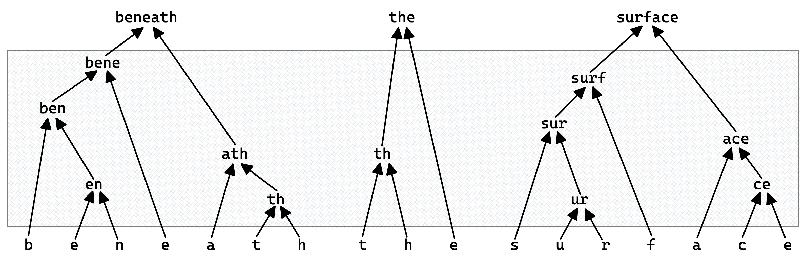
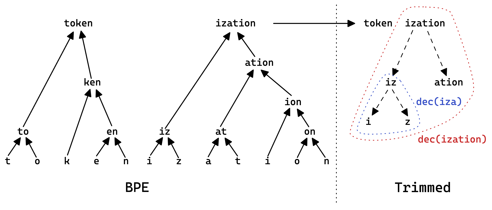

# 探究神经机器翻译中BPE词汇削减的效果与影响

发布时间：2024年03月30日

`LLM理论` `机器翻译`

> An Analysis of BPE Vocabulary Trimming in Neural Machine Translation

# 摘要

> 我们研究了字节对编码子词分词中的词汇阈值修剪技巧，该技巧通过替换生僻子词为其组成子词来进行后处理。尽管在机器翻译中去除生僻子词被推崇为减少模型体积和提升模型鲁棒性的有效手段，但我们的实验发现，在众多超参数配置下，词汇修剪并未能有效提升性能，反而可能导致显著的性能下降。

> We explore threshold vocabulary trimming in Byte-Pair Encoding subword tokenization, a postprocessing step that replaces rare subwords with their component subwords. The technique is available in popular tokenization libraries but has not been subjected to rigorous scientific scrutiny. While the removal of rare subwords is suggested as best practice in machine translation implementations, both as a means to reduce model size and for improving model performance through robustness, our experiments indicate that, across a large space of hyperparameter settings, vocabulary trimming fails to improve performance, and is even prone to incurring heavy degradation.

[Arxiv](https://arxiv.org/abs/2404.00397)