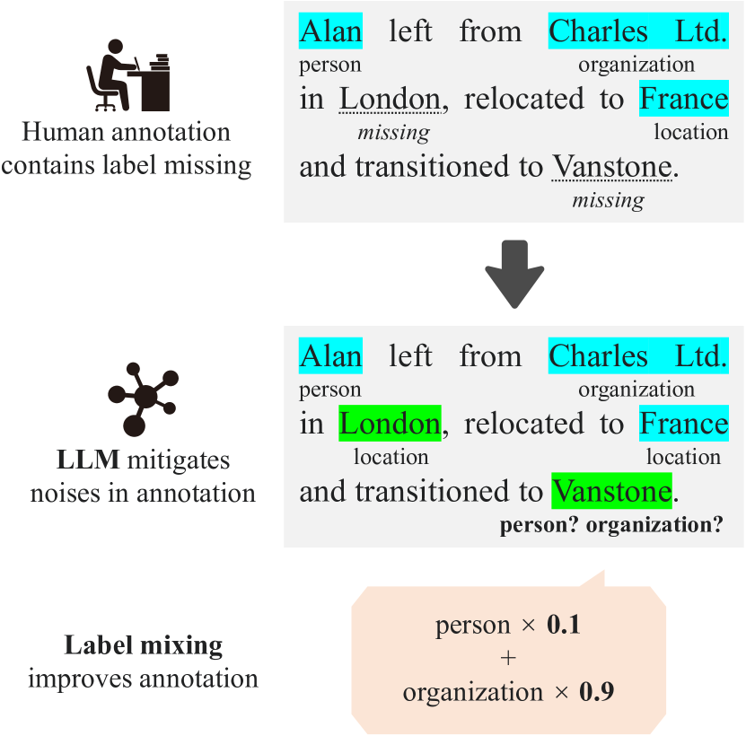
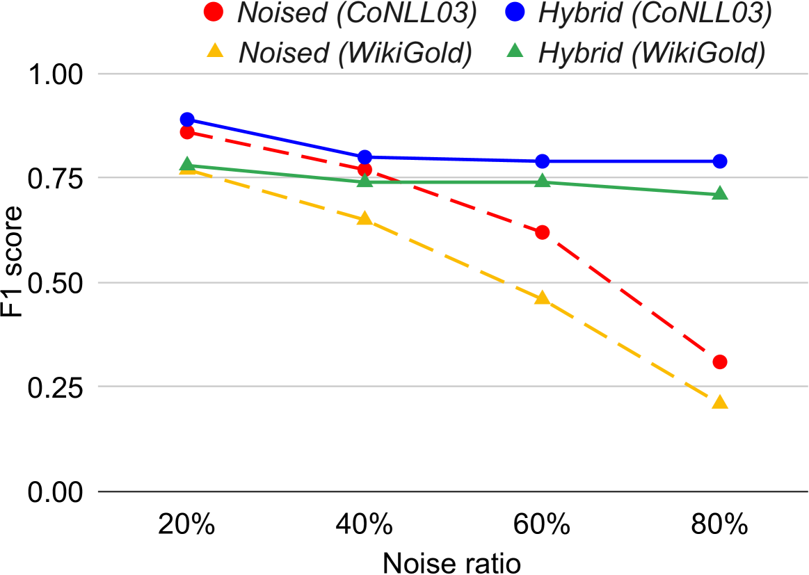
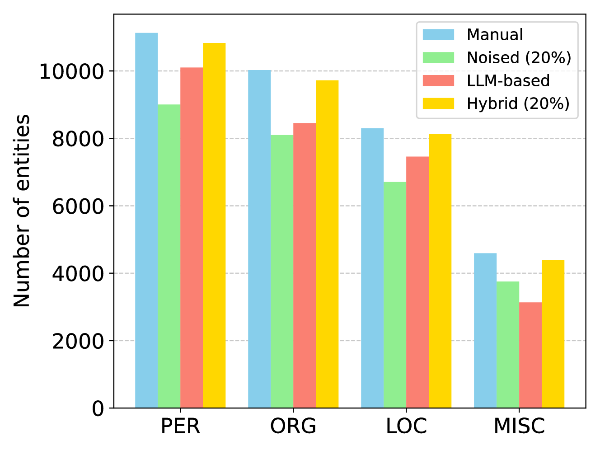
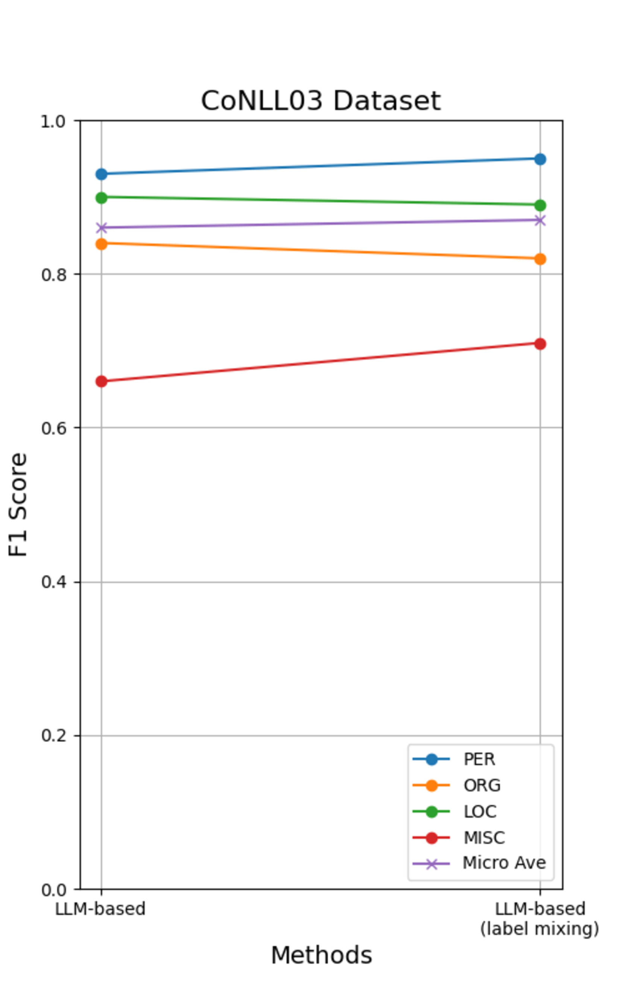
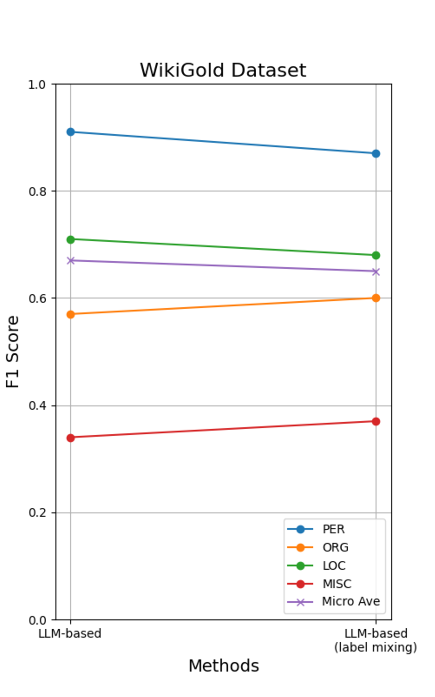

# 借助大型语言模型，我们能够扩充命名实体识别数据集，迈向自动化且更为精细的注释工作。

发布时间：2024年03月30日

`LLM应用` `数据注释`

> Augmenting NER Datasets with LLMs: Towards Automated and Refined Annotation

# 摘要

> 自然语言处理（NLP）领域中，命名实体识别（NER）技术至关重要，被广泛应用于多种应用中。传统为NER模型注释数据集的方法因成本高昂和数据集质量不一而受到挑战。本研究提出了一种创新的混合注释策略，它将人力与大型语言模型（LLMs）的能力相结合。这种策略不仅有效降低了手动注释中的误差，如遗漏等问题，提升了NER模型的准确性，并且成本更为经济。同时，通过实施标签混合策略，它还解决了LLM注释中常见的类别不平衡问题。经过多个数据集的分析验证，这种方法在性能上始终超越传统方法，即便在预算紧张的情况下亦然。研究展示了利用LLMs优化数据集质量的巨大潜力，提出了一种新颖的解决类别不平衡问题的技术，并证明了以高效经济的方式实现高性能NER的可能性。

> In the field of Natural Language Processing (NLP), Named Entity Recognition (NER) is recognized as a critical technology, employed across a wide array of applications. Traditional methodologies for annotating datasets for NER models are challenged by high costs and variations in dataset quality. This research introduces a novel hybrid annotation approach that synergizes human effort with the capabilities of Large Language Models (LLMs). This approach not only aims to ameliorate the noise inherent in manual annotations, such as omissions, thereby enhancing the performance of NER models, but also achieves this in a cost-effective manner. Additionally, by employing a label mixing strategy, it addresses the issue of class imbalance encountered in LLM-based annotations. Through an analysis across multiple datasets, this method has been consistently shown to provide superior performance compared to traditional annotation methods, even under constrained budget conditions. This study illuminates the potential of leveraging LLMs to improve dataset quality, introduces a novel technique to mitigate class imbalances, and demonstrates the feasibility of achieving high-performance NER in a cost-effective way.

[Arxiv](https://arxiv.org/abs/2404.01334)