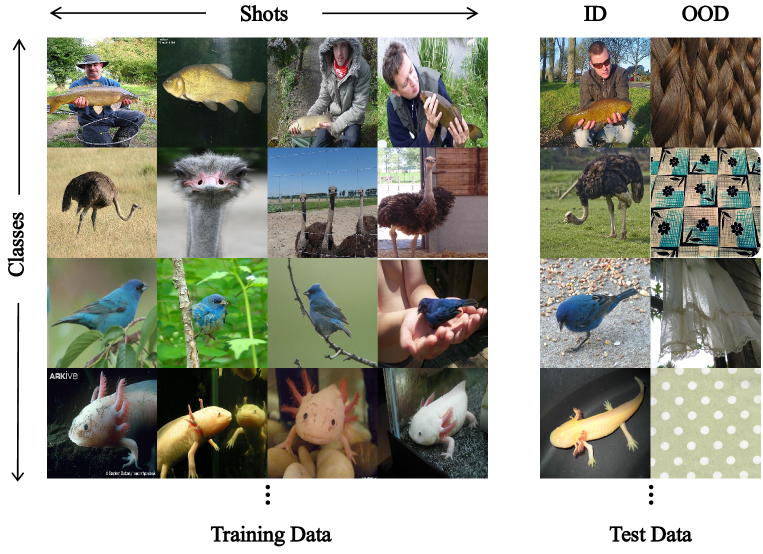
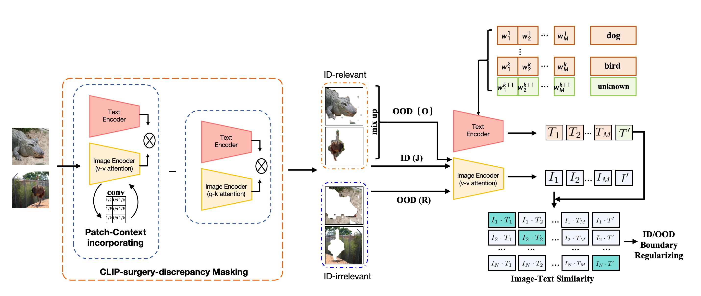
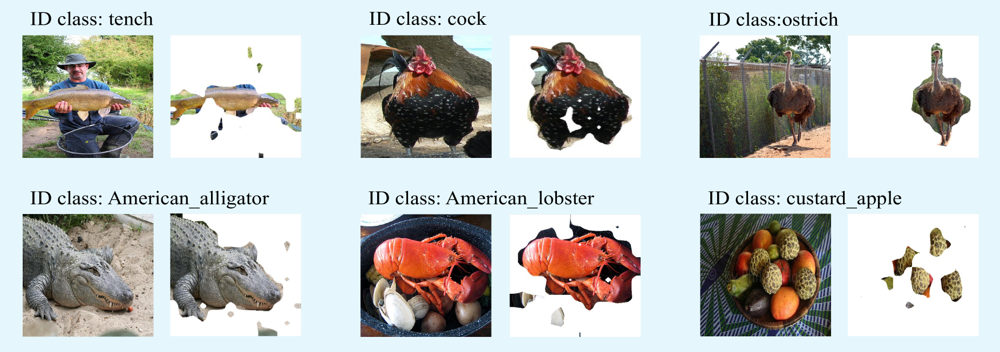
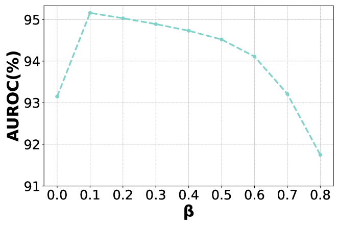
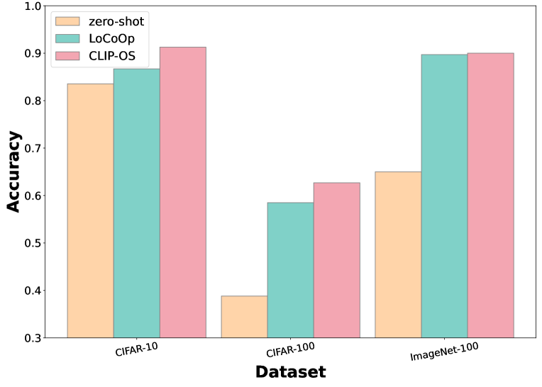

# 借助CLIP技术，我们提出了一种针对少量样本的异常检测方法，通过合成异常值来实现。

发布时间：2024年03月30日

`RAG` `计算机视觉` `异常检测`

> CLIP-driven Outliers Synthesis for few-shot OOD detection

# 摘要

> 针对少量样本的OOD识别问题，我们关注如何识别训练时未见过的分布外图像，仅利用有限的标记分布内图像。目前，主流做法依赖于如CLIP这样的大规模视觉-语言模型。但这些方法忽略了一个关键问题：缺乏有效的OOD监督信息，容易造成ID与OOD之间的界限偏颇。为此，我们提出了一种基于CLIP的新型方法——CLIP驱动的异常合成(CLIP-OS)。CLIP-OS首先通过创新的补丁均匀卷积强化对补丁级特征的识别，并运用CLIP-surgery-discrepancy技术，智能提取与ID相关的信息比例，实现与ID不相关信息的区分。接着，通过融合不同类别的ID特征，CLIP-OS创造出可信的OOD数据，为模型提供必要的OOD监督信息。此外，CLIP-OS采用未知感知提示学习，利用合成的OOD样本进一步提升ID与OOD的区分度。经过多个基准测试验证，CLIP-OS在少样本OOD检测方面展现出卓越的性能。

> Few-shot OOD detection focuses on recognizing out-of-distribution (OOD) images that belong to classes unseen during training, with the use of only a small number of labeled in-distribution (ID) images. Up to now, a mainstream strategy is based on large-scale vision-language models, such as CLIP. However, these methods overlook a crucial issue: the lack of reliable OOD supervision information, which can lead to biased boundaries between in-distribution (ID) and OOD. To tackle this problem, we propose CLIP-driven Outliers Synthesis~(CLIP-OS). Firstly, CLIP-OS enhances patch-level features' perception by newly proposed patch uniform convolution, and adaptively obtains the proportion of ID-relevant information by employing CLIP-surgery-discrepancy, thus achieving separation between ID-relevant and ID-irrelevant. Next, CLIP-OS synthesizes reliable OOD data by mixing up ID-relevant features from different classes to provide OOD supervision information. Afterward, CLIP-OS leverages synthetic OOD samples by unknown-aware prompt learning to enhance the separability of ID and OOD. Extensive experiments across multiple benchmarks demonstrate that CLIP-OS achieves superior few-shot OOD detection capability.

[Arxiv](https://arxiv.org/abs/2404.00323)