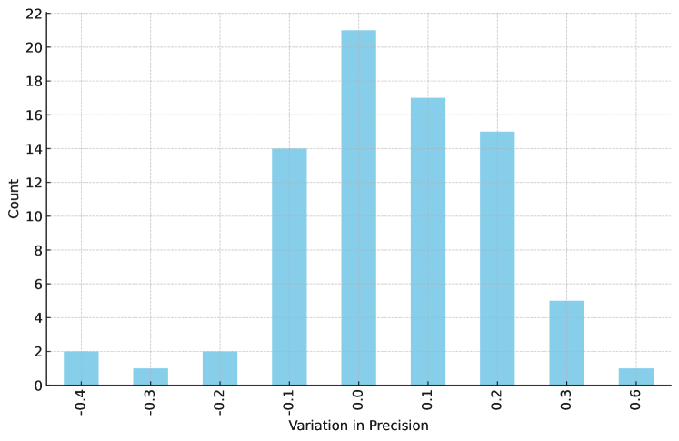

# 大型语言模型能否驾驭数学？深入探索 LLM 在数学领域的 Stack Exchange 互动表现。

发布时间：2024年03月30日

`LLM应用`

> Can LLMs Master Math? Investigating Large Language Models on Math Stack Exchange

# 摘要

> 大型语言模型（LLMs）在众多自然语言处理任务中展现出卓越的能力，往往超越了人类的表现。然而，数学领域因其独特的结构和对精确度的高要求，成为了一个特殊的挑战。本研究通过两步策略，深入探究了LLMs解答数学问题的能力。我们首先利用在数学问题基准测试中表现出色的LLMs，为Math Stack Exchange（MSE）中的78道题目生成答案。接着，我们对其中表现最为出色的LLM进行了个案分析，通过人工评估，细致考察了其答案的质量和准确性。研究结果显示，GPT-4在针对数学问题优化的LLMs中表现最佳（nDCG达到0.48，P@10为0.37），并在ArqMATH3任务1上，以P@10为标准，超越了目前的最佳方法。案例分析揭示，GPT-4虽然能在特定情况下提供相关回答，但并不能始终如一地准确解题。本文深入讨论了LLMs在处理复杂数学问题时所面临的局限。通过个案研究，我们揭示了LLMs在数学领域的能力短板，为未来AI在数学推理领域的研究和进步铺平了道路。我们的代码和研究成果已公开，供学术界研究之用：\url{https://github.com/gipplab/LLM-Investig-MathStackExchange}。

> Large Language Models (LLMs) have demonstrated exceptional capabilities in various natural language tasks, often achieving performances that surpass those of humans. Despite these advancements, the domain of mathematics presents a distinctive challenge, primarily due to its specialized structure and the precision it demands. In this study, we adopted a two-step approach for investigating the proficiency of LLMs in answering mathematical questions. First, we employ the most effective LLMs, as identified by their performance on math question-answer benchmarks, to generate answers to 78 questions from the Math Stack Exchange (MSE). Second, a case analysis is conducted on the LLM that showed the highest performance, focusing on the quality and accuracy of its answers through manual evaluation. We found that GPT-4 performs best (nDCG of 0.48 and P@10 of 0.37) amongst existing LLMs fine-tuned for answering mathematics questions and outperforms the current best approach on ArqMATH3 Task1, considering P@10. Our Case analysis indicates that while the GPT-4 can generate relevant responses in certain instances, it does not consistently answer all questions accurately. This paper explores the current limitations of LLMs in navigating complex mathematical problem-solving. Through case analysis, we shed light on the gaps in LLM capabilities within mathematics, thereby setting the stage for future research and advancements in AI-driven mathematical reasoning. We make our code and findings publicly available for research: \url{https://github.com/gipplab/LLM-Investig-MathStackExchange}

[Arxiv](https://arxiv.org/abs/2404.00344)