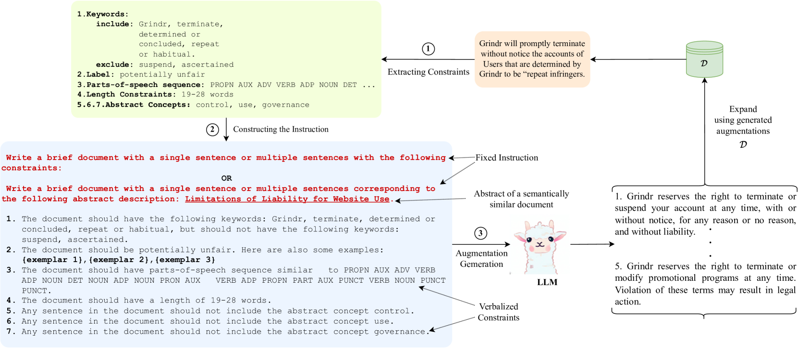
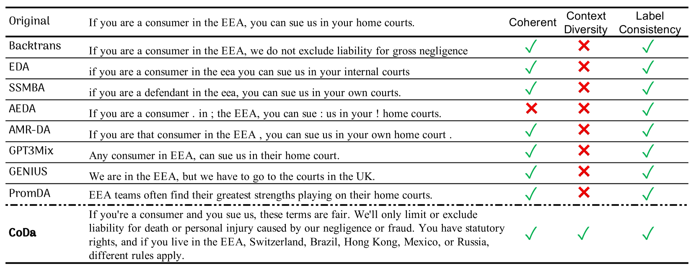
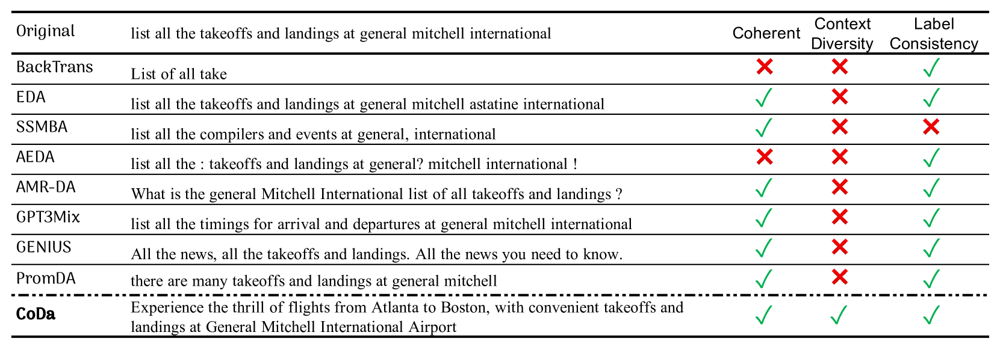
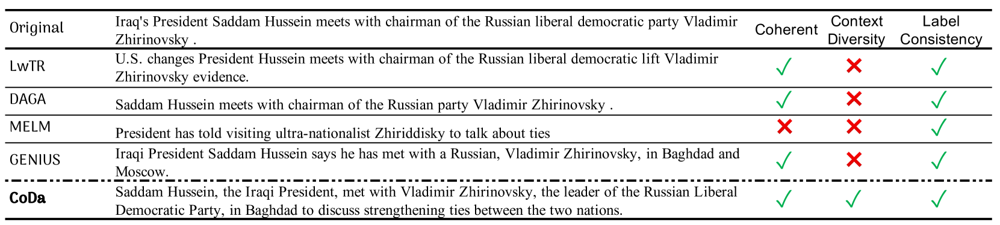
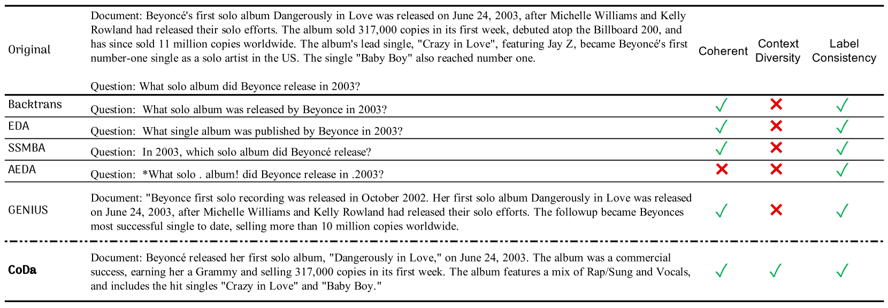

# CoDa：针对低资源NLP的约束生成数据增强技术

发布时间：2024年03月30日

`LLM应用` `数据增强`

> CoDa: Constrained Generation based Data Augmentation for Low-Resource NLP

# 摘要

> 我们推出了CoDa，这是一种新颖的数据增强方法，专为资源匮乏的NLP领域设计，它通过引导现成的大型语言模型生成符合特定约束的文本。我们从低资源数据集的每个样本中提炼出简单约束，并将其转化为模型的提示，以创造出新的多样化训练样本。研究结果表明，这些遵循简单规则的合成数据在增强下游数据集时表现出色，CoDa避免了复杂的解码技术和对少量训练样本的过度拟合。CoDa还是首个让用户能够明确控制数据增强过程的框架，便于在不同领域进行调整。我们在11个涵盖3种任务和3种低资源环境的数据集上验证了CoDa的有效性，其表现在质量和数量上均超越了基线水平，提升幅度从0.12%到7.19%不等。相关代码已在GitHub上公开：https://github.com/Sreyan88/CoDa。

> We present CoDa (Constrained Generation based Data Augmentation), a controllable, effective, and training-free data augmentation technique for low-resource (data-scarce) NLP. Our approach is based on prompting off-the-shelf instruction-following Large Language Models (LLMs) for generating text that satisfies a set of constraints. Precisely, we extract a set of simple constraints from every instance in the low-resource dataset and verbalize them to prompt an LLM to generate novel and diverse training instances. Our findings reveal that synthetic data that follows simple constraints in the downstream dataset act as highly effective augmentations, and CoDa can achieve this without intricate decoding-time constrained generation techniques or fine-tuning with complex algorithms that eventually make the model biased toward the small number of training instances. Additionally, CoDa is the first framework that provides users explicit control over the augmentation generation process, thereby also allowing easy adaptation to several domains. We demonstrate the effectiveness of CoDa across 11 datasets spanning 3 tasks and 3 low-resource settings. CoDa outperforms all our baselines, qualitatively and quantitatively, with improvements of 0.12%-7.19%. Code is available here: https://github.com/Sreyan88/CoDa

[Arxiv](https://arxiv.org/abs/2404.00415)