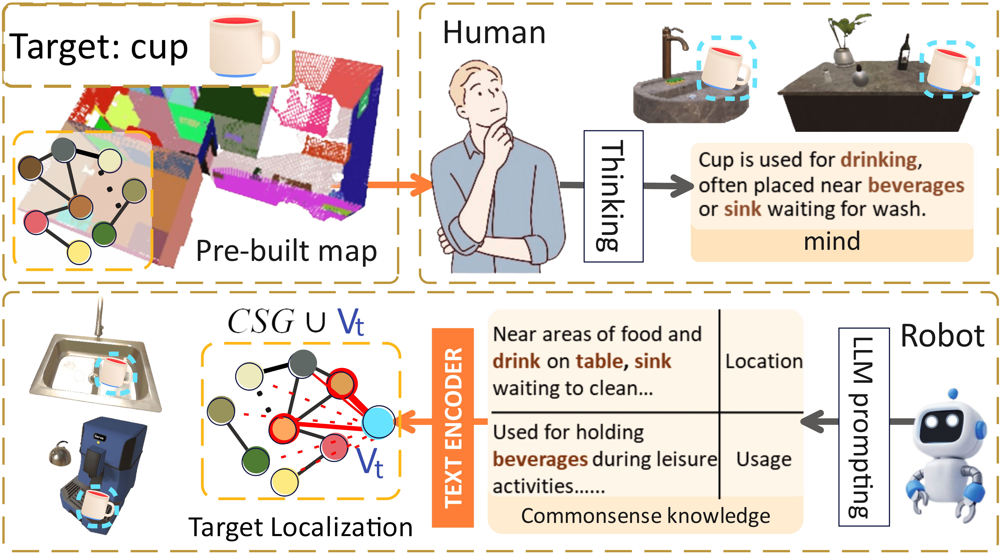
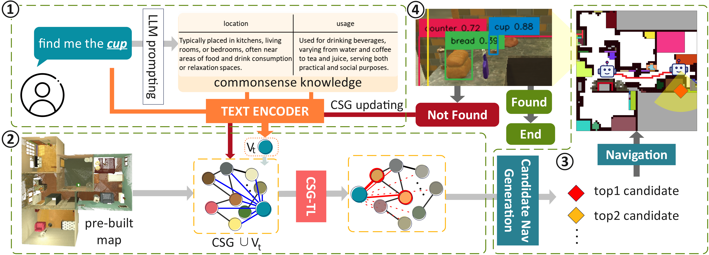
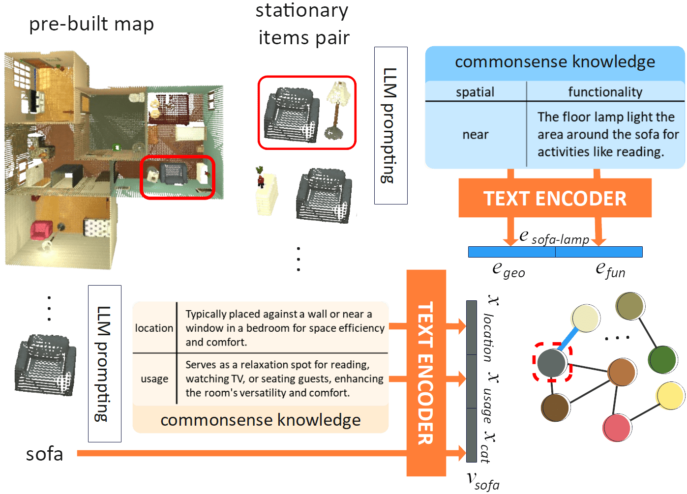
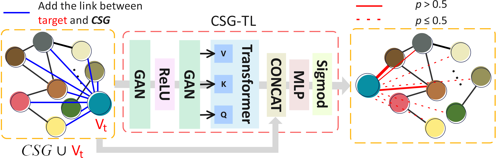
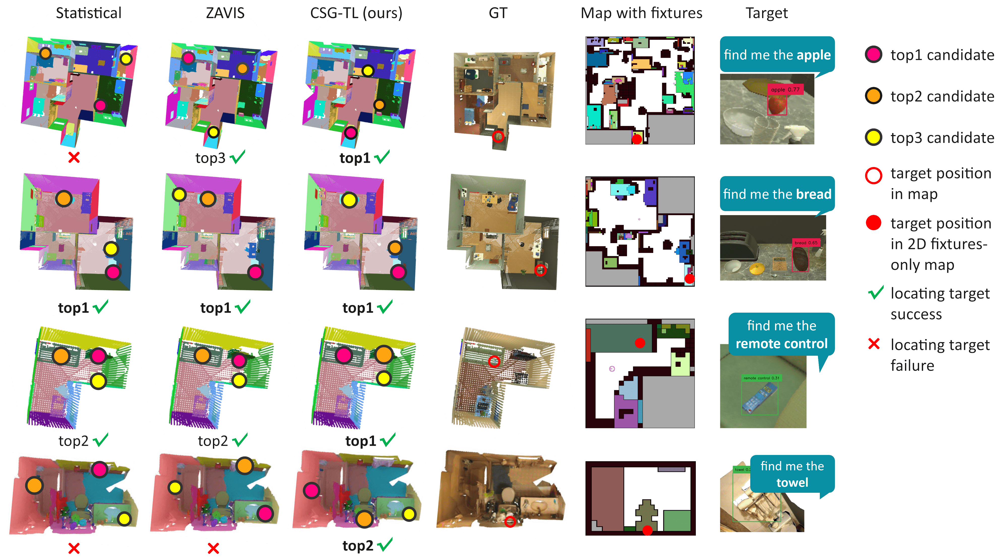
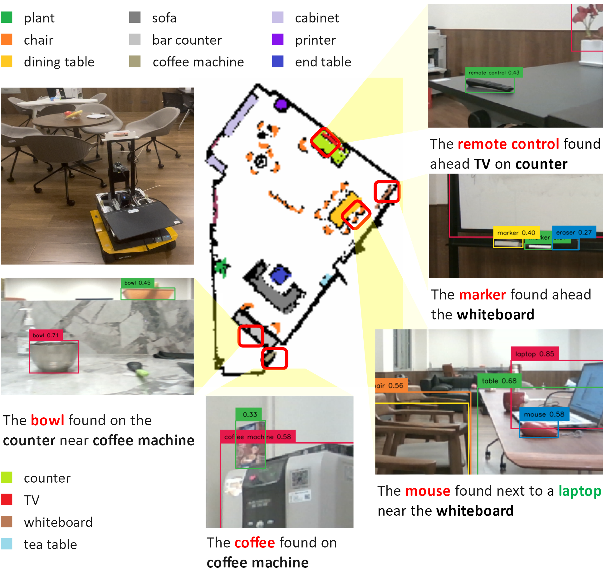

# 通过常识场景图实现目标定位，以优化对象搜索过程。

发布时间：2024年03月30日

`Agent` `家庭自动化` `机器人技术`

> Commonsense Scene Graph-based Target Localization for Object Search

# 摘要

> 家庭机器人要精准找到目标物品，关键在于其定位能力。家庭环境中物品随意摆放的不稳定性，给目标定位带来了难题。机器人要高效地找到目标，需掌握物品和房间两级信息。然而，现有技术仅依赖单一信息源，导致定位效果不理想，搜索效率低下。为此，我们设计了一种基于常识场景图的目标定位技术CSG-TL，利用大型语言模型生成的常识知识，结合固定物品地图，为机器人提供双重信息支持，优化家庭环境中的搜索效率。通过在ScanNet数据集和AI2THOR模拟器上的大量实验，CSG-TL的定位优势得到了验证。我们还将CSG-TL发展成一个目标搜索框架CSG-OS，并在虚拟与现实环境中测试成功。相关代码和演示视频可在https://sites.google.com/view/csg-os查看。

> Object search is a fundamental skill for household robots, yet the core problem lies in the robot's ability to locate the target object accurately. The dynamic nature of household environments, characterized by the arbitrary placement of daily objects by users, makes it challenging to perform target localization. To efficiently locate the target object, the robot needs to be equipped with knowledge at both the object and room level. However, existing approaches rely solely on one type of knowledge, leading to unsatisfactory object localization performance and, consequently, inefficient object search processes. To address this problem, we propose a commonsense scene graph-based target localization, CSG-TL, to enhance target object search in the household environment. Given the pre-built map with stationary items, the robot models the room-level knowledge with object-level commonsense knowledge generated by a large language model (LLM) to a commonsense scene graph (CSG), supporting both types of knowledge for CSG-TL. To demonstrate the superiority of CSG-TL on target localization, extensive experiments are performed on the real-world ScanNet dataset and the AI2THOR simulator. Moreover, we have extended CSG-TL to an object search framework, CSG-OS, validated in both simulated and real-world environments. Code and videos are available at https://sites.google.com/view/csg-os.

[Arxiv](https://arxiv.org/abs/2404.00343)