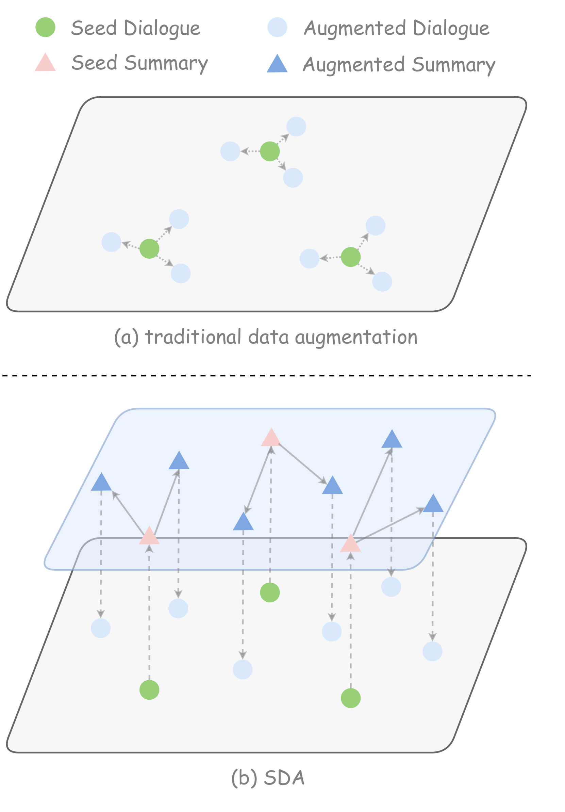
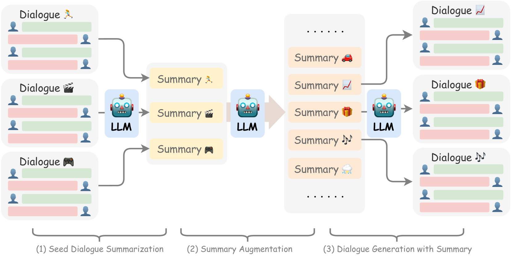
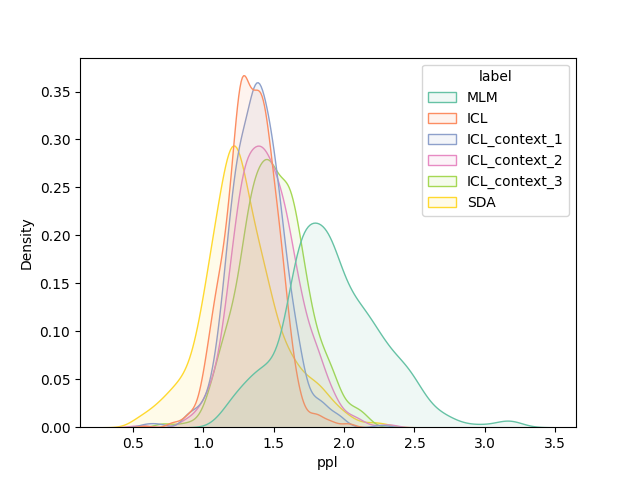
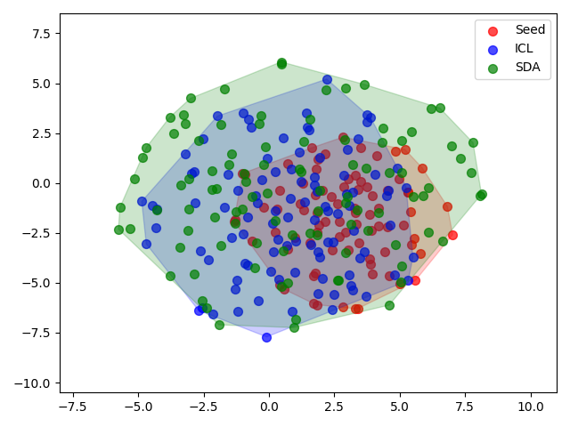
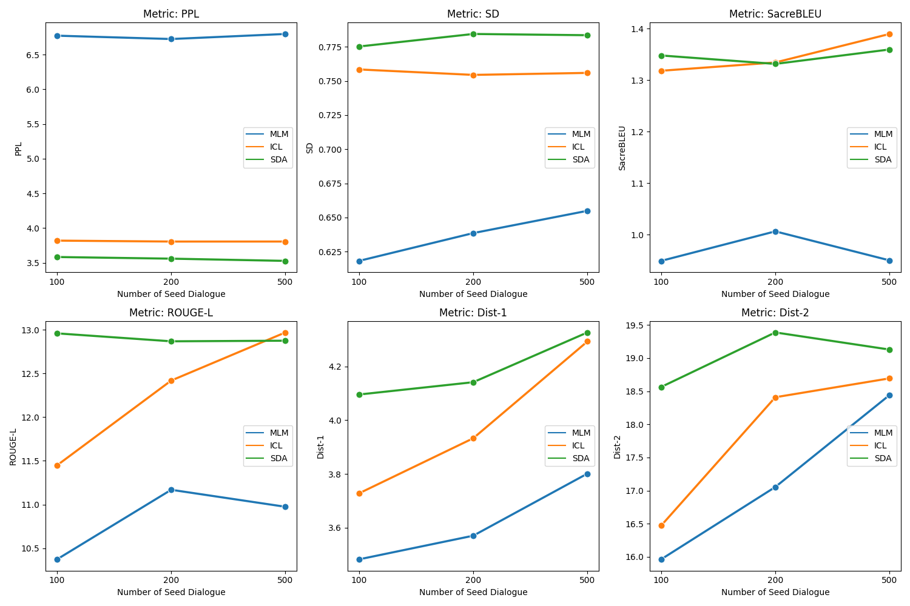

# 在低资源开放领域对话生成中，通过大型语言模型实现可控性和多样性的数据增强。

发布时间：2024年03月30日

`LLM应用` `对话系统` `数据增强`

> Controllable and Diverse Data Augmentation with Large Language Model for Low-Resource Open-Domain Dialogue Generation

# 摘要

> 在开放领域对话生成任务中，数据增强（DA）是解决模型训练不稳定性和过拟合问题的关键。然而，传统方法往往忽略语义多样性，从而影响整体对话质量。借助大型语言模型（LLM），我们能够生成更丰富的对话内容，但这些方法往往缺乏精细控制，生成的对话与原始样本存在分布差异。为了提高多样性并增强控制力，我们引入了一种新颖的方法——基于摘要的对话增强与LLM（SDA）。该方法利用对话摘要作为策略工具，提升了LLM的可控性。即便只有少量的初始数据，SDA也能创造出丰富且多样的高质量对话。我们进一步设计了一种聚类度量标准，用以评估增强后对话的语义多样性。实验表明，SDA能够有效地扩充对话数据集，所增强的数据能够显著提升开放领域对话模型的表现。

> Data augmentation (DA) is crucial to mitigate model training instability and over-fitting problems in low-resource open-domain dialogue generation. However, traditional DA methods often neglect semantic data diversity, restricting the overall quality. Recently, large language models (LLM) have been used for DA to generate diversified dialogues. However, they have limited controllability and tend to generate dialogues with a distribution shift compared to the seed dialogues. To maximize the augmentation diversity and address the controllability problem, we propose \textbf{S}ummary-based \textbf{D}ialogue \textbf{A}ugmentation with LLM (SDA). Our approach enhances the controllability of LLM by using dialogue summaries as a planning tool. Based on summaries, SDA can generate high-quality and diverse dialogue data even with a small seed dataset. To evaluate the efficacy of data augmentation methods for open-domain dialogue, we designed a clustering-based metric to characterize the semantic diversity of the augmented dialogue data. The experimental results show that SDA can augment high-quality and semantically diverse dialogues given a small seed dataset and an LLM, and the augmented data can boost the performance of open-domain dialogue models.

[Arxiv](https://arxiv.org/abs/2404.00361)