# DeFT：一种结合输入输出敏感性的闪速树注意力机制，旨在提升大型语言模型树搜索推理的效率。

发布时间：2024年03月30日

`LLM理论` `推理系统` `计算效率`

> DeFT: Flash Tree-attention with IO-Awareness for Efficient Tree-search-based LLM Inference

# 摘要

> 通过树搜索解码能显著增强基于变换器的大型语言模型（LLMs）的推理效能。依据引导信号，该方法在树结构中寻找最优路径，以提升模型的可控性、推理力和对齐度等。然而，由于计算、内存占用和访问的冗余，现有的树解码策略与推理系统并不匹配，导致推理效率不尽人意。为此，我们提出了DeFT算法，一种IO感知的树注意力机制，它通过两个阶段实现内存高效的注意力计算和较低的内存占用：首先，我们设计了KV引导的树分割策略，合理分组QKV，以提高GPU利用率并减少内存读写；其次，在融合内核中计算各QKV组的部分注意力，再通过树拓扑感知的全局归约策略得到最终结果。得益于KV缓存IO的3.6至4.5倍减少，以及$\mathbf{Q} \mathbf{K}^\top$和Softmax操作IO的25%降低，DeFT在两项实际推理任务中实现了端到端延迟的1.7至2.4倍加速，超越了现有最先进注意力算法。

> Decoding using tree search can greatly enhance the inference quality for transformer-based Large Language Models (LLMs). Depending on the guidance signal, it searches for the best path from root to leaf in the tree by forming LLM outputs to improve controllability, reasoning ability, alignment, et cetera. However, current tree decoding strategies and their inference systems do not suit each other well due to redundancy in computation, memory footprints, and memory access, resulting in inefficient inference. To address this issue, we propose DeFT, an IO-aware tree attention algorithm that maintains memory-efficient attention calculation with low memory footprints in two stages: (1) QKV Preparation: we propose a KV-Guided Tree Split strategy to group QKV wisely for high utilization of GPUs and reduction of memory reads/writes for the KV cache between GPU global memory and on-chip shared memory as much as possible; (2) Attention Calculation: we calculate partial attention of each QKV groups in a fused kernel then apply a Tree-topology-aware Global Reduction strategy to get final attention. Thanks to a reduction in KV cache IO by 3.6-4.5$\times$, along with an additional reduction in IO for $\mathbf{Q} \mathbf{K}^\top$ and Softmax equivalent to 25% of the total KV cache IO, DeFT can achieve a speedup of 1.7-2.4$\times$ in end-to-end latency across two practical reasoning tasks over the SOTA attention algorithms.

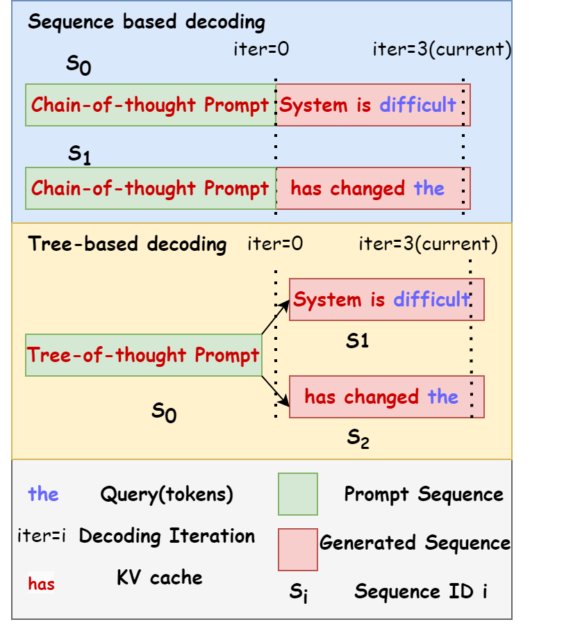

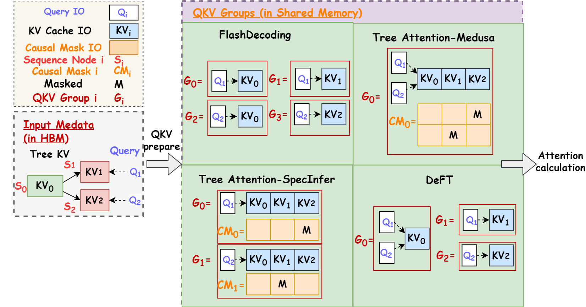

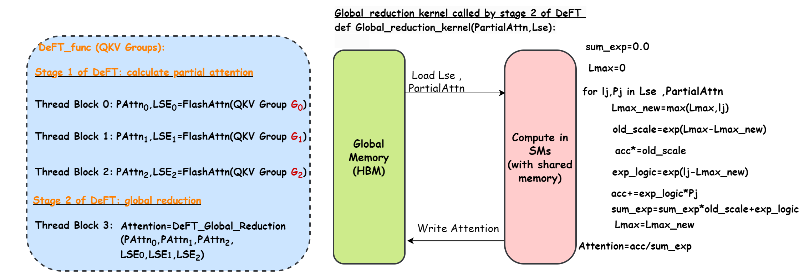

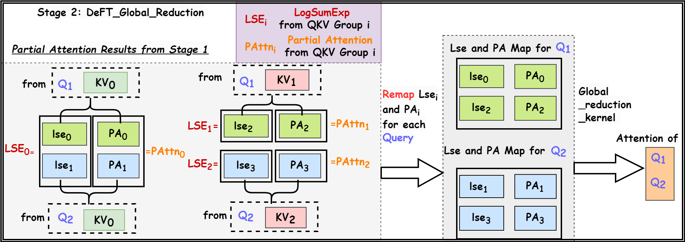

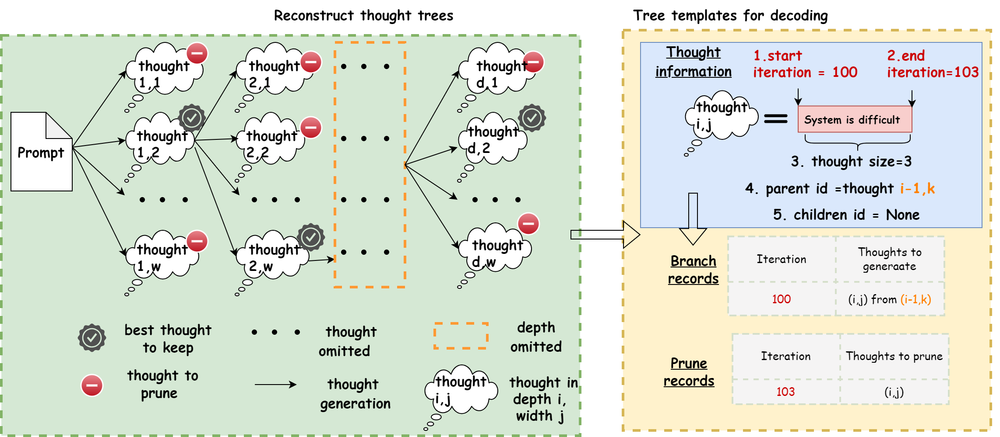

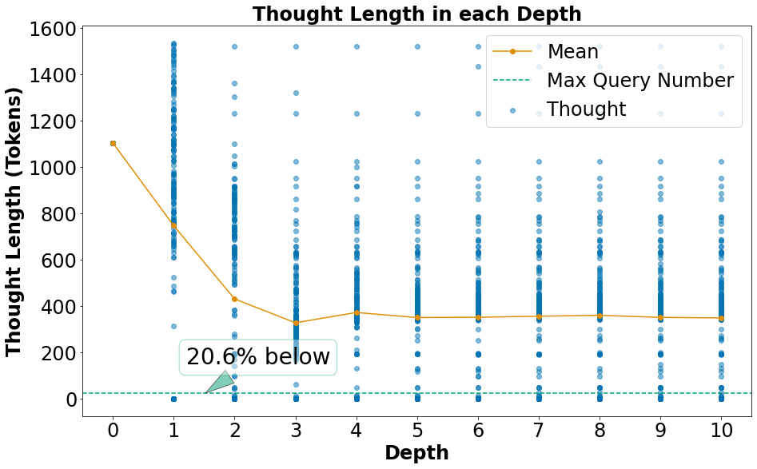

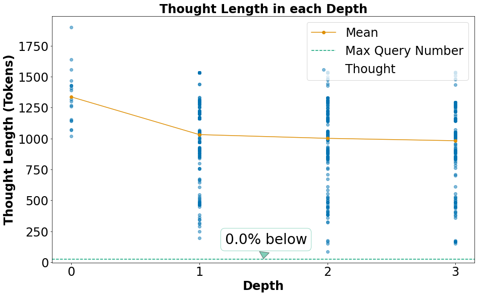

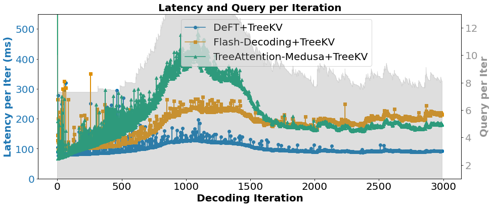

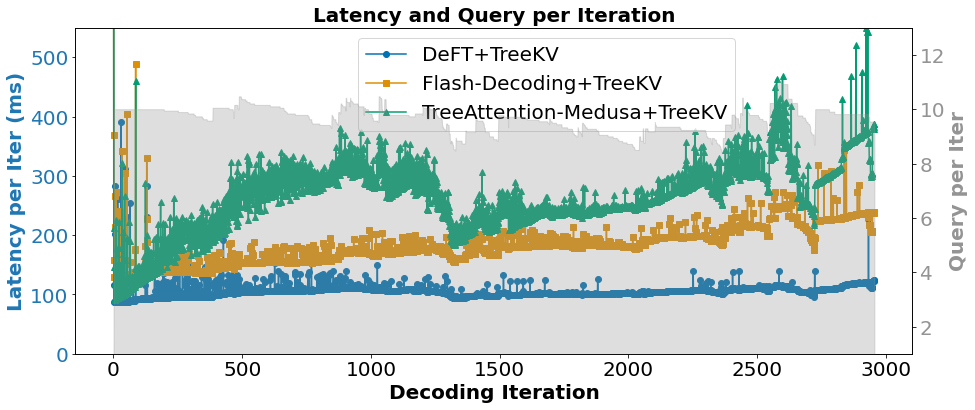

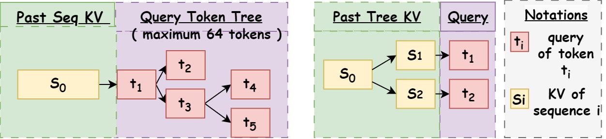

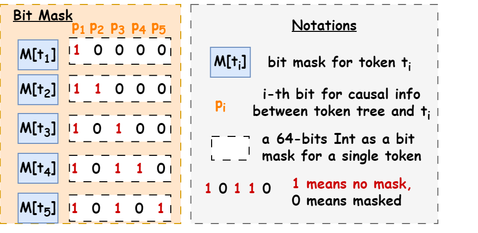

[Arxiv](https://arxiv.org/abs/2404.00242)