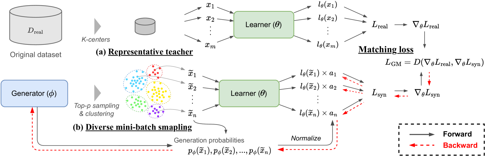
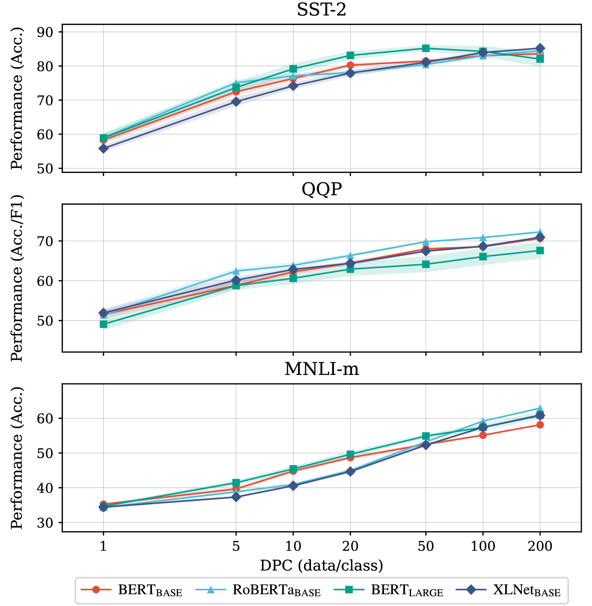

# DiLM：将数据集转化为语言模型，实现文本级别的数据集提炼

发布时间：2024年03月30日

`LLM应用` `文本分类` `数据集蒸馏`

> DiLM: Distilling Dataset into Language Model for Text-level Dataset Distillation

# 摘要

> 数据集蒸馏通过生成少量富有信息的合成样本来精简训练集，让基于这些样本训练的神经网络达到与原始数据集训练相当的性能。现有文本蒸馏技术以词嵌入序列而非文本形式创建样本，以便进行梯度优化，但这样得到的嵌入级数据集不适用于权重不同的其他模型训练。为克服这一局限，我们提出了一种创新方法——DiLM（Distilling dataset into Language Model），通过训练语言模型生成文本形式的合成样本，避免了直接优化样本。在多个文本分类任务中，DiLM生成的合成样本表现优于传统核心集方法。它在不同模型训练和大型语言模型的上下文学习中展现了卓越的泛化能力。相关代码已在GitHub发布，地址为：https://github.com/arumaekawa/DiLM。

> Dataset distillation aims to compress a training dataset by creating a small number of informative synthetic samples such that neural networks trained on them perform as well as those trained on the original training dataset. Current text dataset distillation methods create each synthetic sample as a sequence of word embeddings instead of a text to apply gradient-based optimization; however, such embedding-level distilled datasets cannot be used for training other models whose word embedding weights are different from the model used for distillation. To address this issue, we propose a novel text dataset distillation approach, called Distilling dataset into Language Model (DiLM), which trains a language model to generate informative synthetic training samples as text data, instead of directly optimizing synthetic samples. We evaluated DiLM on various text classification datasets and showed that distilled synthetic datasets from DiLM outperform those from current coreset selection methods. DiLM achieved remarkable generalization performance in training different types of models and in-context learning of large language models. Our code will be available at https://github.com/arumaekawa/DiLM.

[Arxiv](https://arxiv.org/abs/2404.00264)