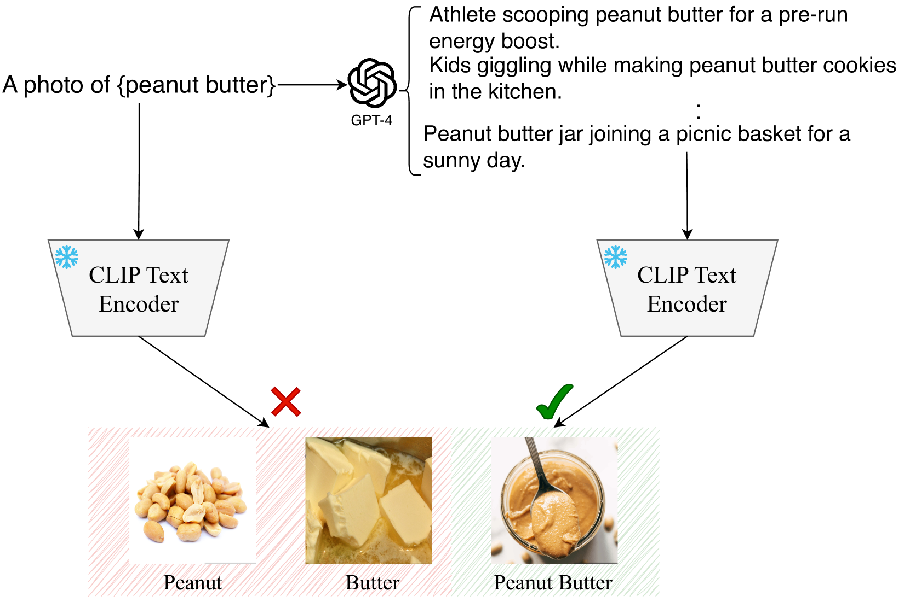
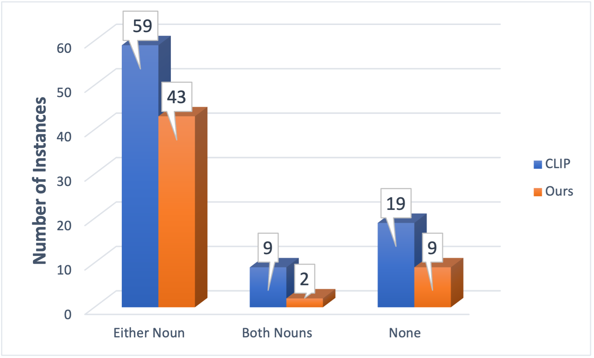
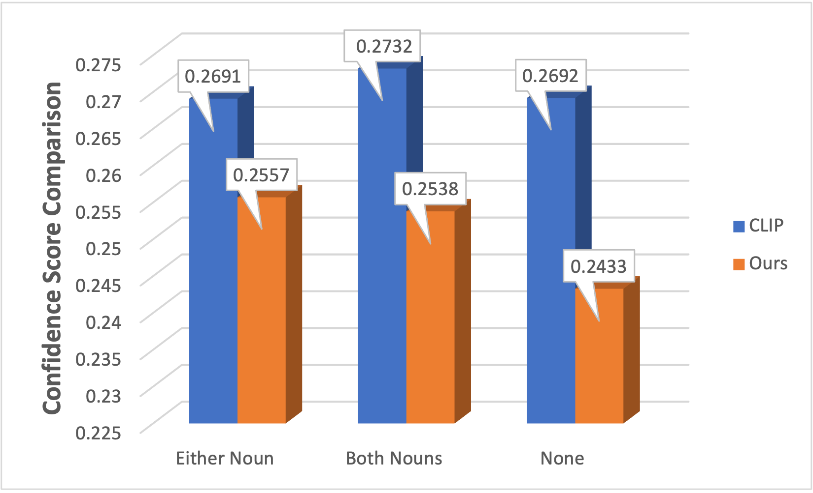

# 视觉与语言模型真的懂得复合名词吗？

发布时间：2024年03月30日

`LLM应用` `视觉-语言模型` `图像检索`

> Do Vision-Language Models Understand Compound Nouns?

# 摘要

> CLIP 等开放词汇视觉-语言模型（VLMs）在文本到图像检索方面展现出巨大潜力。但它们对复合名词（如实验服）的理解是否与对普通名词（如实验室）一样透彻？我们推出了 Compun 基准，汇集 400 个常见复合名词，以测试 VLMs 解释这些词汇的能力。在这个挑战中，模型需在干扰图像中准确识别出与文本提示中的复合名词相对应的图像。深入分析揭示了 CLIP 在理解某些复合名词方面的不足。为此，我们提出了一种新框架，用大型语言模型生成多样化描述，将复合名词融入场景，从而提升了 8.25% 的理解准确率。相关代码和基准数据集已在 GitHub 上发布。

> Open-vocabulary vision-language models (VLMs) like CLIP, trained using contrastive loss, have emerged as a promising new paradigm for text-to-image retrieval. However, do VLMs understand compound nouns (CNs) (e.g., lab coat) as well as they understand nouns (e.g., lab)? We curate Compun, a novel benchmark with 400 unique and commonly used CNs, to evaluate the effectiveness of VLMs in interpreting CNs. The Compun benchmark challenges a VLM for text-to-image retrieval where, given a text prompt with a CN, the task is to select the correct image that shows the CN among a pair of distractor images that show the constituent nouns that make up the CN. Next, we perform an in-depth analysis to highlight CLIPs' limited understanding of certain types of CNs. Finally, we present an alternative framework that moves beyond hand-written templates for text prompts widely used by CLIP-like models. We employ a Large Language Model to generate multiple diverse captions that include the CN as an object in the scene described by the caption. Our proposed method improves CN understanding of CLIP by 8.25% on Compun. Code and benchmark are available at: https://github.com/sonalkum/Compun

[Arxiv](https://arxiv.org/abs/2404.00419)