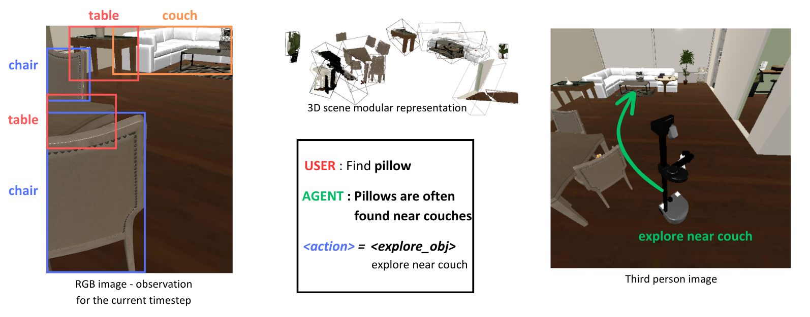
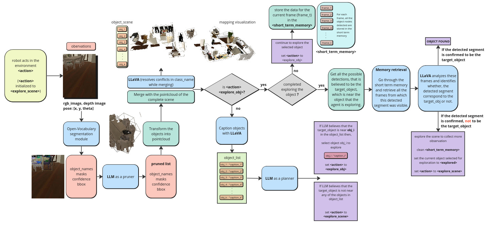
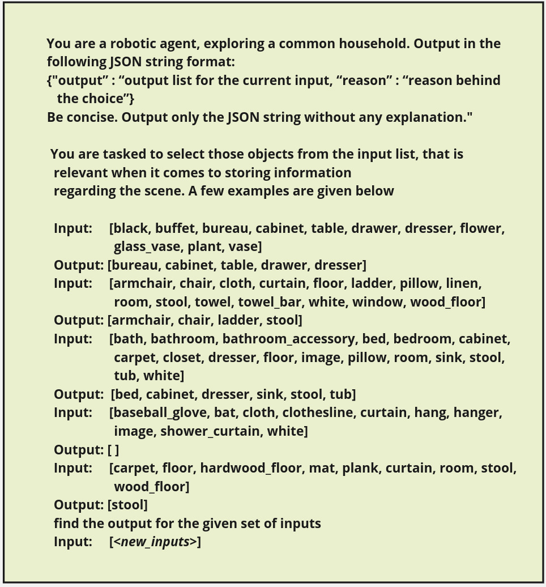
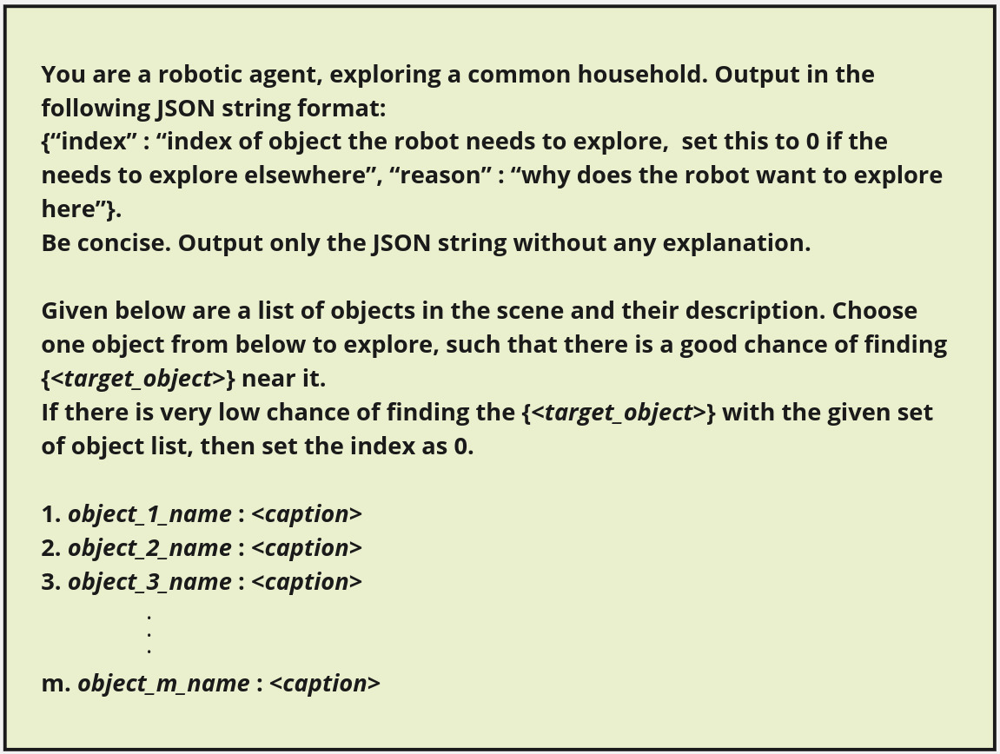

# 借助程序化生成的三维场景，利用大型语言和视觉模型，探索机器人所面临的未知环境。

发布时间：2024年03月30日

`Agent` `机器人` `认知规划`

> Exploring Unseen Environments with Robots using Large Language and Vision Models through a Procedurally Generated 3D Scene Representation

# 摘要

> 生成性人工智能的最新突破，尤其是在大型语言和视觉语言模型领域，为在机器人系统中融入认知规划开辟了新天地。本研究旨在通过模拟人类认知，关注、感知和记忆特定任务信息，并制定相应计划，解决目标导向的导航难题。我们提出了一个全面的框架，利用大型语言和视觉语言模型深入理解世界语义，探索未知环境寻找特定对象。然而，挑战在于如何高效地为LLM呈现机器人周围的环境。我们建议采用3D场景模块化表示法，通过语义丰富的对象描述，为LLM提供与任务息息相关的信息。为避免信息过多导致计划低效，我们提出运用基于LLM的修剪器，借助上下文学习剔除无关信息。

> Recent advancements in Generative Artificial Intelligence, particularly in the realm of Large Language Models (LLMs) and Large Vision Language Models (LVLMs), have enabled the prospect of leveraging cognitive planners within robotic systems. This work focuses on solving the object goal navigation problem by mimicking human cognition to attend, perceive and store task specific information and generate plans with the same. We introduce a comprehensive framework capable of exploring an unfamiliar environment in search of an object by leveraging the capabilities of Large Language Models(LLMs) and Large Vision Language Models (LVLMs) in understanding the underlying semantics of our world. A challenging task in using LLMs to generate high level sub-goals is to efficiently represent the environment around the robot. We propose to use a 3D scene modular representation, with semantically rich descriptions of the object, to provide the LLM with task relevant information. But providing the LLM with a mass of contextual information (rich 3D scene semantic representation), can lead to redundant and inefficient plans. We propose to use an LLM based pruner that leverages the capabilities of in-context learning to prune out irrelevant goal specific information.

[Arxiv](https://arxiv.org/abs/2404.00318)