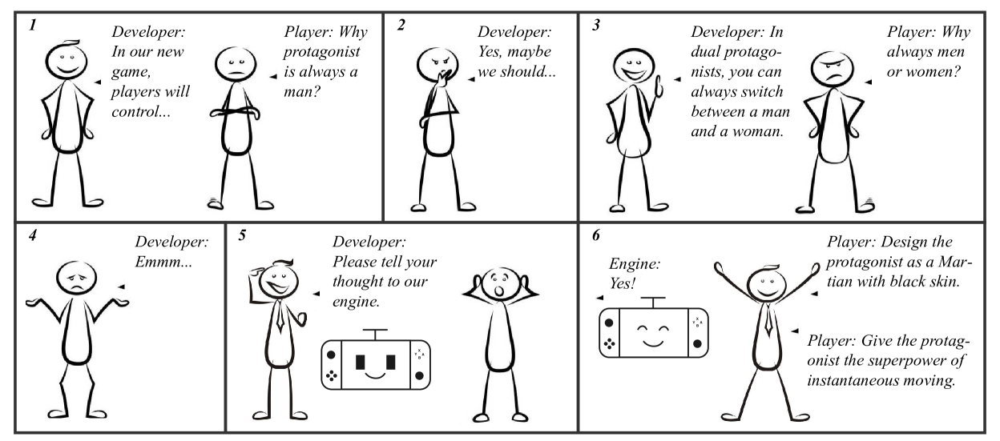
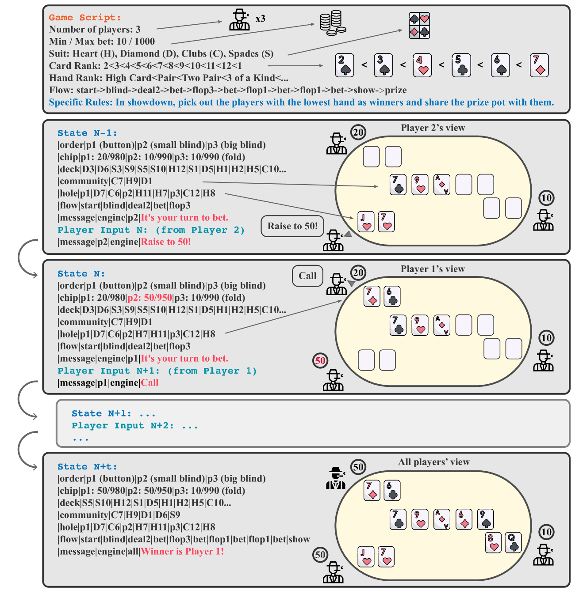
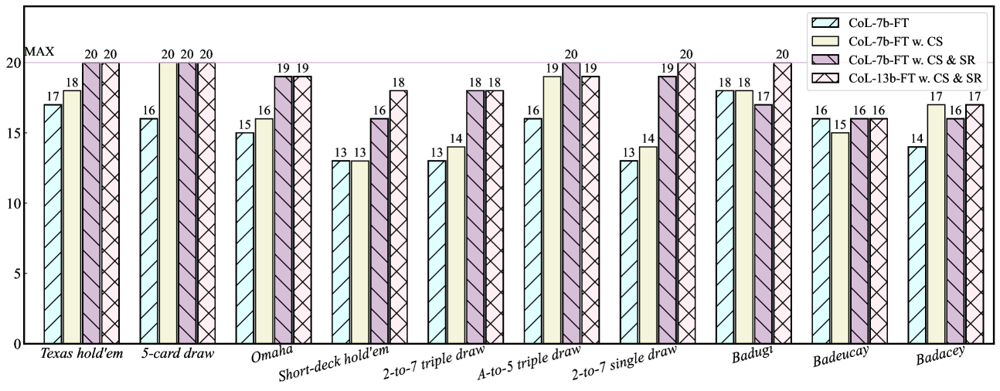
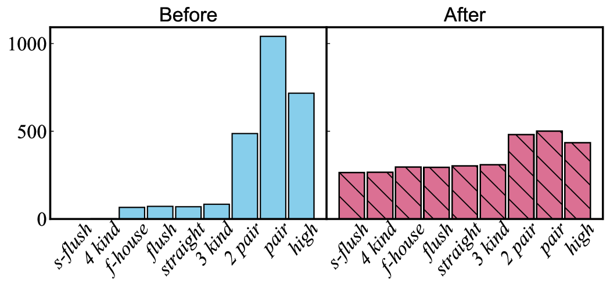

# 在大型语言模型上，通过指令驱动的游戏引擎展现出了新的可能性。

发布时间：2024年03月30日

`LLM应用` `游戏开发`

> Instruction-Driven Game Engines on Large Language Models

# 摘要

> Instruction-Driven Game Engine（IDGE）项目致力于通过让大型语言模型（LLM）遵循灵活的游戏规则并自动生成游戏过程，来普及游戏开发。通过简单的自然语言指令，IDGE 让用户轻松创建游戏，大大降低了游戏开发的难度。我们将 IDGE 的学习过程视作下一状态预测任务，即模型根据玩家操作递归预测游戏状态。鉴于游戏状态计算的精确性至关重要，微小差池都可能干扰游戏体验，我们采用循序渐进的课程训练方法，逐步提升模型处理复杂情境的能力。我们在扑克游戏上取得了初步成果，开发的 IDGE 不仅支持多种扑克玩法，还能通过自然语言输入灵活定制规则。此外，它还能基于极少量样本快速开发新游戏，为游戏开发带来了一种新的范式，即依靠最少的提示和数据工程。这项工作为未来指令驱动游戏创作的进一步发展奠定了基础，预示着游戏设计和玩法的潜在变革。

> The Instruction-Driven Game Engine (IDGE) project aims to democratize game development by enabling a large language model (LLM) to follow free-form game rules and autonomously generate game-play processes. The IDGE allows users to create games by issuing simple natural language instructions, which significantly lowers the barrier for game development. We approach the learning process for IDGEs as a Next State Prediction task, wherein the model autoregressively predicts in-game states given player actions. It is a challenging task because the computation of in-game states must be precise; otherwise, slight errors could disrupt the game-play. To address this, we train the IDGE in a curriculum manner that progressively increases the model's exposure to complex scenarios.
  Our initial progress lies in developing an IDGE for Poker, a universally cherished card game. The engine we've designed not only supports a wide range of poker variants but also allows for high customization of rules through natural language inputs. Furthermore, it also favors rapid prototyping of new games from minimal samples, proposing an innovative paradigm in game development that relies on minimal prompt and data engineering. This work lays the groundwork for future advancements in instruction-driven game creation, potentially transforming how games are designed and played.

[Arxiv](https://arxiv.org/abs/2404.00276)