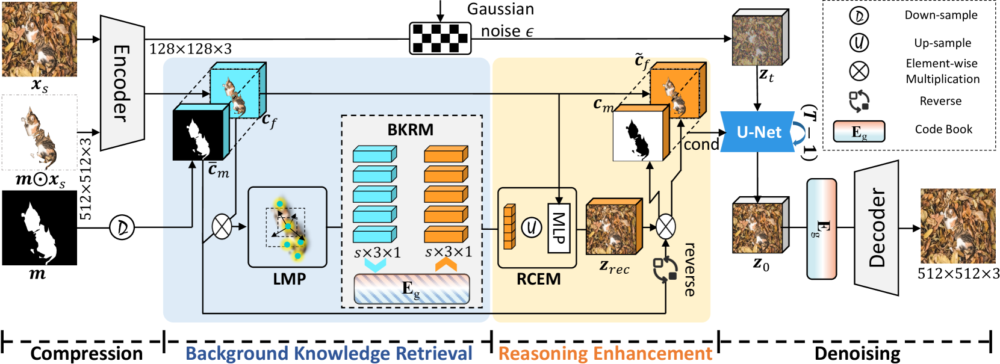
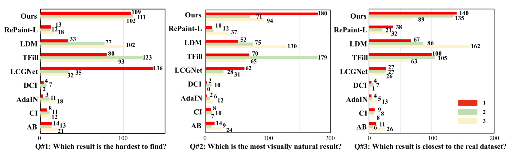

# LAKE-RED：利用潜在背景知识检索技术，扩散模型打造隐蔽伪装图像

发布时间：2024年03月30日

`Agent` `视觉识别` `计算机视觉`

> LAKE-RED: Camouflaged Images Generation by Latent Background Knowledge Retrieval-Augmented Diffusion

# 摘要

> 伪装视觉识别，实用而关键，却因数据集物种类别的局限性和高昂的成本而受阻。现有伪装生成技术需手动设定背景，限制了样本多样性的发展。本文提出了一种新颖的潜在背景知识检索增强扩散技术（LAKE-RED），用于生成伪装图像。这是首次提出无需背景输入的生成范式，LAKE-RED作为首个具备可解释性的伪装图像生成方法，通过分离知识检索与推理增强，有效应对特定任务挑战。该方法不受特定前景或背景限制，拓宽了伪装视觉识别的应用范围。实验证明，我们的方法超越了现有技术，创造出更加真实的伪装图像。

> Camouflaged vision perception is an important vision task with numerous practical applications. Due to the expensive collection and labeling costs, this community struggles with a major bottleneck that the species category of its datasets is limited to a small number of object species. However, the existing camouflaged generation methods require specifying the background manually, thus failing to extend the camouflaged sample diversity in a low-cost manner. In this paper, we propose a Latent Background Knowledge Retrieval-Augmented Diffusion (LAKE-RED) for camouflaged image generation. To our knowledge, our contributions mainly include: (1) For the first time, we propose a camouflaged generation paradigm that does not need to receive any background inputs. (2) Our LAKE-RED is the first knowledge retrieval-augmented method with interpretability for camouflaged generation, in which we propose an idea that knowledge retrieval and reasoning enhancement are separated explicitly, to alleviate the task-specific challenges. Moreover, our method is not restricted to specific foreground targets or backgrounds, offering a potential for extending camouflaged vision perception to more diverse domains. (3) Experimental results demonstrate that our method outperforms the existing approaches, generating more realistic camouflage images.

[Arxiv](https://arxiv.org/abs/2404.00292)