# MaGRITTe：结合图像、顶视图和文本，实现三维世界的操控与创造

发布时间：2024年03月30日

`RAG` `三维建模` `人工智能`

> MaGRITTe: Manipulative and Generative 3D Realization from Image, Topview and Text

# 摘要

> 通过用户自定义条件生成3D场景，为缓解三维应用的开发压力开辟了新路径。与以往研究相比，我们提出的方法通过简化控制条件，大大降低了场景构建的难度。我们的方法利用部分图像、顶视图布局信息和文本提示，在多模态条件下控制和生成3D场景。这一过程主要包括两大挑战：构建庞大的数据集、处理多模态条件间的交互作用，以及减少对特定领域的依赖。我们将3D场景的生成分为两个步骤：首先从给定条件生成2D图像，再将2D图像转化为3D场景。通过微调预训练的文本到图像模型，并结合小型人工数据集，我们实现了2D图像的生成；接着，通过布局信息引导的深度估计和神经辐射场技术（NeRF），我们成功构建了3D场景，避免了大规模数据集的需求。此外，通过360度全景图像共享空间信息，我们有效考虑了多模态条件的交互，并降低了对特定领域的依赖。实验结果显示，我们的方法能够根据多模态条件，在室内外等多种场景中生成多样化的3D场景。

> The generation of 3D scenes from user-specified conditions offers a promising avenue for alleviating the production burden in 3D applications. Previous studies required significant effort to realize the desired scene, owing to limited control conditions. We propose a method for controlling and generating 3D scenes under multimodal conditions using partial images, layout information represented in the top view, and text prompts. Combining these conditions to generate a 3D scene involves the following significant difficulties: (1) the creation of large datasets, (2) reflection on the interaction of multimodal conditions, and (3) domain dependence of the layout conditions. We decompose the process of 3D scene generation into 2D image generation from the given conditions and 3D scene generation from 2D images. 2D image generation is achieved by fine-tuning a pretrained text-to-image model with a small artificial dataset of partial images and layouts, and 3D scene generation is achieved by layout-conditioned depth estimation and neural radiance fields (NeRF), thereby avoiding the creation of large datasets. The use of a common representation of spatial information using 360-degree images allows for the consideration of multimodal condition interactions and reduces the domain dependence of the layout control. The experimental results qualitatively and quantitatively demonstrated that the proposed method can generate 3D scenes in diverse domains, from indoor to outdoor, according to multimodal conditions.

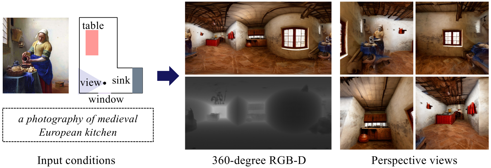

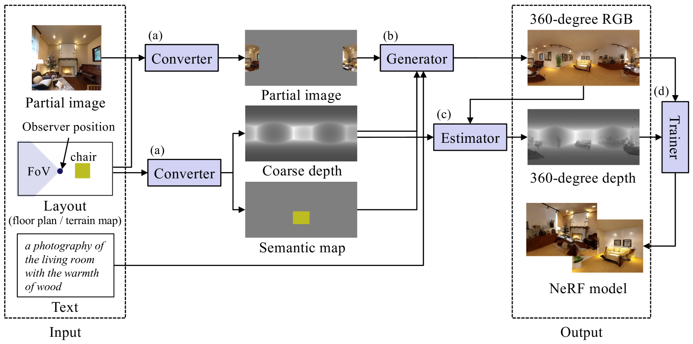

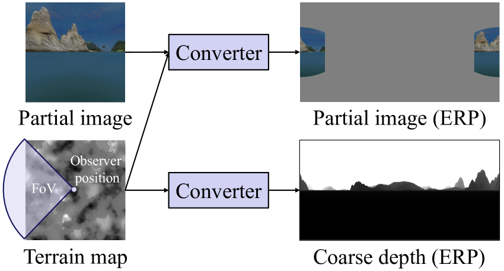

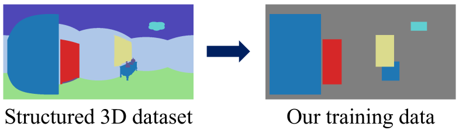

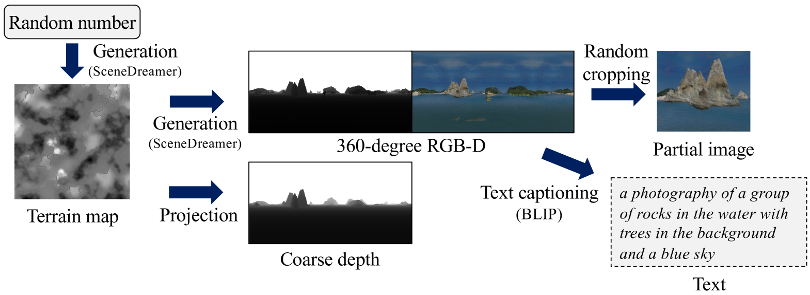

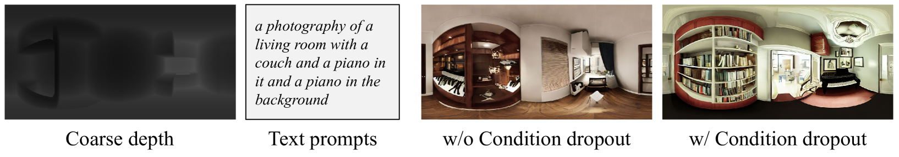

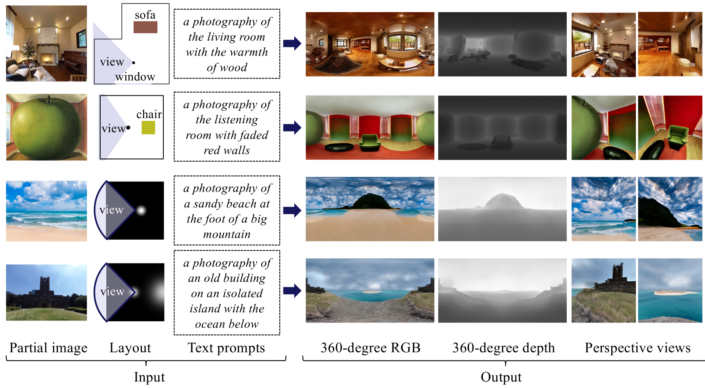

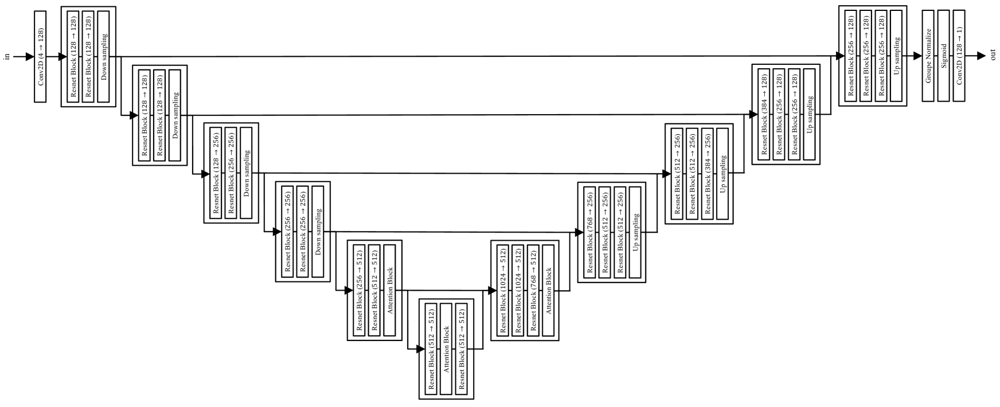

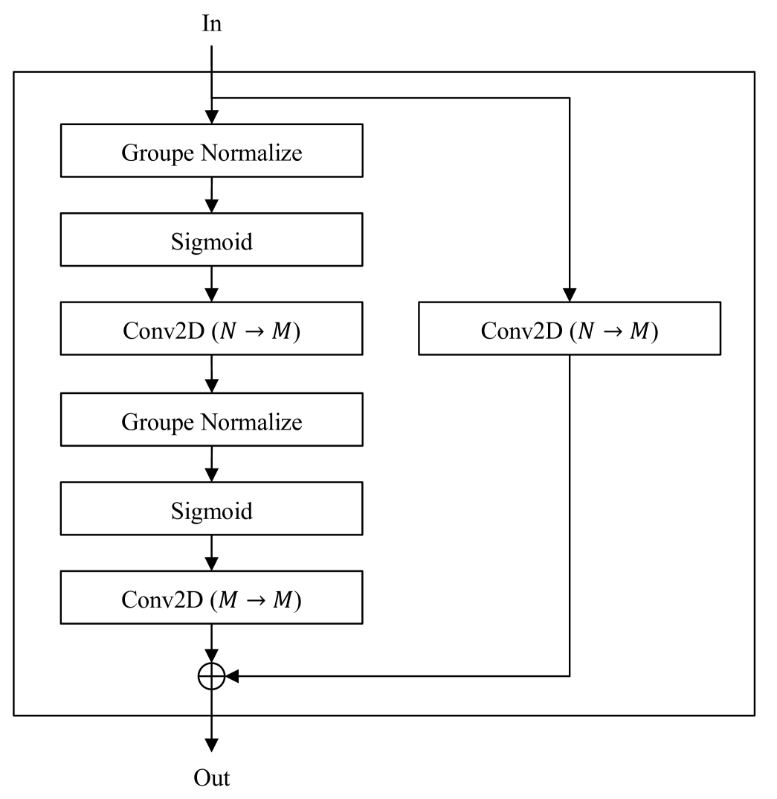

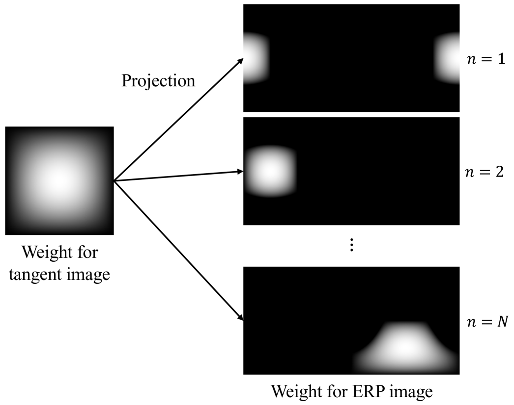

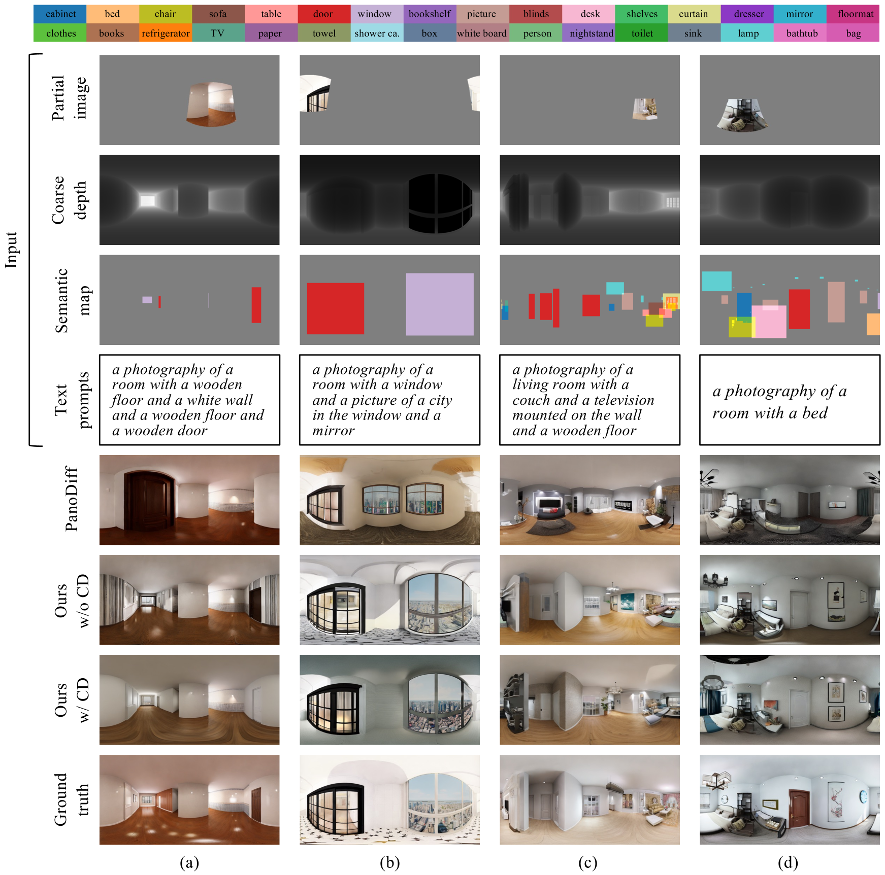

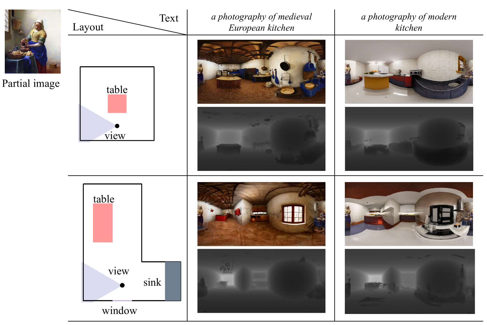

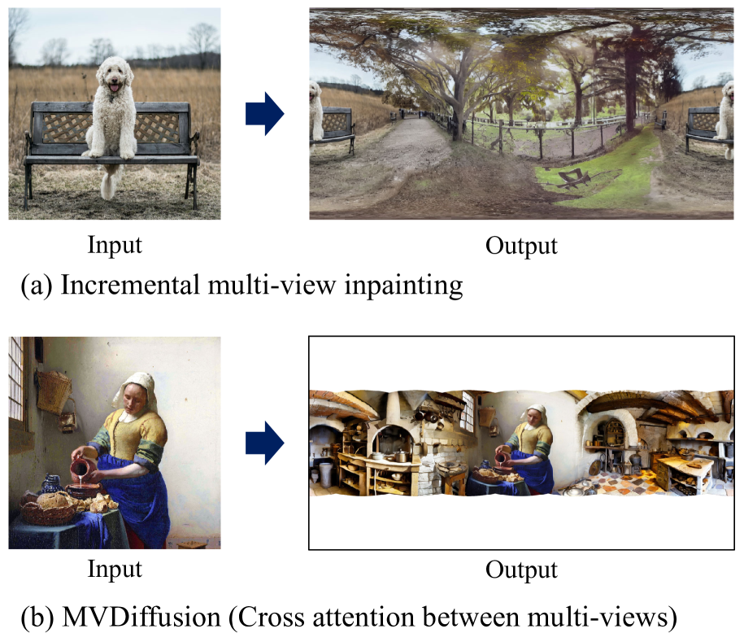

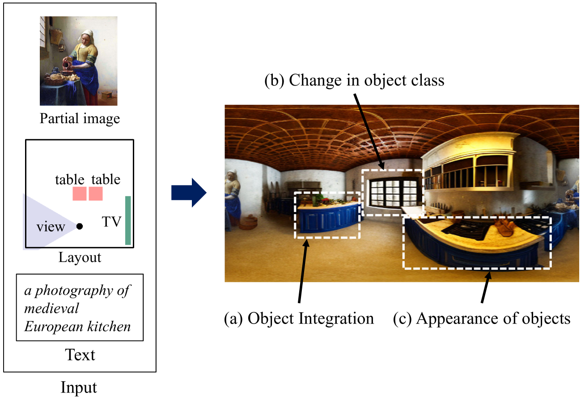

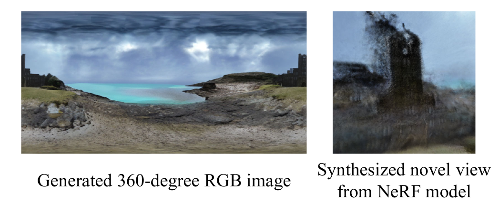

[Arxiv](https://arxiv.org/abs/2404.00345)