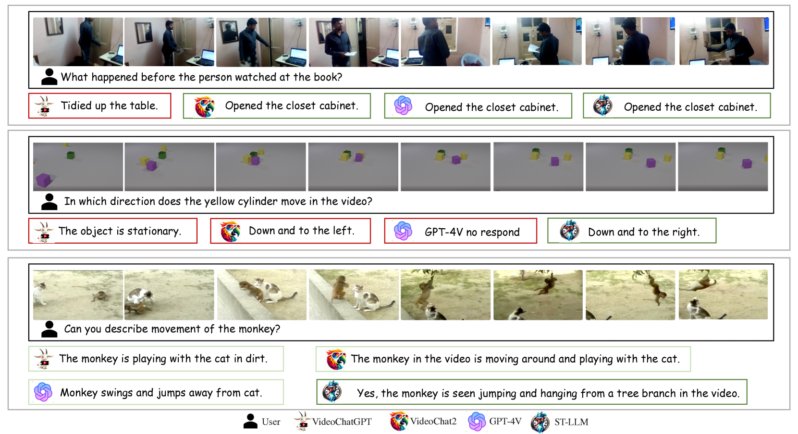
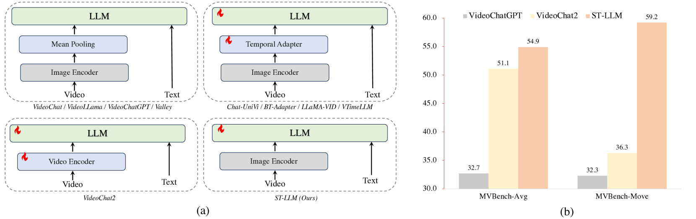
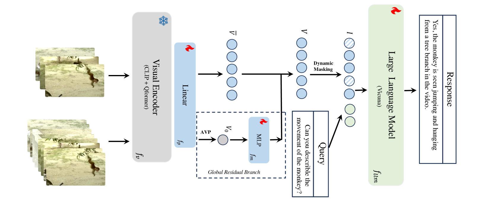
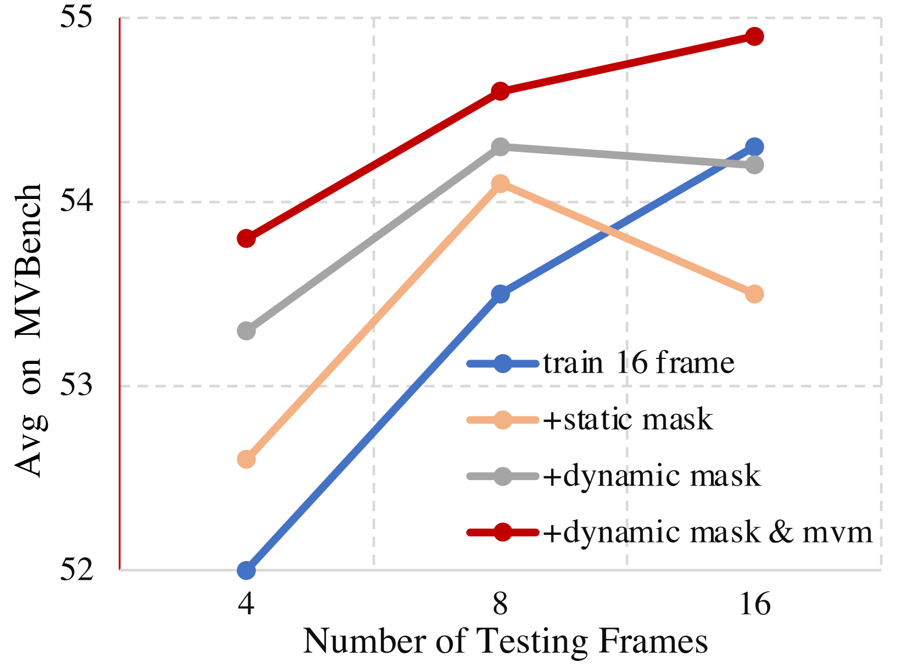
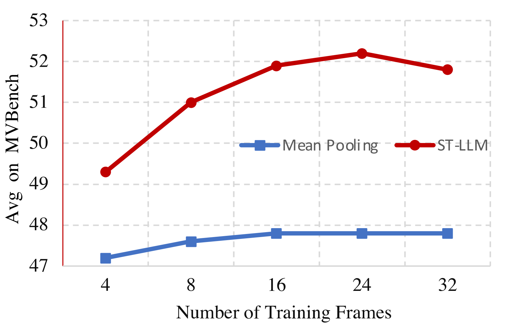
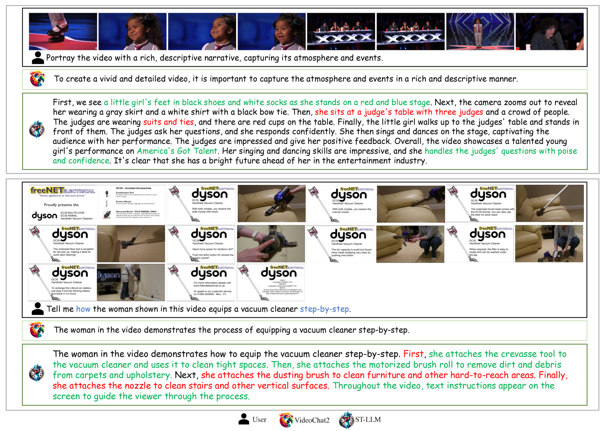

# ST-LLM：大型语言模型展现出作为时间学习者的有效性

发布时间：2024年03月30日

`LLM应用` `视频对话系统` `时空序列建模`

> ST-LLM: Large Language Models Are Effective Temporal Learners

# 摘要

> 大型语言模型（LLM）在文本理解和生成方面表现出色，激发了研究者探索视频LLM的热情，以期在视频层面加强人与AI的互动。但是，如何高效地编码和解析视频内容，在视频对话系统中仍是一个挑战。本文探讨了一个简单却未被充分研究的问题：我们能否将所有时空标记直接输入LLM，让LLM承担视频序列建模的重任？出乎意料的是，这种直接的方法显著提升了视频理解的能力。据此，我们提出了ST-LLM，这是一种新颖的视频LLM基准，内置了时空序列建模功能。为了应对LLM中未压缩视频标记带来的额外负担和稳定性问题，我们设计了一种动态掩码策略，并设定了专门的训练目标。对于长篇视频，我们还引入了一个全局到局部的输入模块，以兼顾效率与效能。因此，ST-LLM在保持高效稳定的同时也能进行精准的时空建模。大量实验验证了我们方法的卓越性能。ST-LLM以更精简的模型和训练流程，在VideoChatGPT-Bench和MVBench上创造了新的最高标准。相关代码已在https://github.com/TencentARC/ST-LLM上发布。

> Large Language Models (LLMs) have showcased impressive capabilities in text comprehension and generation, prompting research efforts towards video LLMs to facilitate human-AI interaction at the video level. However, how to effectively encode and understand videos in video-based dialogue systems remains to be solved. In this paper, we investigate a straightforward yet unexplored question: Can we feed all spatial-temporal tokens into the LLM, thus delegating the task of video sequence modeling to the LLMs? Surprisingly, this simple approach yields significant improvements in video understanding. Based upon this, we propose ST-LLM, an effective video-LLM baseline with Spatial-Temporal sequence modeling inside LLM. Furthermore, to address the overhead and stability issues introduced by uncompressed video tokens within LLMs, we develop a dynamic masking strategy with tailor-made training objectives. For particularly long videos, we have also designed a global-local input module to balance efficiency and effectiveness. Consequently, we harness LLM for proficient spatial-temporal modeling, while upholding efficiency and stability. Extensive experimental results attest to the effectiveness of our method. Through a more concise model and training pipeline, ST-LLM establishes a new state-of-the-art result on VideoChatGPT-Bench and MVBench. Codes have been available at https://github.com/TencentARC/ST-LLM.

[Arxiv](https://arxiv.org/abs/2404.00308)