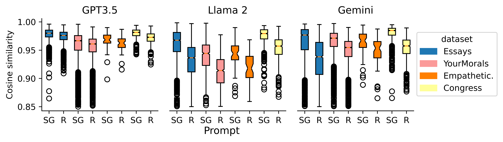
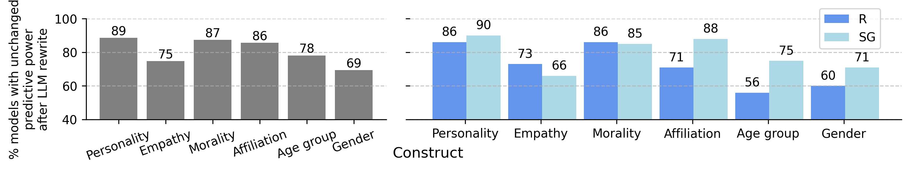
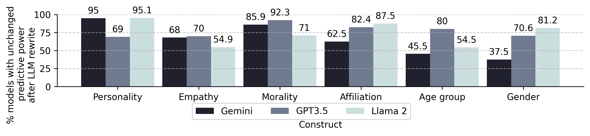
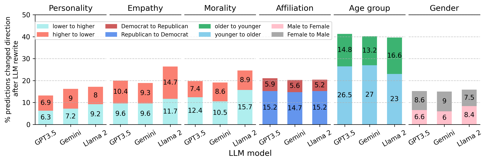
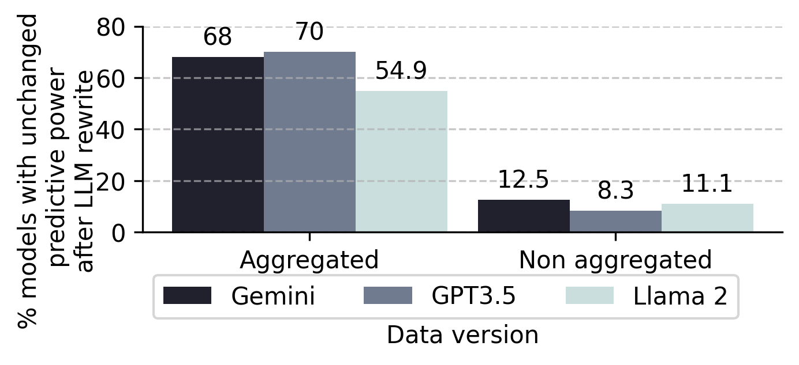
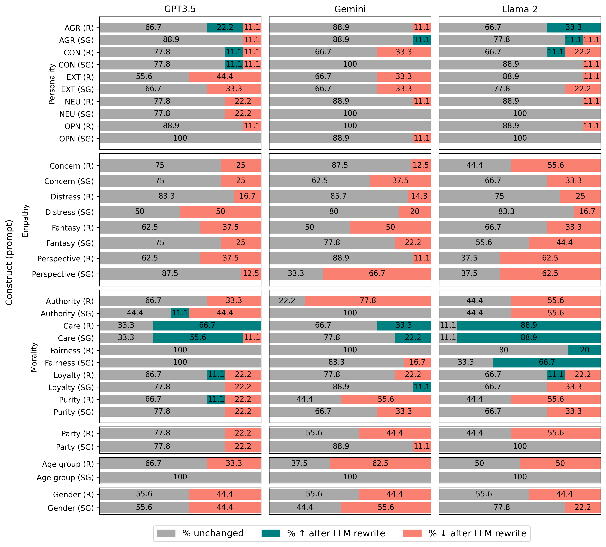
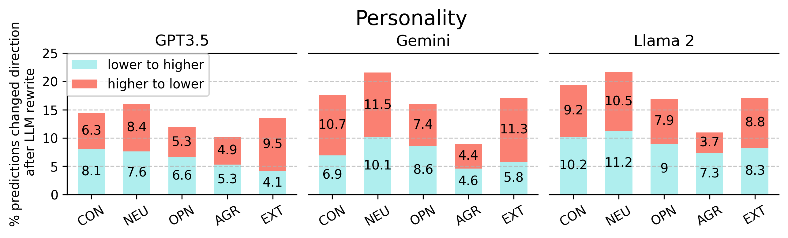
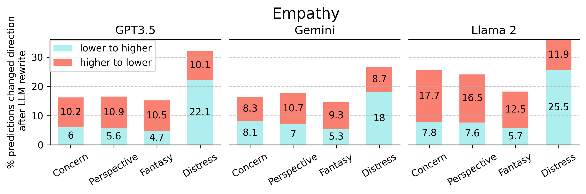
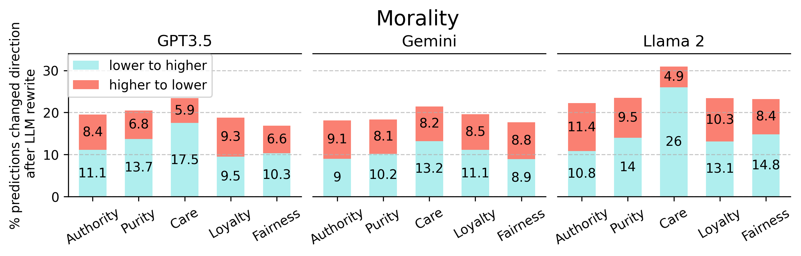

# 揭秘守护者：大型语言模型如何塑造个人特质的语言标识

发布时间：2024年03月30日

`LLM应用` `语言学` `心理学`

> Secret Keepers: The Impact of LLMs on Linguistic Markers of Personal Traits

# 摘要

> 以往的研究已经揭示了人们的语言习惯与其个性特征之间的联系；我们的说话和写作模式能够透露出我们的性格、情绪和信仰。但是，在大型语言模型（LLMs）成为日常写作的得力助手的今天，一个新的疑问应运而生：当LLMs介入创作时，作者的语言风格是否还能准确反映其个性特征？本研究深入探讨了LLMs如何影响我们的语言表现，并进一步分析了GPT3.5、Llama 2和Gemini这三个LLM在性别、年龄、政治立场、性格、同理心和道德六个维度上的表现。研究结果显示，尽管LLMs的应用在一定程度上削弱了语言风格对个性特征的预测力，但这种变化并不显著，LLMs的使用并未完全消除作者语言风格对其个性特征的预测价值。此外，我们还发现，一些理论上基于词汇的语言特征在LLMs辅助写作时，其预测准确性有所下降。这一发现对于在LLMs盛行的时代研究个人特质的语言标记具有深远的影响。

> Prior research has established associations between individuals' language usage and their personal traits; our linguistic patterns reveal information about our personalities, emotional states, and beliefs. However, with the increasing adoption of Large Language Models (LLMs) as writing assistants in everyday writing, a critical question emerges: are authors' linguistic patterns still predictive of their personal traits when LLMs are involved in the writing process? We investigate the impact of LLMs on the linguistic markers of demographic and psychological traits, specifically examining three LLMs - GPT3.5, Llama 2, and Gemini - across six different traits: gender, age, political affiliation, personality, empathy, and morality. Our findings indicate that although the use of LLMs slightly reduces the predictive power of linguistic patterns over authors' personal traits, the significant changes are infrequent, and the use of LLMs does not fully diminish the predictive power of authors' linguistic patterns over their personal traits. We also note that some theoretically established lexical-based linguistic markers lose their reliability as predictors when LLMs are used in the writing process. Our findings have important implications for the study of linguistic markers of personal traits in the age of LLMs.

[Arxiv](https://arxiv.org/abs/2404.00267)