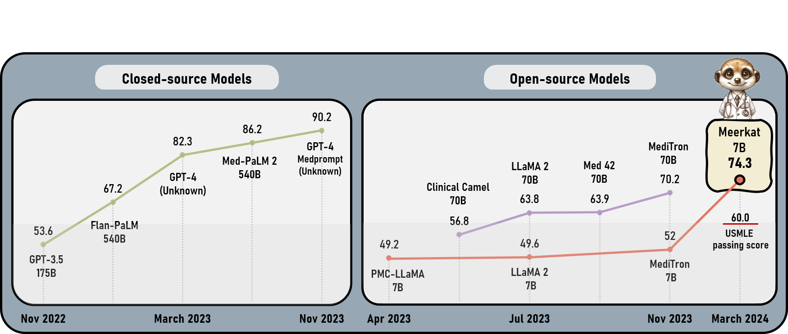
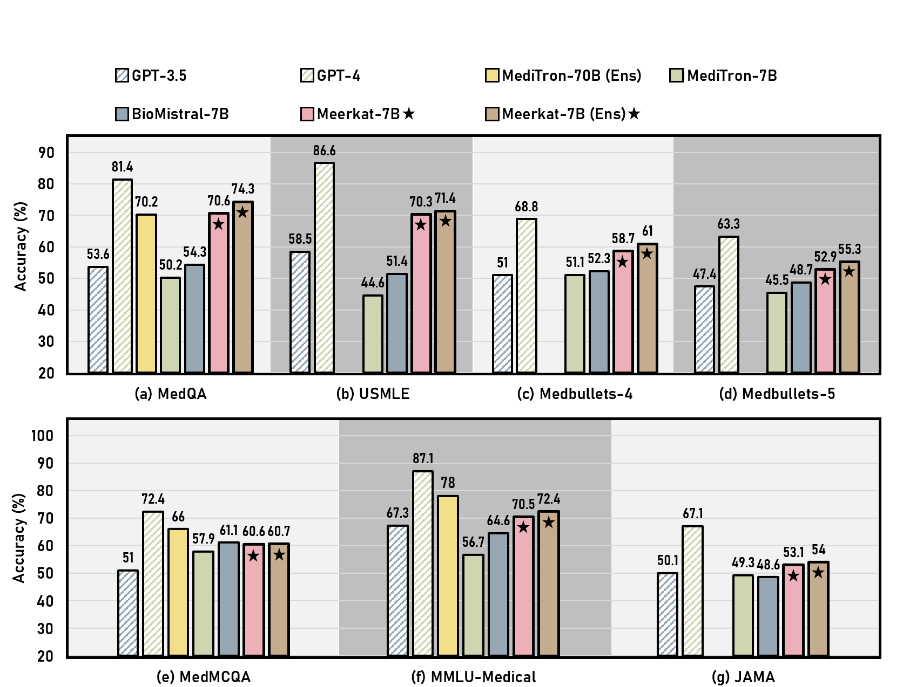
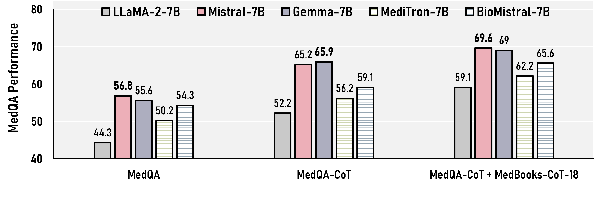
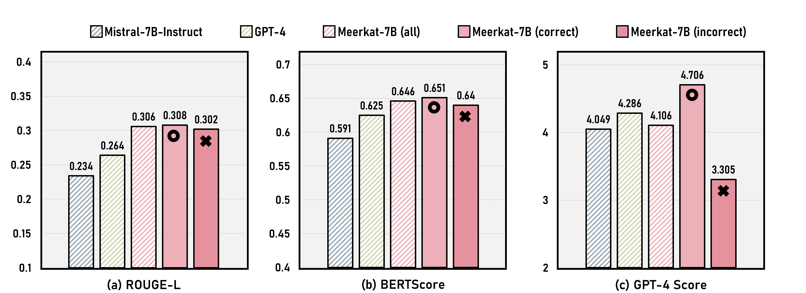
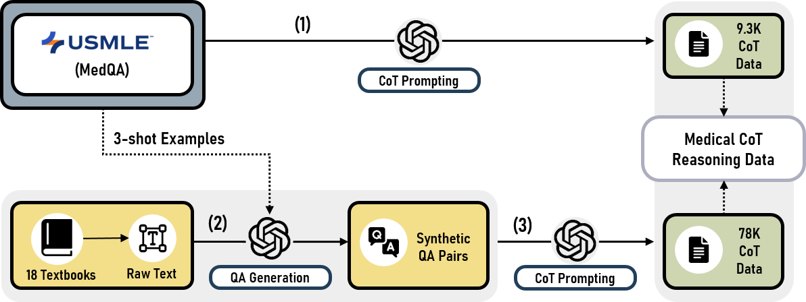
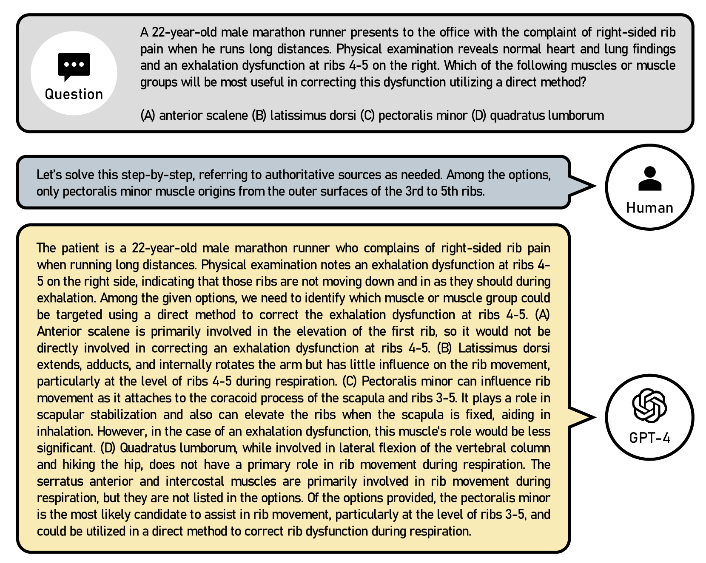
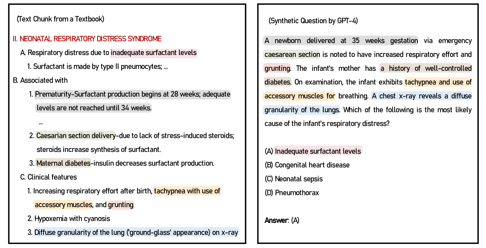

# 医学教科书助力小型语言模型提升推理能力

发布时间：2024年03月30日

`LLM应用` `人工智能`

> Small Language Models Learn Enhanced Reasoning Skills from Medical Textbooks

# 摘要

> 近期商业大型语言模型在医学领域的应用展现出潜力，但其封闭源代码引发了隐私与安全方面的顾虑，限制了其在该领域的普及。虽然开源模型的尝试不断，但受限的参数数量常常导致缺乏处理复杂医学问题所需的连续推理能力。为此，我们推出了Meerkat-7B，一款具有70亿参数的创新医疗AI系统。该系统通过结合18本医学教科书中的高质量推理路径和多样化的指令遵循数据集进行训练。在七项医学基准测试中，Meerkat-7B的准确度表现卓越，领先GPT-3.5达13.1%，并且在性能上超越了先前的顶尖70亿参数模型MediTron-7B和BioMistral-7B，分别提高了13.4%和9.8%。更引人注目的是，它首次在70亿参数模型中超越了美国医学执照考试的及格标准。此外，与现有的70亿和130亿模型相比，Meerkat-7B在回答临床咨询时提供了更为详尽的自由形式回复，其性能接近GPT-3.5。这大大缩小了与大型语言模型之间的性能鸿沟，证明了其在应对复杂医学难题方面的有效性。

> While recent advancements in commercial large language models (LM) have shown promising results in medical tasks, their closed-source nature poses significant privacy and security concerns, hindering their widespread use in the medical field. Despite efforts to create open-source models, their limited parameters often result in insufficient multi-step reasoning capabilities required for solving complex medical problems. To address this, we introduce Meerkat-7B, a novel medical AI system with 7 billion parameters. Meerkat-7B was trained using our new synthetic dataset consisting of high-quality chain-of-thought reasoning paths sourced from 18 medical textbooks, along with diverse instruction-following datasets. Our system achieved remarkable accuracy across seven medical benchmarks, surpassing GPT-3.5 by 13.1%, as well as outperforming the previous best 7B models such as MediTron-7B and BioMistral-7B by 13.4% and 9.8%, respectively. Notably, it surpassed the passing threshold of the United States Medical Licensing Examination (USMLE) for the first time for a 7B-parameter model. Additionally, our system offered more detailed free-form responses to clinical queries compared to existing 7B and 13B models, approaching the performance level of GPT-3.5. This significantly narrows the performance gap with large LMs, showcasing its effectiveness in addressing complex medical challenges.

[Arxiv](https://arxiv.org/abs/2404.00376)