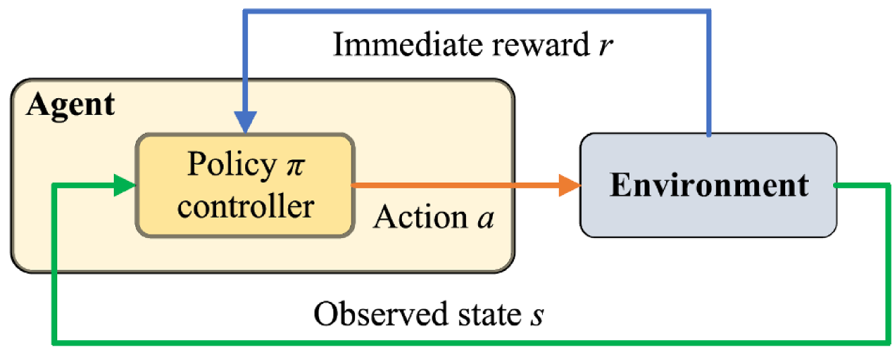
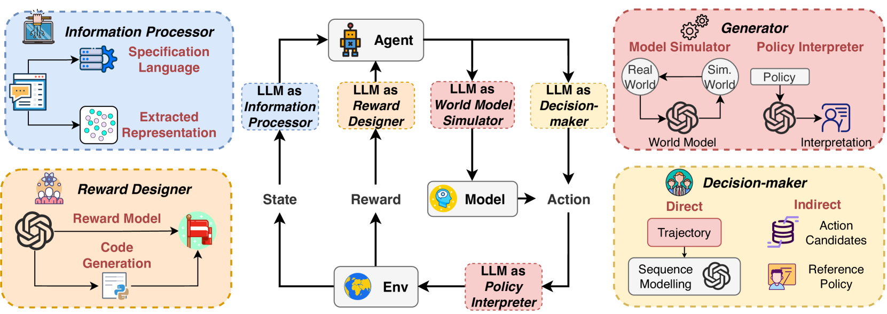
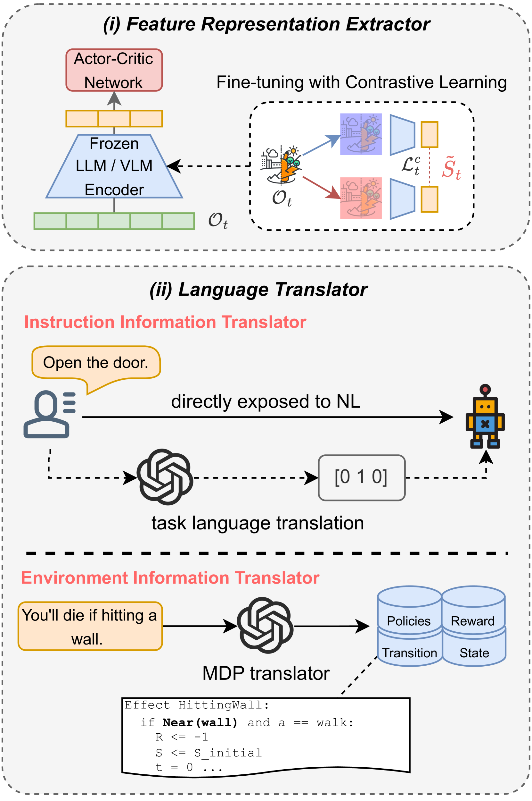
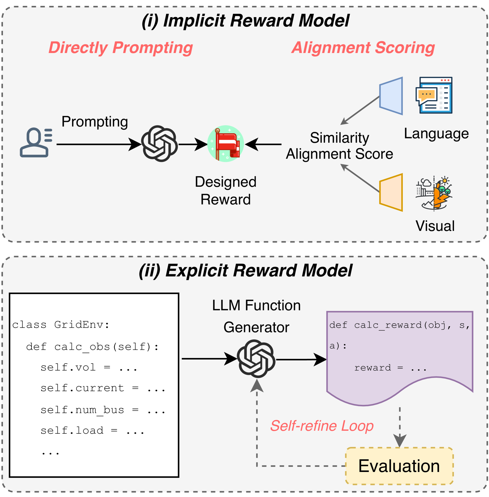
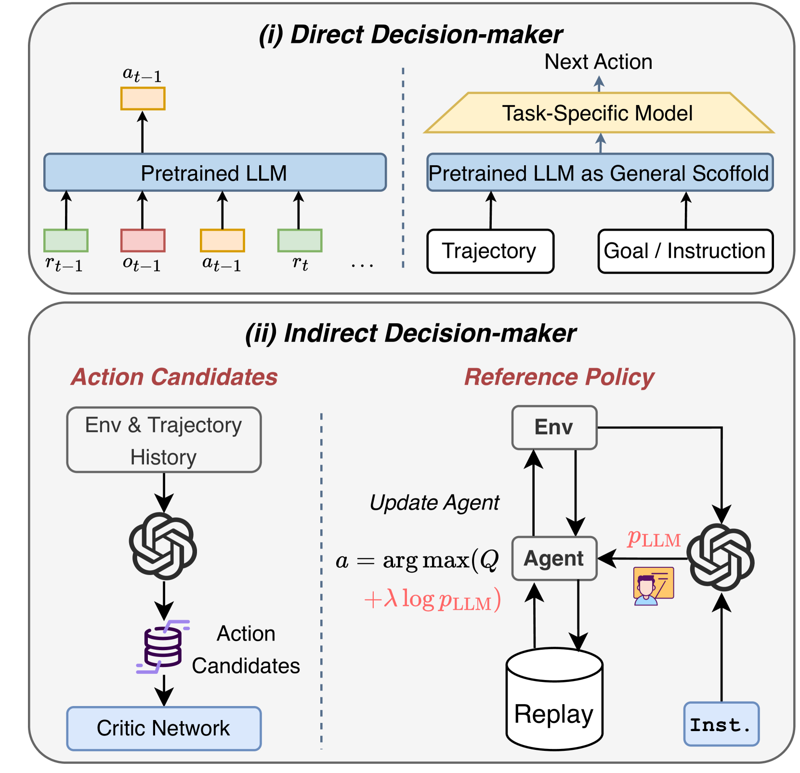
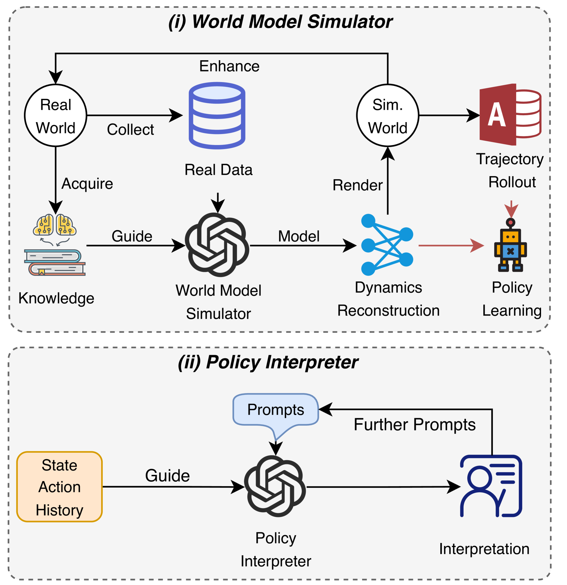

# 探究大型语言模型助力强化学习的研究：理念、体系和策略

发布时间：2024年03月30日

`RAG` `人工智能`

> Survey on Large Language Model-Enhanced Reinforcement Learning: Concept, Taxonomy, and Methods

# 摘要

> 大型语言模型（LLM）凭借其丰富的预训练知识库和卓越的通用能力，正日益成为强化学习（RL）领域的一股新兴力量，尤其在多任务学习、样本效率和任务规划等关键方面。本文综述了“LLM助力RL”的相关研究文献，对比分析了其与传统RL方法的不同特点，并旨在为未来的研究明确方向和范围。我们采用经典的代理-环境互动模型，构建了一个系统化的分类体系，将LLM在RL中的作用细分为四种角色：信息处理、奖励设计、决策制定和内容生成。对于每个角色，我们不仅梳理了相应的方法论，还分析了它们如何缓解特定的RL难题，并对未来的发展趋势提出了洞见。文章最后探讨了“LLM增强RL”可能的应用场景、面临的机遇与挑战。

> With extensive pre-trained knowledge and high-level general capabilities, large language models (LLMs) emerge as a promising avenue to augment reinforcement learning (RL) in aspects such as multi-task learning, sample efficiency, and task planning. In this survey, we provide a comprehensive review of the existing literature in $\textit{LLM-enhanced RL}$ and summarize its characteristics compared to conventional RL methods, aiming to clarify the research scope and directions for future studies. Utilizing the classical agent-environment interaction paradigm, we propose a structured taxonomy to systematically categorize LLMs' functionalities in RL, including four roles: information processor, reward designer, decision-maker, and generator. Additionally, for each role, we summarize the methodologies, analyze the specific RL challenges that are mitigated, and provide insights into future directions. Lastly, potential applications, prospective opportunities and challenges of the $\textit{LLM-enhanced RL}$ are discussed.

[Arxiv](https://arxiv.org/abs/2404.00282)