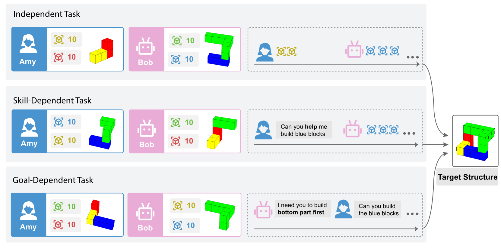
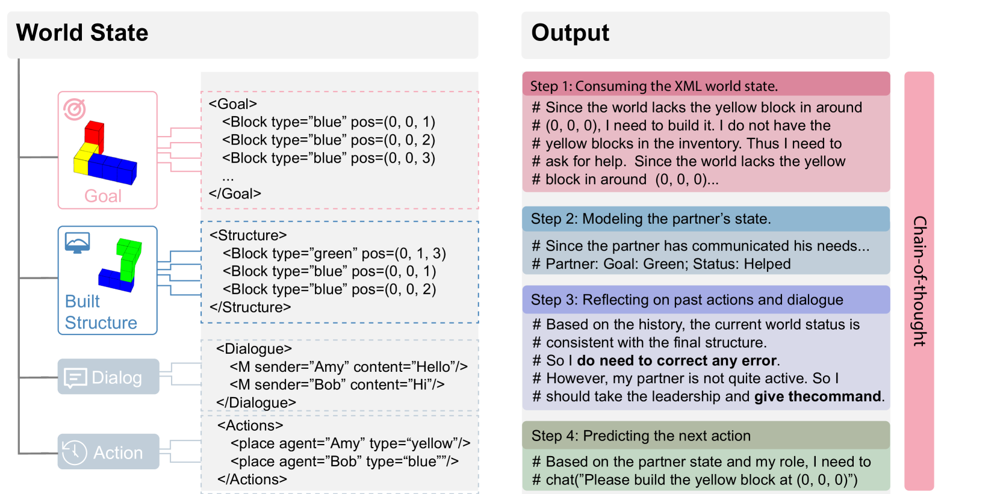
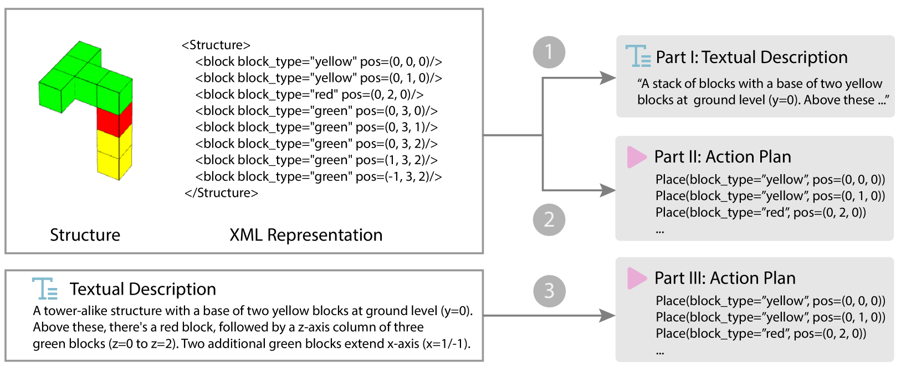
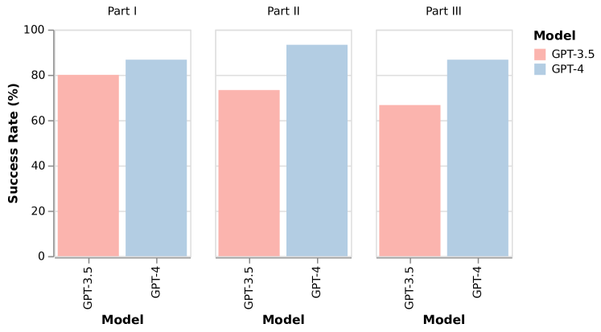
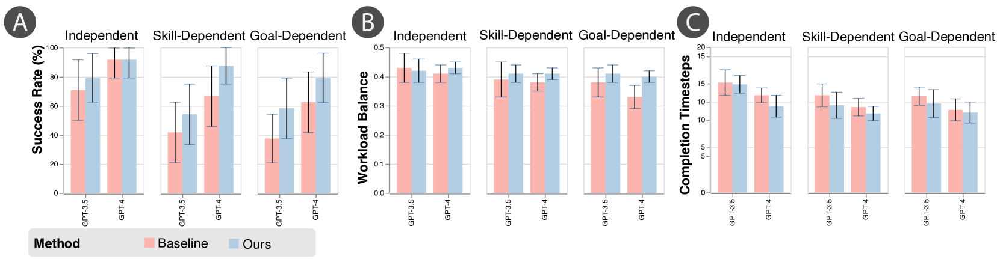
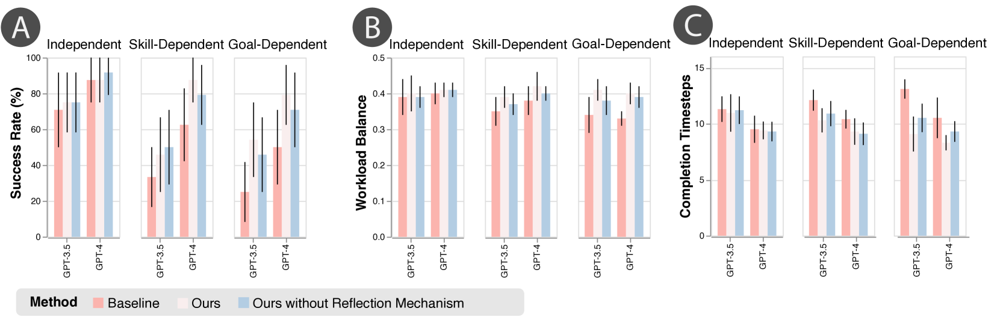
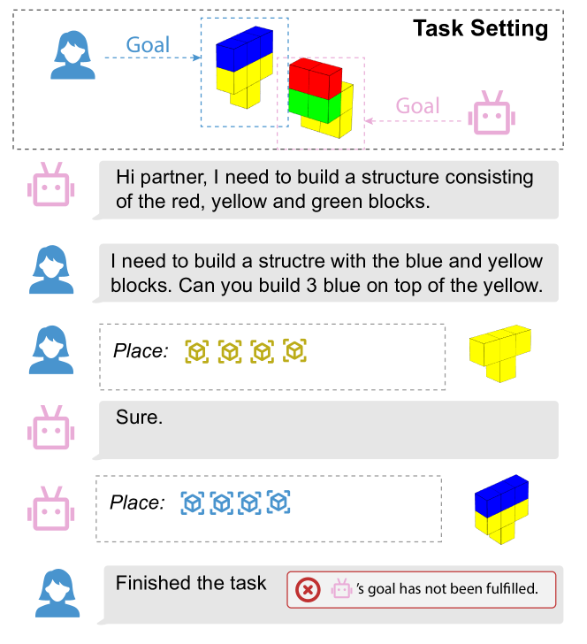
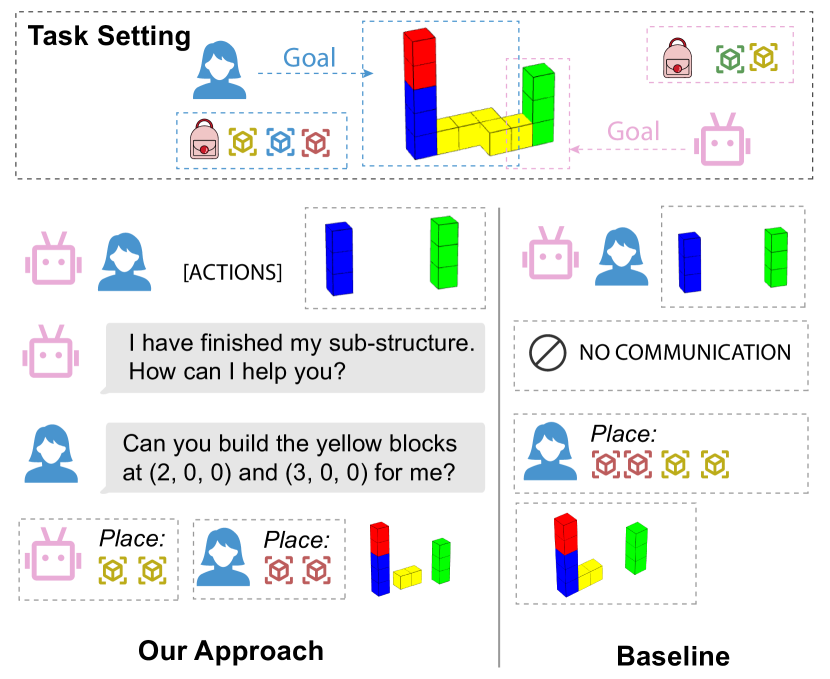

# 同事的影响力：探究语言模型在积木世界协作任务中的表现

发布时间：2024年03月30日

`Agent` `人工智能` `人机交互`

> Your Co-Workers Matter: Evaluating Collaborative Capabilities of Language Models in Blocks World

# 摘要

> 自主互动的语言代理在自动化数字任务上展现出巨大潜力。大型语言模型（LLM）代理在理解并执行文本游戏、网页控制等任务上已取得进展，但真实世界的许多任务还需与人类或其他LLM进行平等合作，涉及意图理解、任务协调与沟通。为测试LLM的合作能力，我们构建了一个积木世界环境，让两个具有不同目标和技能的代理共同搭建目标结构。它们可以通过行动和自然语言沟通来实现目标。我们设计了递增难度的挑战，评估从独立作业到复杂依赖任务的合作模式。我们还引入了包含推理步骤的思考链提示，模拟伙伴状态，识别并纠正执行错误。实验显示，无论是人机还是机机合作，LLM代理都表现出强大的基础能力，我们的方法显著提升了评估效果。

> Language agents that interact with the world on their own have great potential for automating digital tasks. While large language model (LLM) agents have made progress in understanding and executing tasks such as textual games and webpage control, many real-world tasks also require collaboration with humans or other LLMs in equal roles, which involves intent understanding, task coordination, and communication. To test LLM's ability to collaborate, we design a blocks-world environment, where two agents, each having unique goals and skills, build a target structure together. To complete the goals, they can act in the world and communicate in natural language. Under this environment, we design increasingly challenging settings to evaluate different collaboration perspectives, from independent to more complex, dependent tasks. We further adopt chain-of-thought prompts that include intermediate reasoning steps to model the partner's state and identify and correct execution errors. Both human-machine and machine-machine experiments show that LLM agents have strong grounding capacities, and our approach significantly improves the evaluation metric.

[Arxiv](https://arxiv.org/abs/2404.00246)