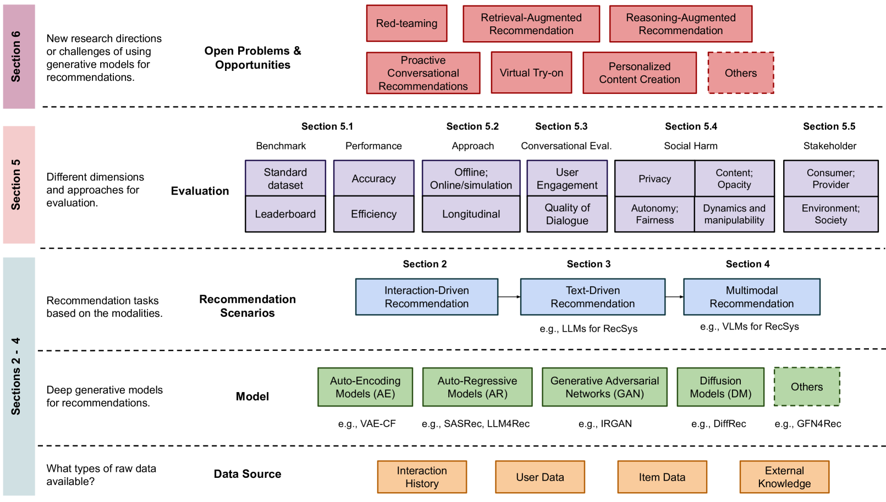

# 现代推荐系统通过运用生成模型 (Gen-RecSys) 已经取得了显著进展。本文将对这些系统进行深入评述，探讨它们如何通过创新的方式提升个性化推荐的准确性和用户体验。

发布时间：2024年03月31日

`LLM应用` `推荐系统` `生成模型`

> A Review of Modern Recommender Systems Using Generative Models (Gen-RecSys)

# 摘要

> 传统推荐系统主要依托用户和项目的评分记录，协同过滤技术便是其中的核心手段。但新兴的生成模型已能模拟并采样复杂数据分布，涵盖了用户互动历史、文本、图像、视频等多元信息，为创新推荐任务开辟了新天地。本综述旨在梳理利用生成模型的推荐系统（Gen-RecSys）的主要进展，内容涵盖交互驱动生成模型的基础知识、大型语言模型在创新推荐、检索和对话推荐中的应用，以及多模态模型在处理和创造图像与视频内容方面的融合运用。我们从宏观角度出发，强调了评估Gen-RecSys影响和潜在风险的关键范式，并指出了当前面临的挑战。相关论文的最新版本可在https://github.com/yasdel/LLM-RecSys找到。

> Traditional recommender systems (RS) have used user-item rating histories as their primary data source, with collaborative filtering being one of the principal methods. However, generative models have recently developed abilities to model and sample from complex data distributions, including not only user-item interaction histories but also text, images, and videos - unlocking this rich data for novel recommendation tasks. Through this comprehensive and multi-disciplinary survey, we aim to connect the key advancements in RS using Generative Models (Gen-RecSys), encompassing: a foundational overview of interaction-driven generative models; the application of large language models (LLM) for generative recommendation, retrieval, and conversational recommendation; and the integration of multimodal models for processing and generating image and video content in RS. Our holistic perspective allows us to highlight necessary paradigms for evaluating the impact and harm of Gen-RecSys and identify open challenges. A more up-to-date version of the papers is maintained at: https://github.com/yasdel/LLM-RecSys.

[Arxiv](https://arxiv.org/abs/2404.00579)