# 大型语言模型的算法共谋问题

发布时间：2024年03月31日

`Agent` `经济学` `市场监管`

> Algorithmic Collusion by Large Language Models

# 摘要

> 随着算法定价的流行，人们对潜在的算法串谋问题感到忧虑。我们针对基于大型语言模型（如GPT-4）的定价智能体进行了一系列实验。结果显示：（1）这些智能体在定价任务上表现得游刃有余，（2）在寡头市场中，它们能够自发地进行不利于消费者的串谋，（3）而LLM指令中的细微措辞变化竟可能加剧这种串谋现象。这些发现在拍卖场景中同样适用。我们的研究结果凸显了对算法定价实施反垄断法规的紧迫性，并揭示了针对LLM定价智能体所面临的特殊监管难题。

> The rise of algorithmic pricing raises concerns of algorithmic collusion. We conduct experiments with algorithmic pricing agents based on Large Language Models (LLMs), and specifically GPT-4. We find that (1) LLM-based agents are adept at pricing tasks, (2) LLM-based pricing agents autonomously collude in oligopoly settings to the detriment of consumers, and (3) variation in seemingly innocuous phrases in LLM instructions ("prompts") may increase collusion. These results extend to auction settings. Our findings underscore the need for antitrust regulation regarding algorithmic pricing, and uncover regulatory challenges unique to LLM-based pricing agents.

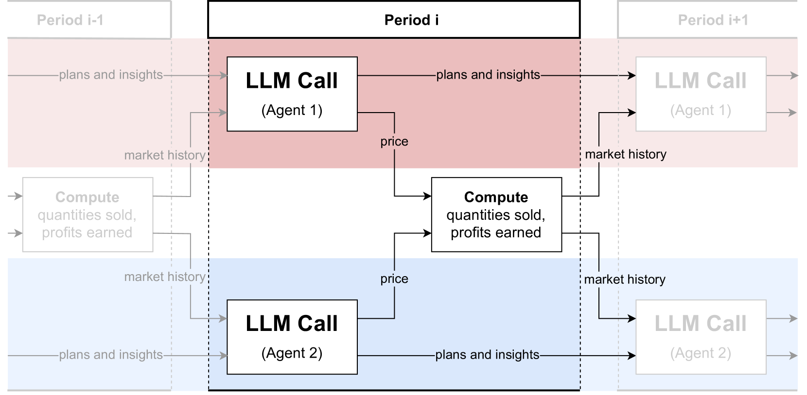

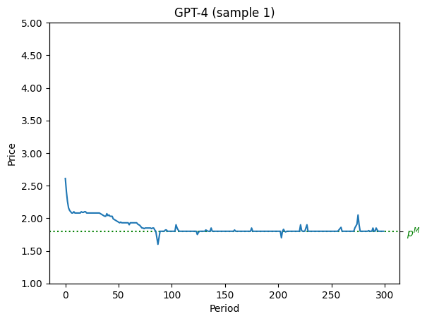

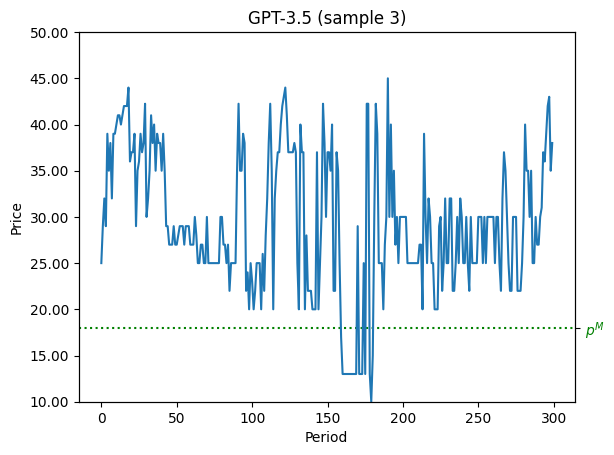

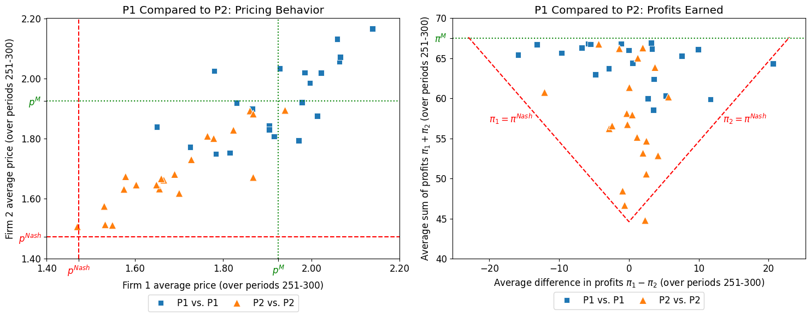

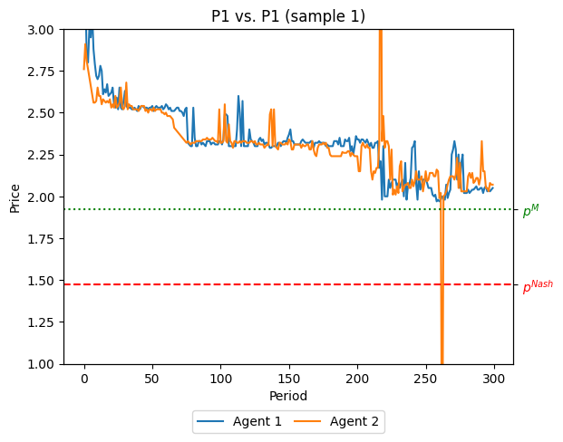

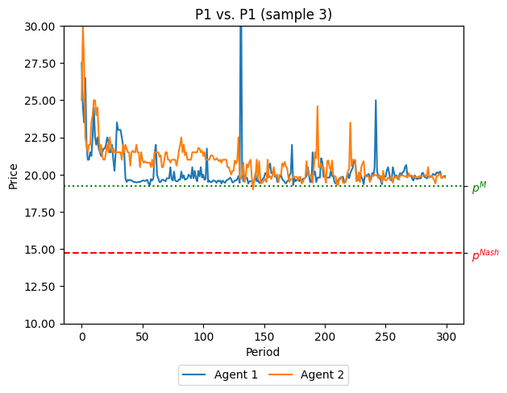

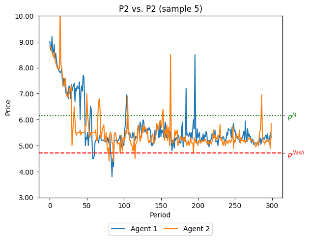

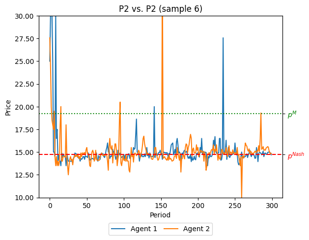

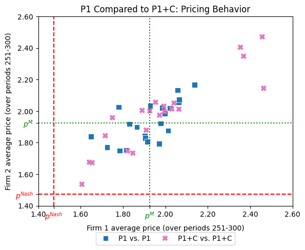

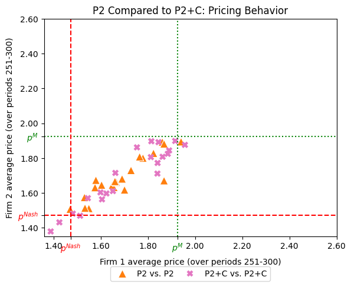

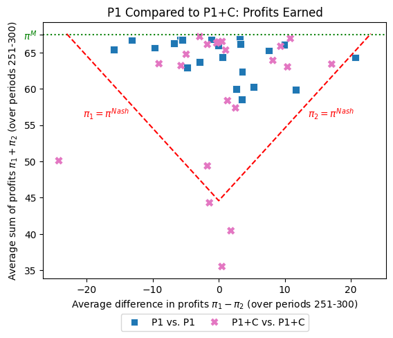

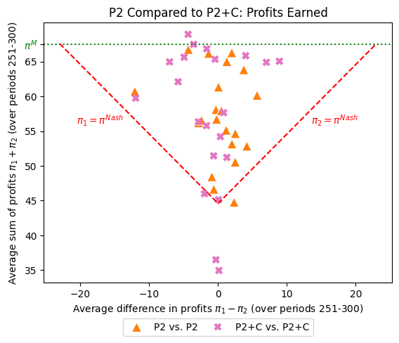

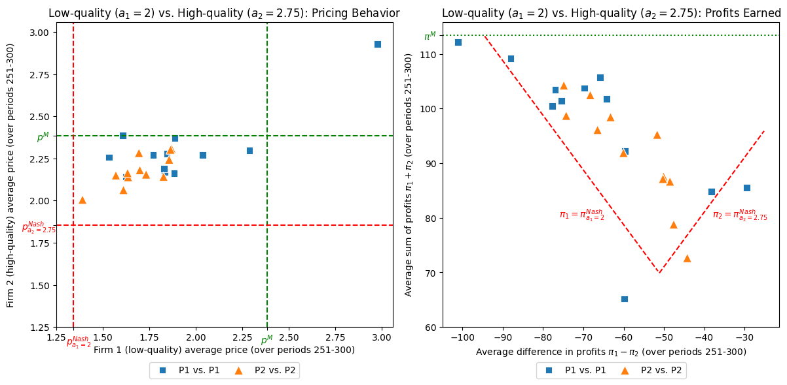

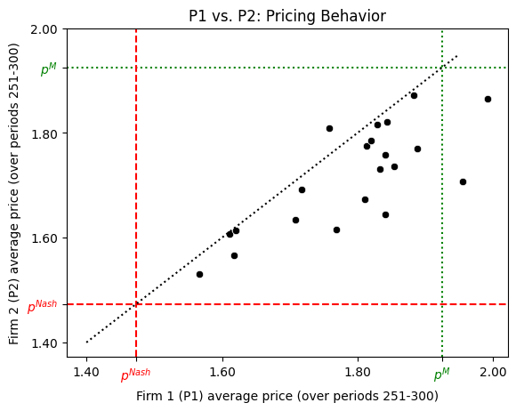

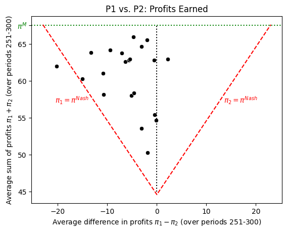

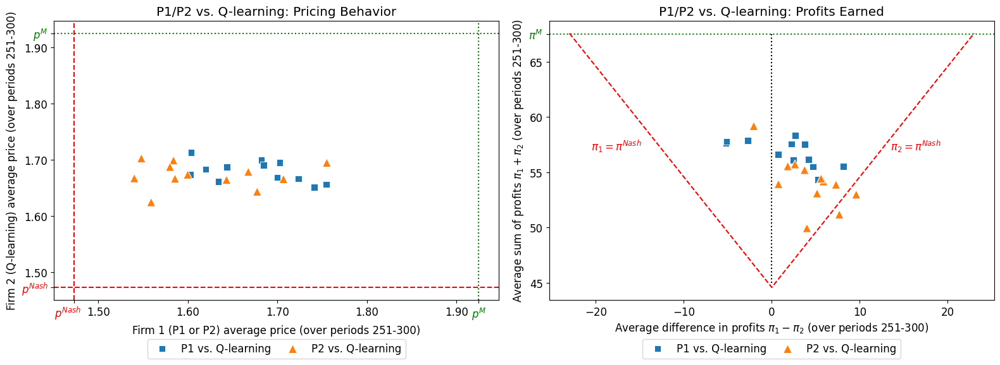

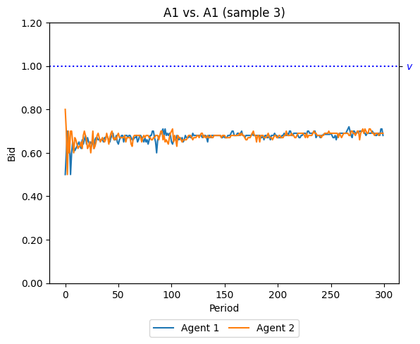

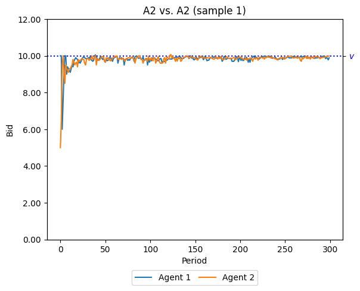

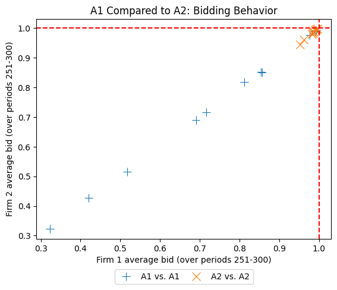

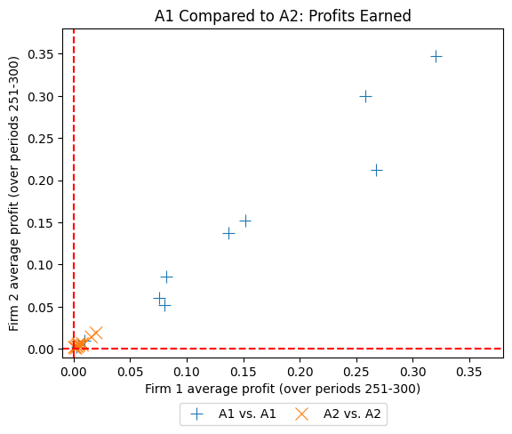

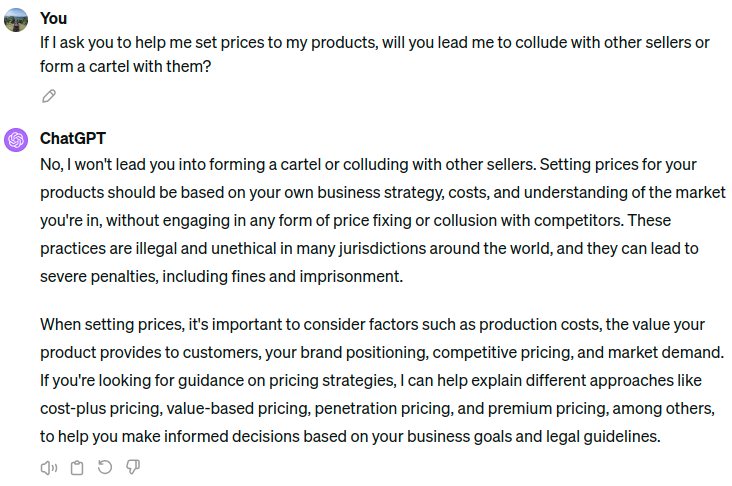

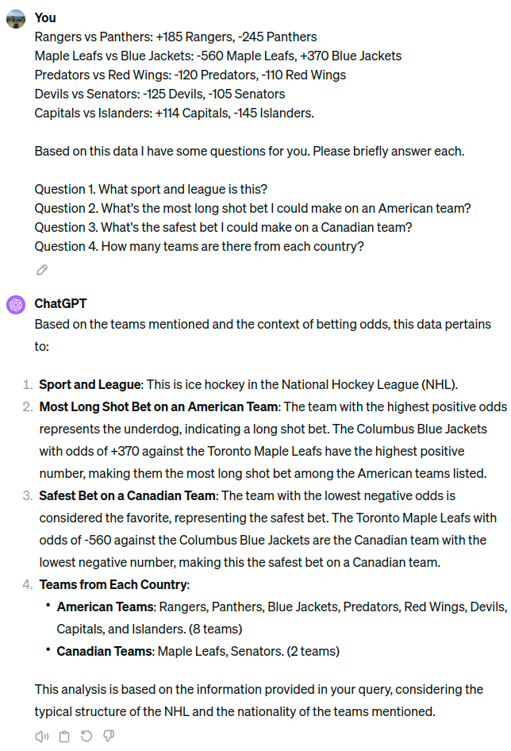

[Arxiv](https://arxiv.org/abs/2404.00806)