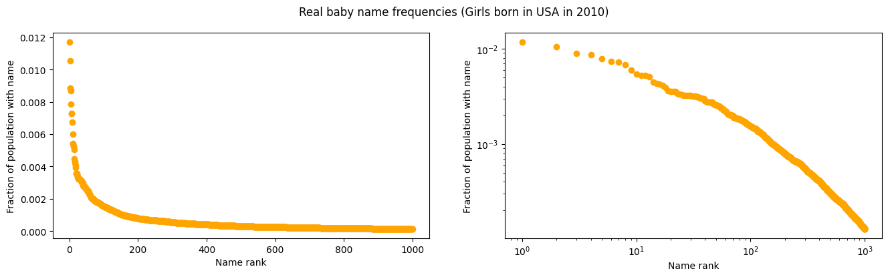
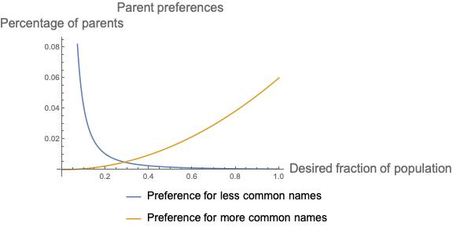
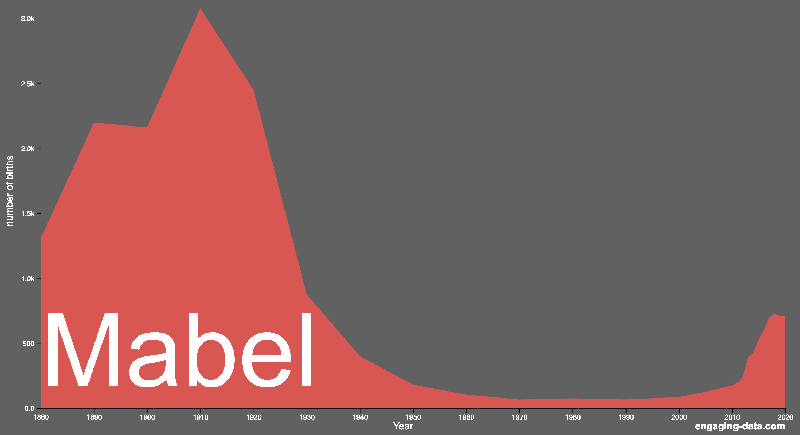
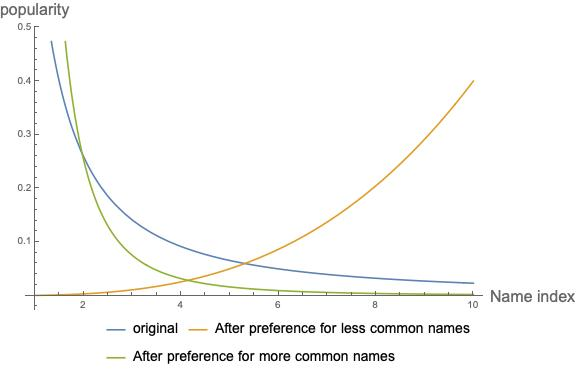
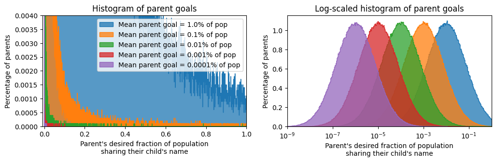
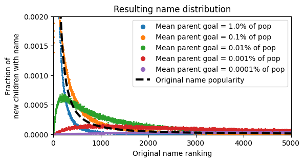
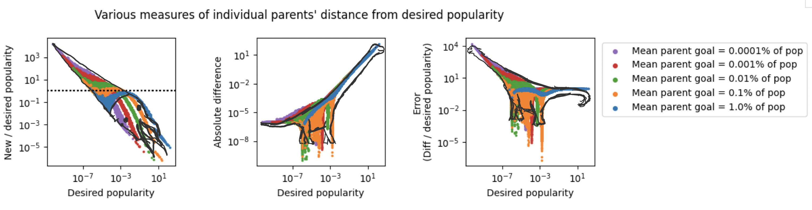
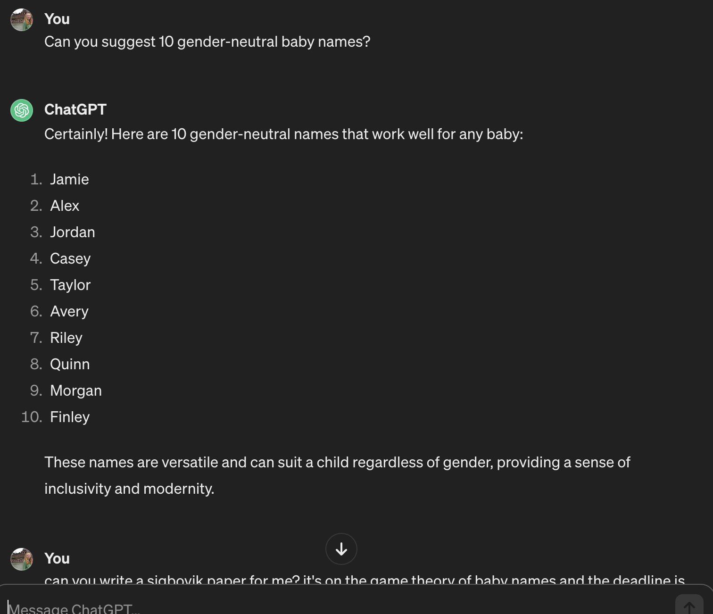

# 《宝宝命名大作战：游戏理论视角下的凯瑟琳现象》

发布时间：2024年03月31日

`LLM应用` `人工智能` `文本生成`

> An Abundance of Katherines: The Game Theory of Baby Naming

# 摘要

> 本文探讨了宝宝起名这一充满挑战的领域。我们基于几个非常合理的假设——父母作为目光短浅但信息全面的决策者，他们在为孩子起名时只关注名字的独一无二——构建了一个模型，该模型不仅易于操作、条理清晰，还精准映射了现实世界。接着，我们通过一系列数值实验和对大型语言模型工具的深入分析，进一步推进了研究。文章最后，我们展望了未来研究的可能方向。

> In this paper, we study the highly competitive arena of baby naming. Through making several Extremely Reasonable Assumptions (namely, that parents are myopic, perfectly knowledgeable agents who pick a name based solely on its uniquness), we create a model which is not only tractable and clean, but also perfectly captures the real world. We then extend our investigation with numerical experiments, as well as analysis of large language model tools. We conclude by discussing avenues for future research.

[Arxiv](https://arxiv.org/abs/2404.00732)