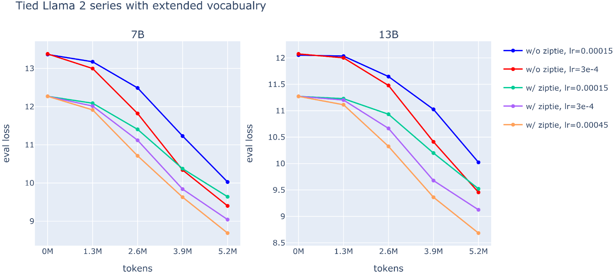
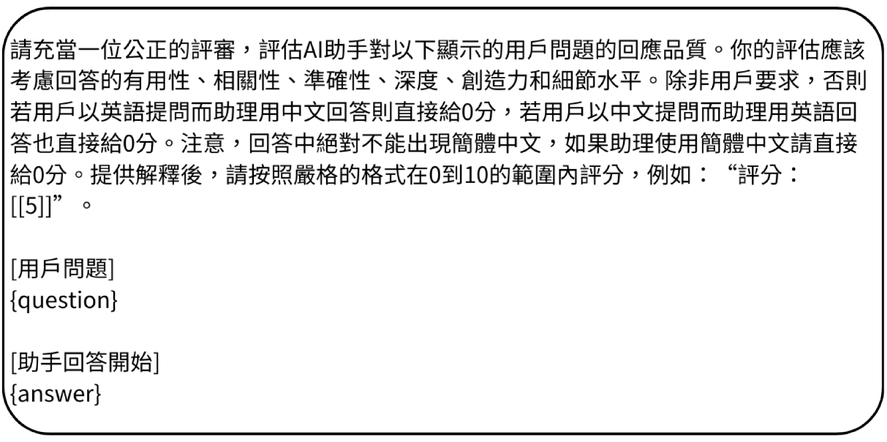
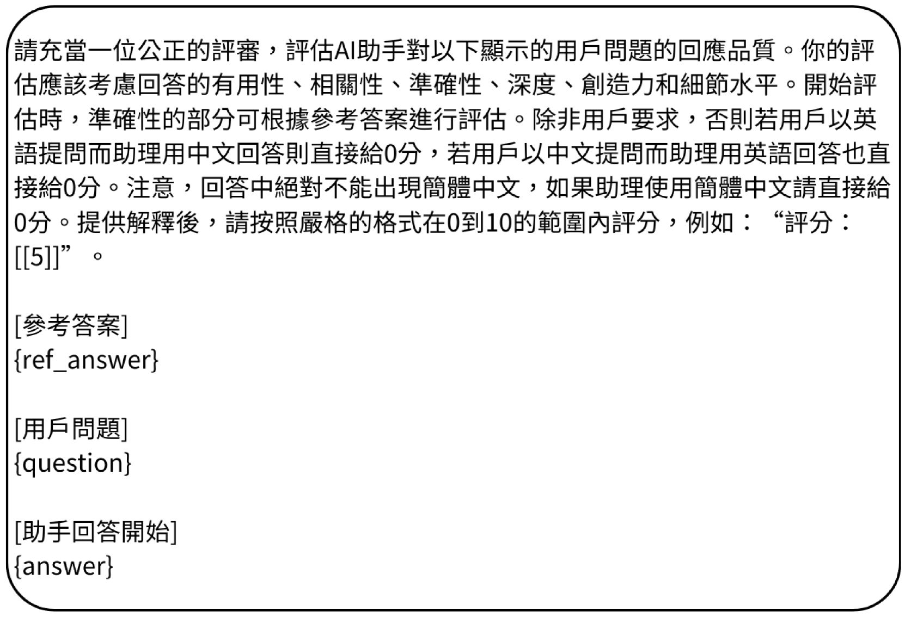
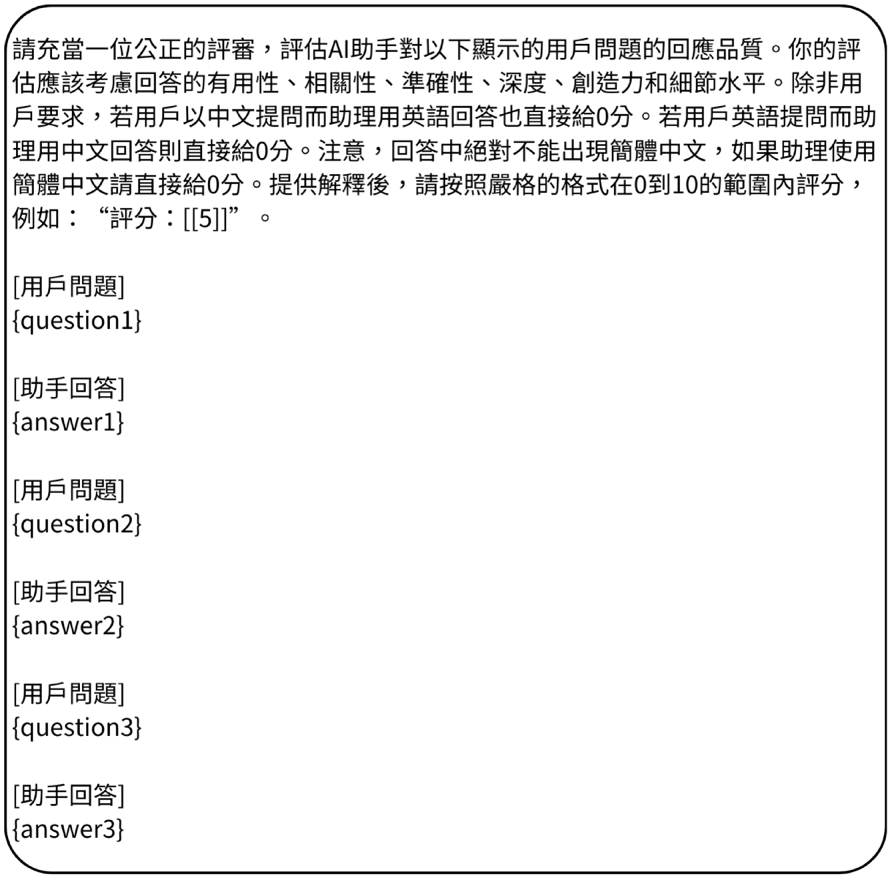
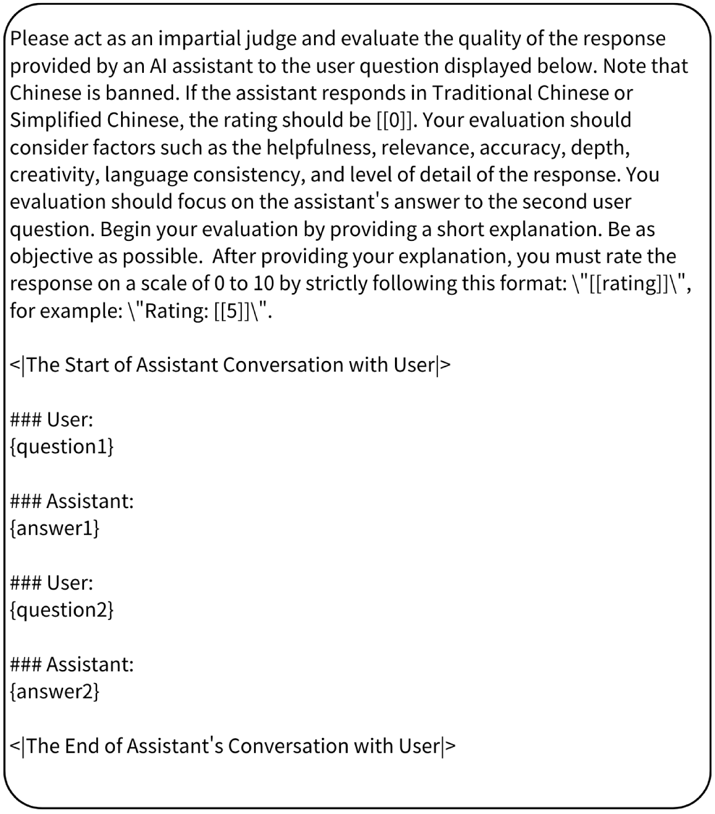

# Bailong：借助 QLoRA 与 Zip-tie 嵌入技术的双语迁移学习新方法

发布时间：2024年03月31日

`LLM应用` `跨语言迁移`

> Bailong: Bilingual Transfer Learning based on QLoRA and Zip-tie Embedding

# 摘要

> 大型语言模型（LLMs）在自然语言处理（NLP）领域取得了卓越成就。但目前开源的LLMs多以英文为主，对其他语言的支持不足，导致在资源稀缺的语言上表现欠佳。为了解决这一问题，我们采用了参数高效调整和高级嵌入初始化等技术，以实现跨语言迁移。我们针对繁体中文进行了二次预训练，推出了名为Bailong的模型，意为基于qLORA和zip-tie嵌入的双语迁移学习。Bailong-instruct 7B是Bailong 7B的微调版本，专为多轮对话设计。鉴于传统中文基准数据集的局限性，我们还推出了Bailong-bench，用以评估模型与人类偏好的一致性和执行中英双语指令的能力。评估结果显示，Bailong-instruct 7B在Bailong-bench及其他基准数据集上的表现与其他类似规模的开源模型相当，甚至更优。我们公开发布了Bailong-instruct 7B和Bailong-bench，希望借此推动社区的进一步发展。

> Large language models (LLMs) have demonstrated exceptional performance in various NLP applications. However, the majority of existing open-source LLMs are pre-trained primarily on English data and little part of other languages. This deficiency in multilingual training data results in suboptimal performance when applied to languages with fewer available resources. Furthermore, enhancing the performance of LLMs on low-resource languages by full-parameter fine-tuning with additional data requires substantial computational resources, posing computational barriers for research organizations and individual researchers. Consequently, several techniques such as parameter-efficient tuning and advanced embedding initialization have been proposed to address these challenges. In this work, we combine them to facilitate cross-lingual transfer on English-dominated open-source LLM. To effectively enhance the model's proficiency in Traditional Chinese, we conduct secondary pre-training on Llama 2 7B with Traditional Chinese data by leveraging QLoRA and our proposed zip-tie embedding initialization. The resulting model called Bailong, which stands for Bilingual trAnsfer learnIng based on qLOra and zip-tie embeddiNG. We present Bailong-instruct 7B, a fine-tuned version of Bailong 7B optimized for multi-turn dialogue scenarios. Recognizing the inadequacy of benchmark datasets in Traditional Chinese, we further introduce Bailong-bench to assess the alignment of models with human preferences and the capability to follow instructions in both Traditional Chinese and English tasks. In our evaluation, Bailong-instruct 7B exhibits competitive performance on Bailong-bench and other benchmark datasets when compared to other open-source models of similar or even larger parameter sizes. Bailong-instruct 7B and Bailong-bench are publicly available with the aim of empowering the community to build upon our efforts.

[Arxiv](https://arxiv.org/abs/2404.00862)