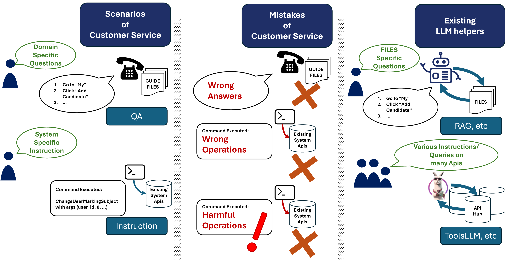
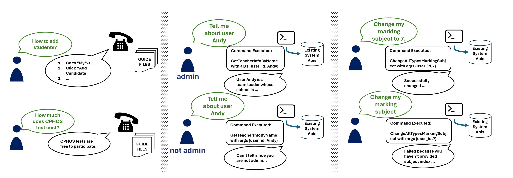
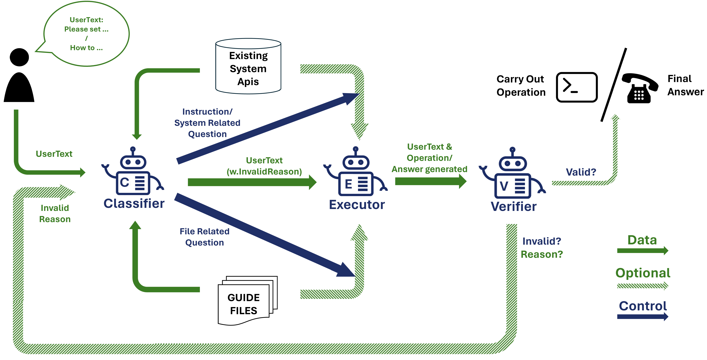
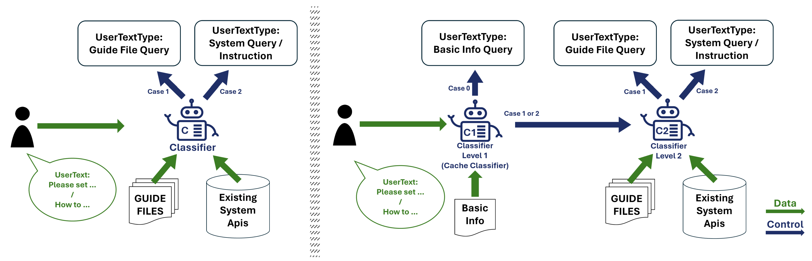

# CHOPS：借助客户档案系统，与大型语言模型 (LLM) 展开高效客户服务对话

发布时间：2024年03月31日

`Agent` `客户服务`

> CHOPS: CHat with custOmer Profile Systems for Customer Service with LLMs

# 摘要

> 越来越多的企业和软件平台开始依赖GPT-3.5、GPT-4、GLM-3和LLaMa-2等大型语言模型，以提供聊天支持、文件访问或客户服务的智能代理。然而，现有的LLM客户服务模式在与客户档案的整合和提供高效服务所需的操作能力方面仍有局限。同时，现行API集成过于强调多样性，忽略了在现实客户服务中至关重要的精确性和错误防范。为此，我们设计了一个名为CHOPS的LLM代理，它能够：（1）高效地利用现有数据库或系统获取用户信息，并遵循既定规范与这些系统互动；（2）在避免不当操作的前提下，提供精确且合理的回答或完成系统要求的操作；（3）结合小型和大型LLM，以合理的推理成本实现卓越性能。我们还推出了CPHOS数据集，内含数据库、指导文件和QA对，这些数据源自CPHOS平台，该平台旨在帮助高中师生组织模拟物理奥林匹克竞赛。通过CPHOS数据集的广泛实验，我们验证了CHOPS架构的效能，展示了LLM如何提升或替代人工客服。我们的代码和数据集即将开放源代码。

> Businesses and software platforms are increasingly turning to Large Language Models (LLMs) such as GPT-3.5, GPT-4, GLM-3, and LLaMa-2 for chat assistance with file access or as reasoning agents for customer service. However, current LLM-based customer service models have limited integration with customer profiles and lack the operational capabilities necessary for effective service. Moreover, existing API integrations emphasize diversity over the precision and error avoidance essential in real-world customer service scenarios. To address these issues, we propose an LLM agent named CHOPS (CHat with custOmer Profile in existing System), designed to: (1) efficiently utilize existing databases or systems for accessing user information or interacting with these systems following existing guidelines; (2) provide accurate and reasonable responses or carry out required operations in the system while avoiding harmful operations; and (3) leverage a combination of small and large LLMs to achieve satisfying performance at a reasonable inference cost. We introduce a practical dataset, the CPHOS-dataset, which includes a database, guiding files, and QA pairs collected from CPHOS, an online platform that facilitates the organization of simulated Physics Olympiads for high school teachers and students. We have conducted extensive experiments to validate the performance of our proposed CHOPS architecture using the CPHOS-dataset, with the aim of demonstrating how LLMs can enhance or serve as alternatives to human customer service. Our code and dataset will be open-sourced soon.

[Arxiv](https://arxiv.org/abs/2404.01343)