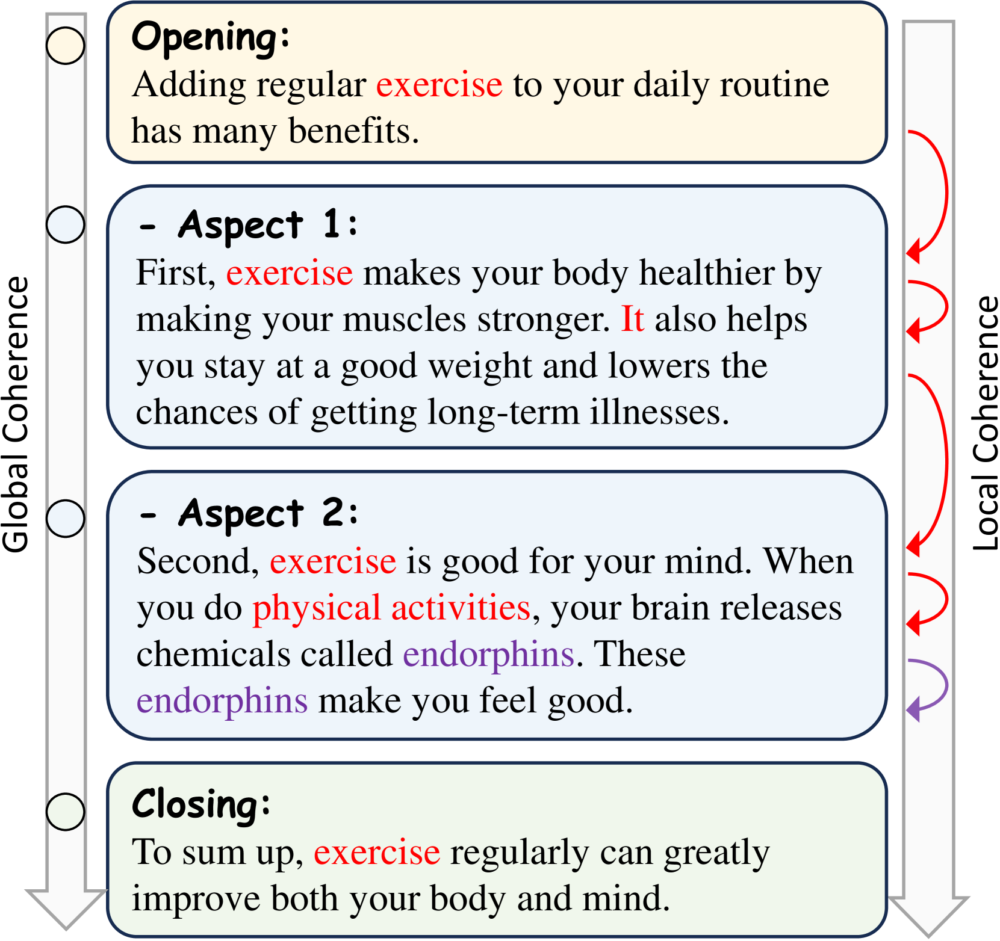
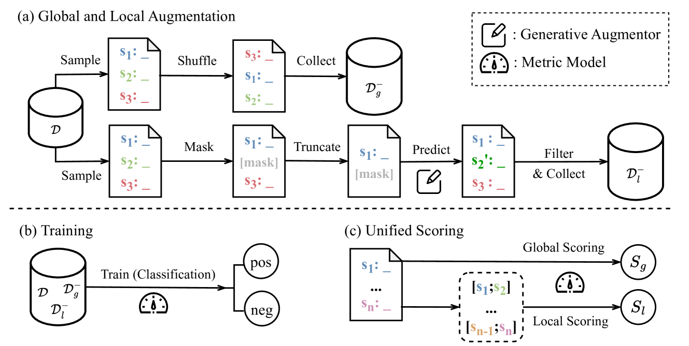
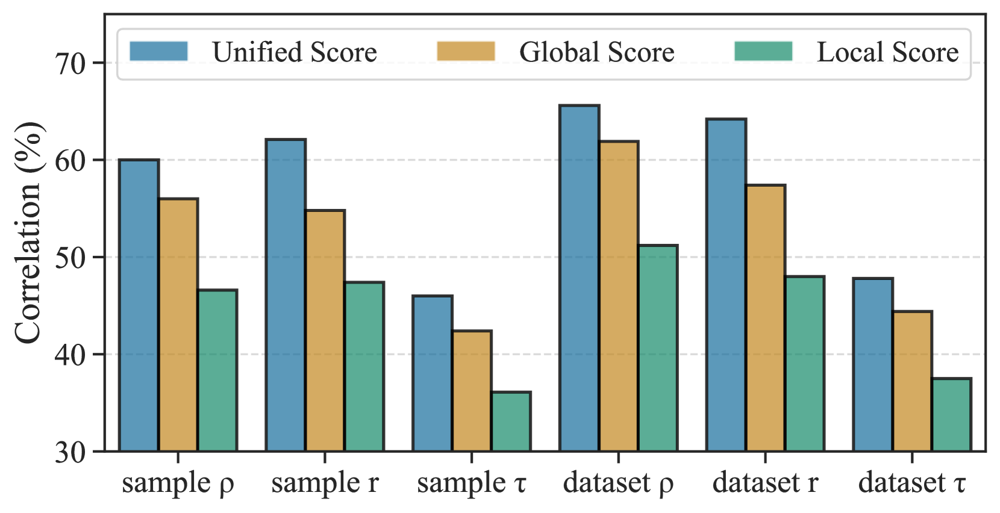
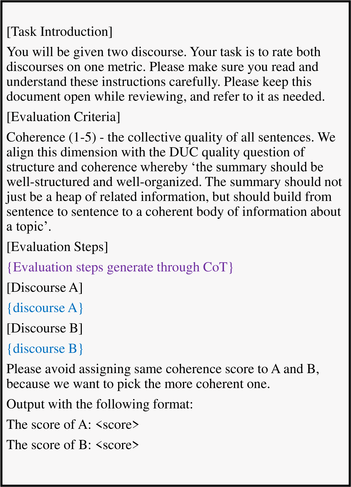
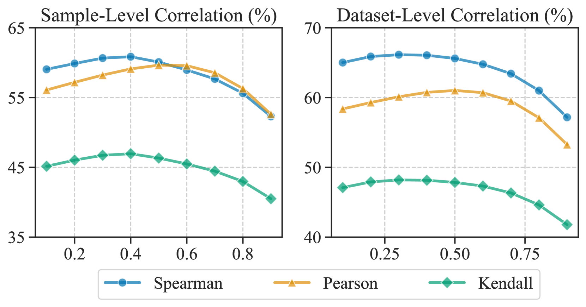

# CoUDA：利用统一的数据增强方法进行文本连贯性评估

发布时间：2024年03月31日

`LLM应用` `语言学` `话语连贯性`

> CoUDA: Coherence Evaluation via Unified Data Augmentation

# 摘要

> 连贯性评估致力于审视话语的条理与架构，即便在大型语言模型盛行的今天，这仍旧是一道难题。由于标注数据难以获得，数据增强技术成为训练评估模型的常用手段。不过，以往的数据增强主要基于经验规则，缺少明确的设计准则。本文借鉴语言学中的话语结构理论，提出了一种新颖的数据增强框架——CoUDA。CoUDA将话语连贯性分为全局和局部两个层面，并为这两方面量身定制了增强策略。对于局部连贯性，我们创新性地提出了一种生成增强样本的策略，包括对生成模型进行后续预训练，并采用两种调控机制来把控样本难度。在推理阶段，CoUDA同时对全局和局部连贯性进行综合评估。实验证明，CoUDA仅凭233M参数便在连贯性评估的点对点打分和成对比较任务中达到了顶尖水平，表现甚至超越了基于GPT-3.5和GPT-4的最新评估指标。

> Coherence evaluation aims to assess the organization and structure of a discourse, which remains challenging even in the era of large language models. Due to the scarcity of annotated data, data augmentation is commonly used for training coherence evaluation models. However, previous augmentations for this task primarily rely on heuristic rules, lacking designing criteria as guidance. In this paper, we take inspiration from linguistic theory of discourse structure, and propose a data augmentation framework named CoUDA. CoUDA breaks down discourse coherence into global and local aspects, and designs augmentation strategies for both aspects, respectively. Especially for local coherence, we propose a novel generative strategy for constructing augmentation samples, which involves post-pretraining a generative model and applying two controlling mechanisms to control the difficulty of generated samples. During inference, CoUDA also jointly evaluates both global and local aspects to comprehensively assess the overall coherence of a discourse. Extensive experiments in coherence evaluation show that, with only 233M parameters, CoUDA achieves state-of-the-art performance in both pointwise scoring and pairwise ranking tasks, even surpassing recent GPT-3.5 and GPT-4 based metrics.

[Arxiv](https://arxiv.org/abs/2404.00681)