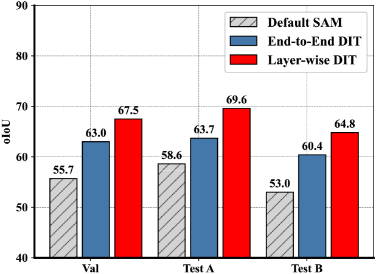
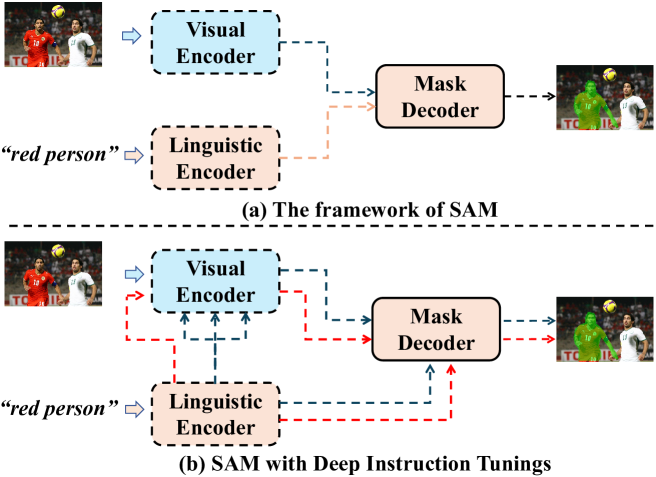
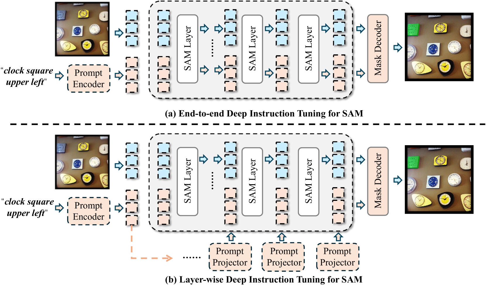

# 通过深度指令调整技术，实现对任何部分模型的精准分割。

发布时间：2024年03月31日

`RAG` `图像分割` `人工智能`

> Deep Instruction Tuning for Segment Anything Model

# 摘要

> 近期，Segment Anything Model (SAM) 在图像分割领域展现出了既强大又灵活的处理能力。然而，相较于点选和框选分割，SAM在文本指令驱动的任务上表现不尽人意。我们认为，通过深度文本指令调整，可以有效解决其轻量级掩码解码器中浅层融合策略所带来的不足。本文提出了两种深度指令调整(DIT)策略：一种是整体式，另一种是分层式。利用这些调整方法，我们能够将SAM的图像编码器作为一个独立的视语言学习器，避免了构建额外的深度融合分支。在三个顶尖的指向图像分割基准数据集上的广泛实验验证了，简单的整体式DIT显著提升了SAM的性能，而分层式DIT进一步将性能推向了新的高度。相关代码已匿名发布在GitHub上：https://github.com/wysnzzzz/DIT。

> Segment Anything Model (SAM) exhibits powerful yet versatile capabilities on (un) conditional image segmentation tasks recently. Although SAM can support various segmentation prompts, we note that, compared to point- and box-guided segmentation, it performs much worse on text-instructed tasks. We argue that deep text instruction tuning is key to mitigate such shortcoming caused by the shallow fusion scheme in its default light-weight mask decoder. In this paper, two \emph{deep instruction tuning} (DIT) methods are proposed, one is end-to-end and the other is layer-wise. With these tuning methods, we can regard the image encoder of SAM as a stand-alone vision-language learner in contrast to building another deep fusion branch. Extensive experiments on three highly competitive benchmark datasets of referring image segmentation show that a simple end-to-end DIT improves SAM by a large margin, with layer-wise DIT further boosts the performance to state-of-the-art. Our code is anonymously released at: https://github.com/wysnzzzz/DIT.

[Arxiv](https://arxiv.org/abs/2404.00650)