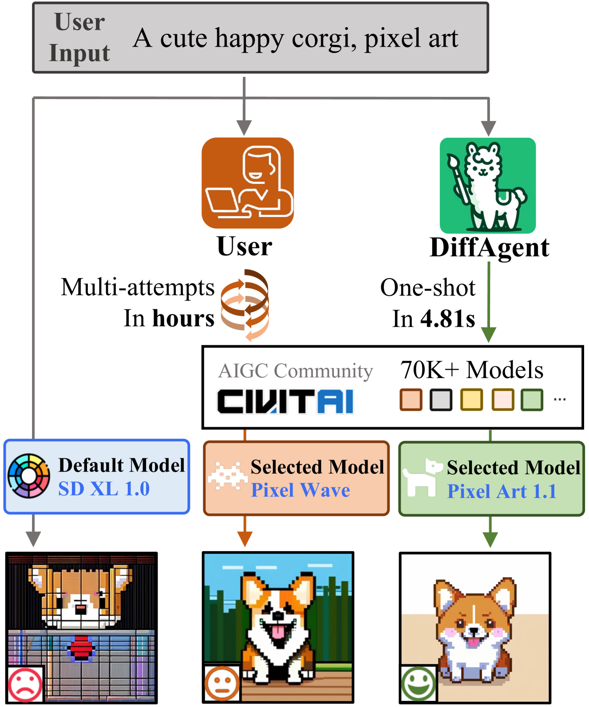
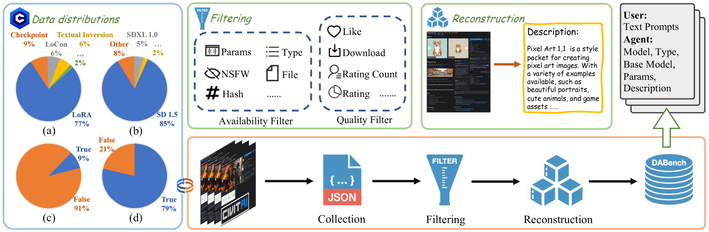
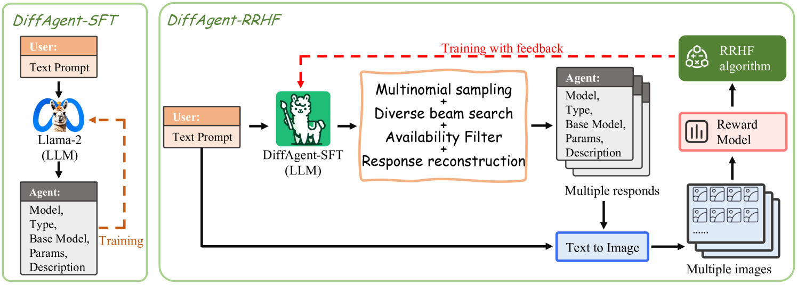
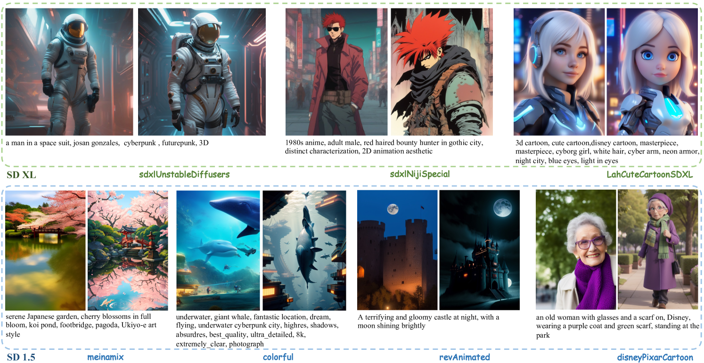
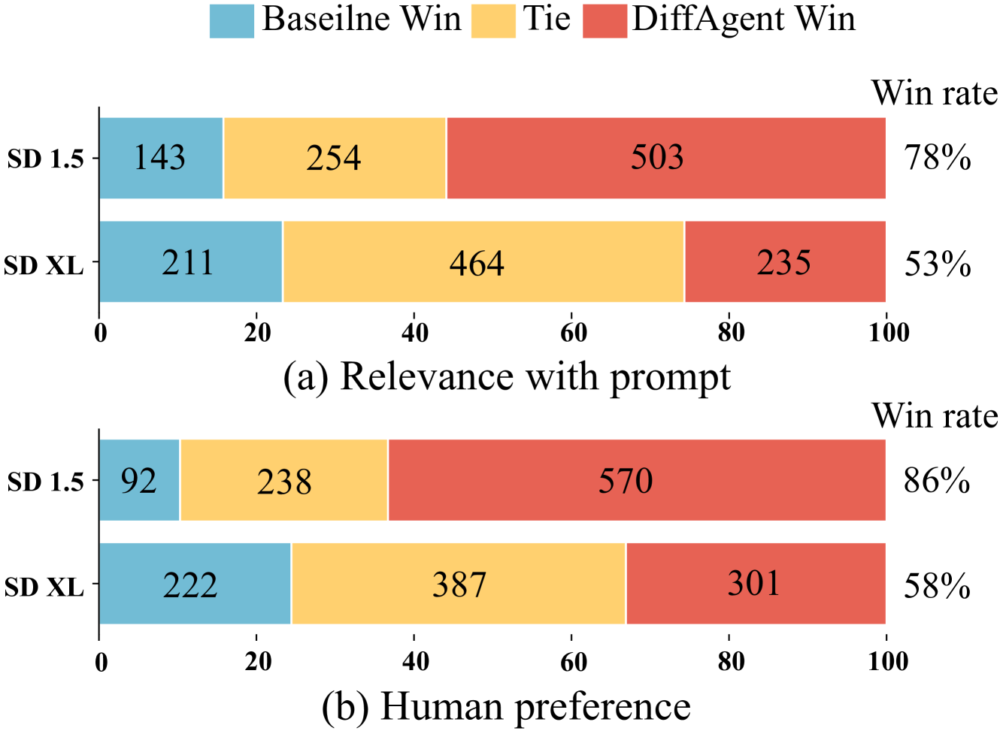

# DiffAgent：借助大型语言模型，实现高效精准的文本到图像API匹配

发布时间：2024年03月31日

`Agent` `图像生成` `文本到图像转换`

> DiffAgent: Fast and Accurate Text-to-Image API Selection with Large Language Model

# 摘要

> 文本到图像生成模型备受瞩目，并在学术界及其它领域广泛应用。Civitai社区作为T2I创新的聚集地，汇集了74,492种独特模型，令人赞叹。然而，模型多样性也带来了挑选合适模型和参数的难题，往往需要大量尝试。受大型语言模型工具使用的启发，我们推出了DiffAgent——一款LLM代理，能够通过API调用迅速精确地完成模型筛选。DiffAgent采用了创新的SFTA两阶段训练框架，确保其能够根据用户需求精准匹配T2I API响应。为培养和测试DiffAgent，我们创建了DABench数据集，覆盖了社区中众多T2I API。评估结果显示，DiffAgent不仅擅长挑选合适的T2I API，还证明了SFTA训练框架的高效性。相关代码已在GitHub上公开，地址为https://github.com/OpenGVLab/DiffAgent。

> Text-to-image (T2I) generative models have attracted significant attention and found extensive applications within and beyond academic research. For example, the Civitai community, a platform for T2I innovation, currently hosts an impressive array of 74,492 distinct models. However, this diversity presents a formidable challenge in selecting the most appropriate model and parameters, a process that typically requires numerous trials. Drawing inspiration from the tool usage research of large language models (LLMs), we introduce DiffAgent, an LLM agent designed to screen the accurate selection in seconds via API calls. DiffAgent leverages a novel two-stage training framework, SFTA, enabling it to accurately align T2I API responses with user input in accordance with human preferences. To train and evaluate DiffAgent's capabilities, we present DABench, a comprehensive dataset encompassing an extensive range of T2I APIs from the community. Our evaluations reveal that DiffAgent not only excels in identifying the appropriate T2I API but also underscores the effectiveness of the SFTA training framework. Codes are available at https://github.com/OpenGVLab/DiffAgent.

[Arxiv](https://arxiv.org/abs/2404.01342)