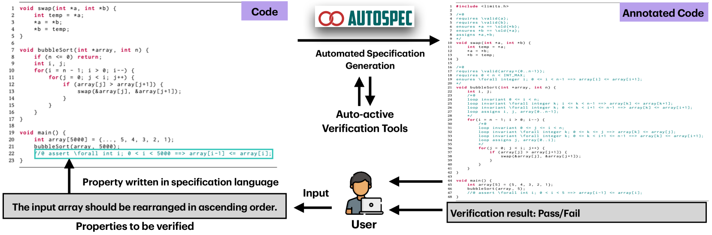
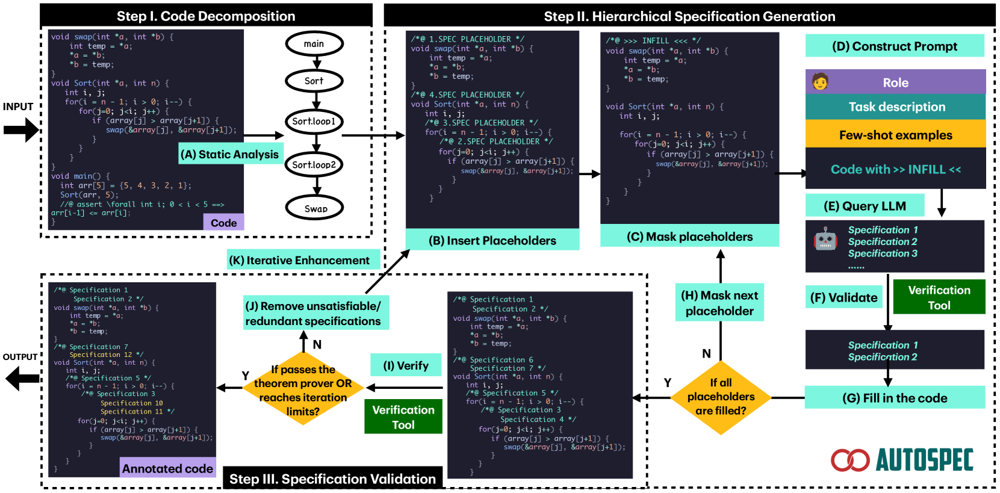
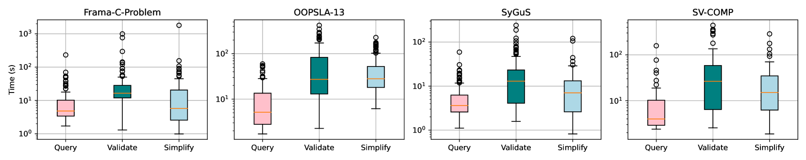

# 大型语言模型借助静态分析和程序验证，探索了程序规范的迷人合成方法。

发布时间：2024年03月31日

`LLM应用` `软件工程` `程序验证`

> Enchanting Program Specification Synthesis by Large Language Models using Static Analysis and Program Verification

# 摘要

> 形式验证确保软件系统精确可靠，但构建全面证明的规范需专业技能和大量人力。为满足这一需求，急需自动化规范合成技术。现有自动化方法局限性明显，要么只针对数值程序的循环不变性，要么仅适用于特定程序类型或不变性。面对复杂数据类型和代码结构的程序，这些方法往往无能为力。为此，我们推出了AutoSpec，一种全新的自动化程序验证规范合成方法。它突破了现有技术的局限，能够合成全面且适用的规范。AutoSpec依托静态分析和程序验证技术，并借助大型语言模型（LLMs）的力量。它通过三大策略应对实际挑战：首先，LLMs根据静态分析结果生成候选规范；其次，程序分解引导LLMs关注重点；最后，每轮迭代验证候选规范，防止错误累积。AutoSpec逐步迭代生成满足条件的规范，评估结果表明，其通过自动规范合成成功验证了79%的程序，效果提升了1.592倍。此外，AutoSpec还成功应用于现实世界的X509解析器项目，验证了其实用性。

> Formal verification provides a rigorous and systematic approach to ensure the correctness and reliability of software systems. Yet, constructing specifications for the full proof relies on domain expertise and non-trivial manpower. In view of such needs, an automated approach for specification synthesis is desired. While existing automated approaches are limited in their versatility, i.e., they either focus only on synthesizing loop invariants for numerical programs, or are tailored for specific types of programs or invariants. Programs involving multiple complicated data types (e.g., arrays, pointers) and code structures (e.g., nested loops, function calls) are often beyond their capabilities. To help bridge this gap, we present AutoSpec, an automated approach to synthesize specifications for automated program verification. It overcomes the shortcomings of existing work in specification versatility, synthesizing satisfiable and adequate specifications for full proof. It is driven by static analysis and program verification, and is empowered by large language models (LLMs). AutoSpec addresses the practical challenges in three ways: (1) driving \name by static analysis and program verification, LLMs serve as generators to generate candidate specifications, (2) programs are decomposed to direct the attention of LLMs, and (3) candidate specifications are validated in each round to avoid error accumulation during the interaction with LLMs. In this way, AutoSpec can incrementally and iteratively generate satisfiable and adequate specifications. The evaluation shows its effectiveness and usefulness, as it outperforms existing works by successfully verifying 79% of programs through automatic specification synthesis, a significant improvement of 1.592x. It can also be successfully applied to verify the programs in a real-world X509-parser project.

[Arxiv](https://arxiv.org/abs/2404.00762)