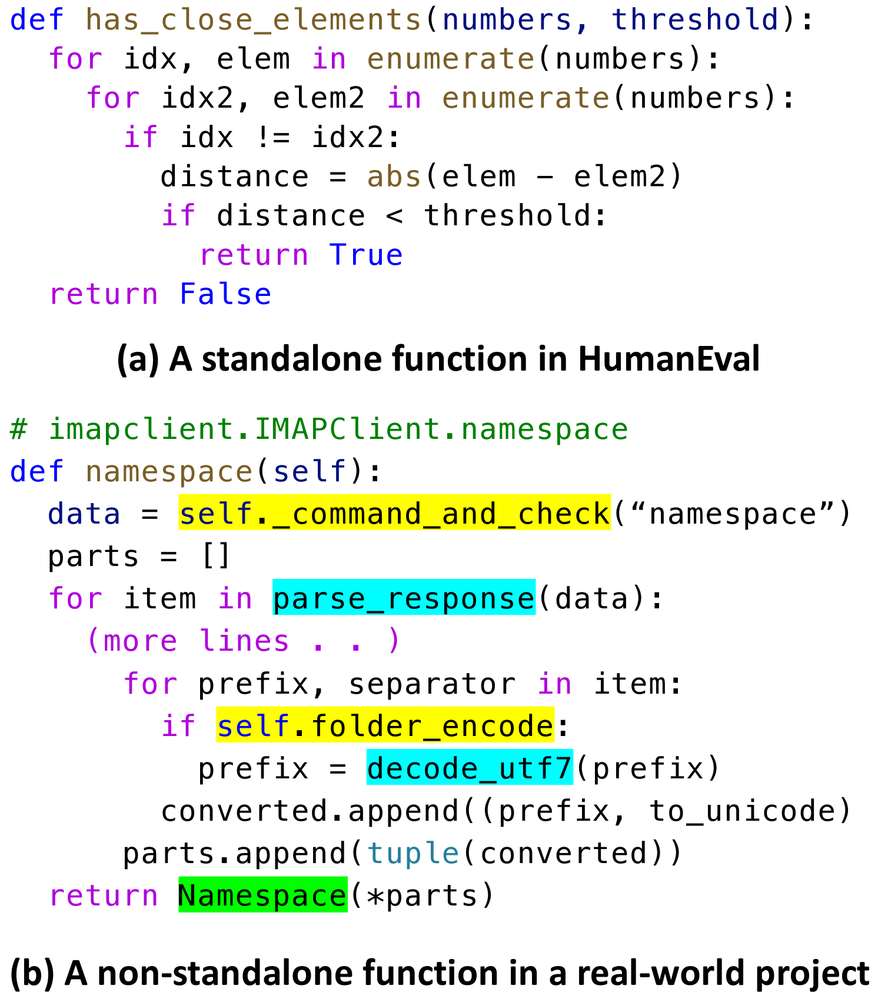
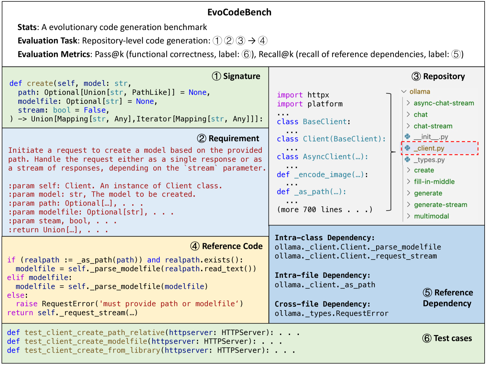
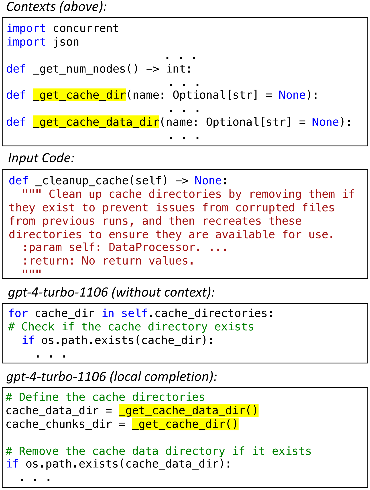
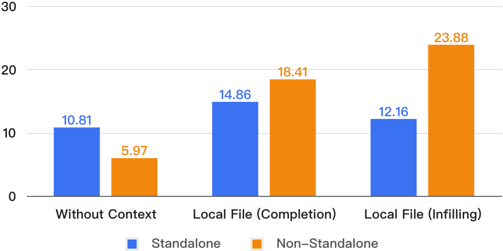
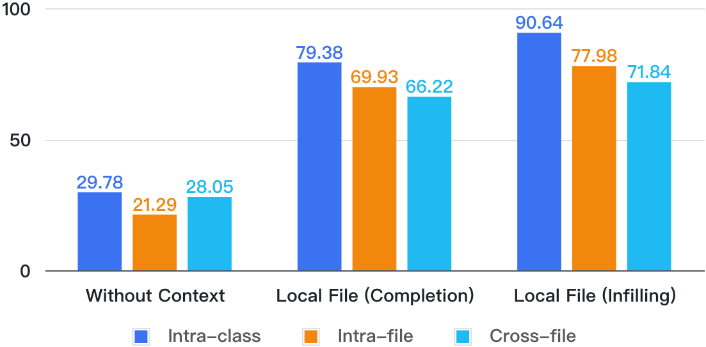
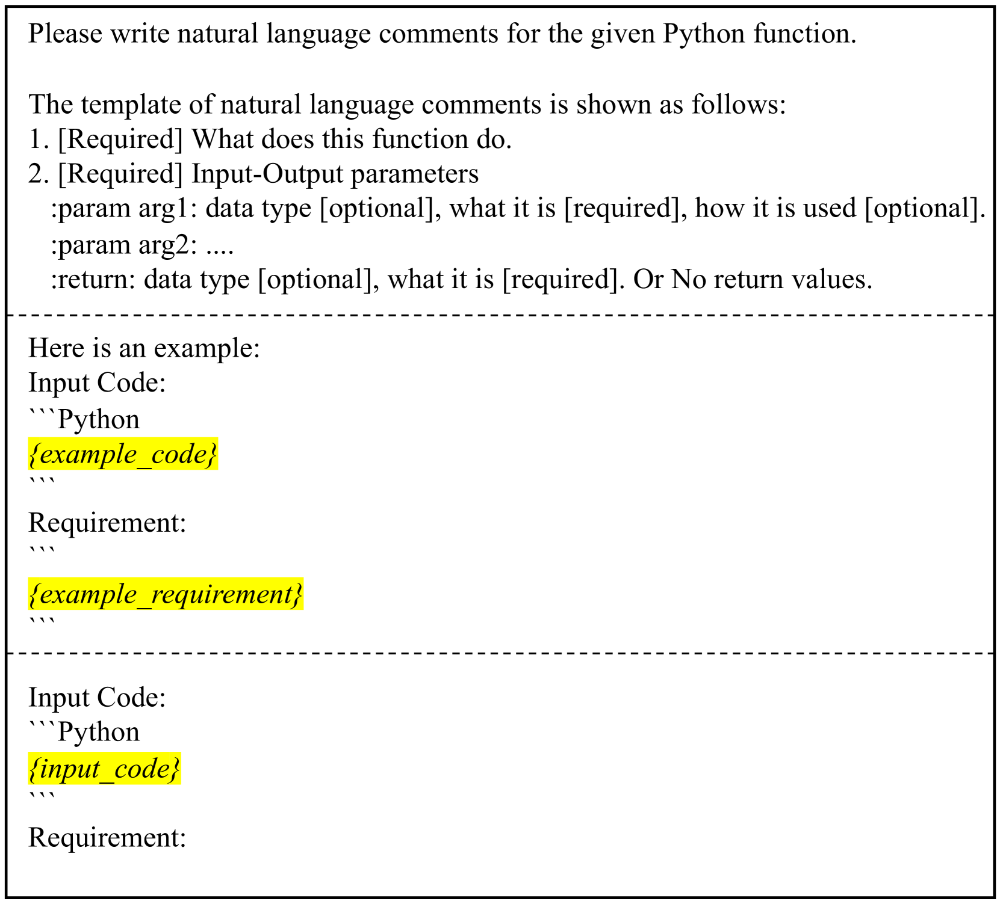
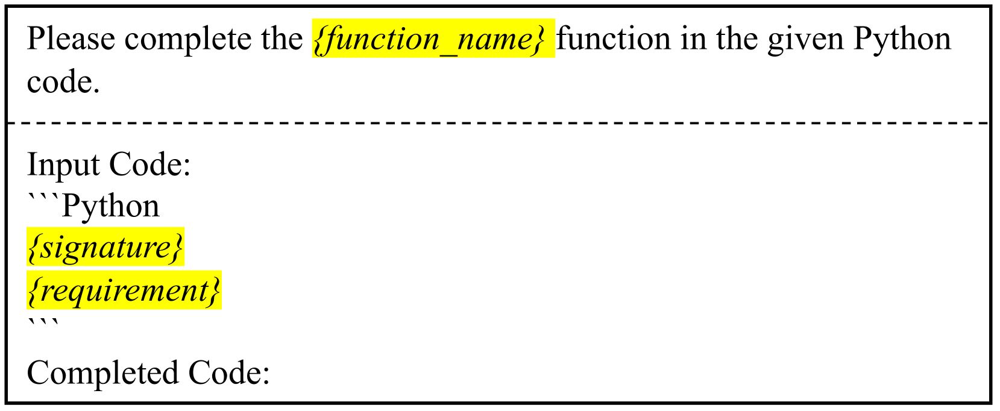
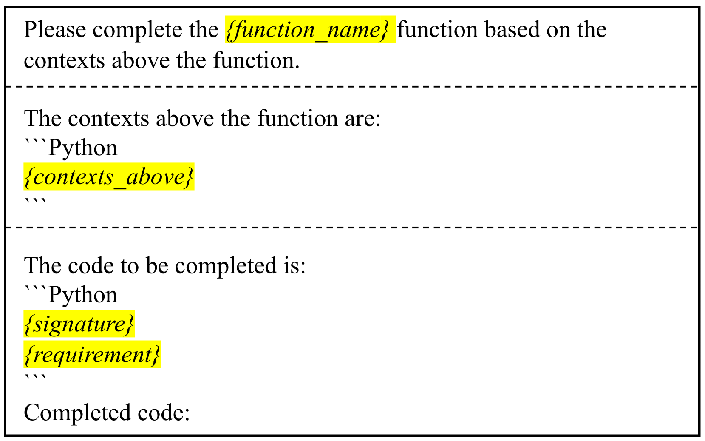
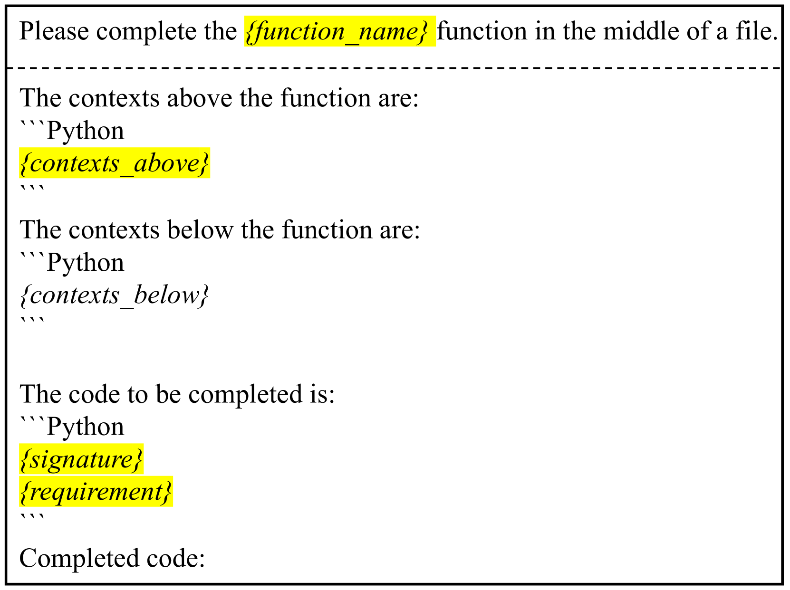
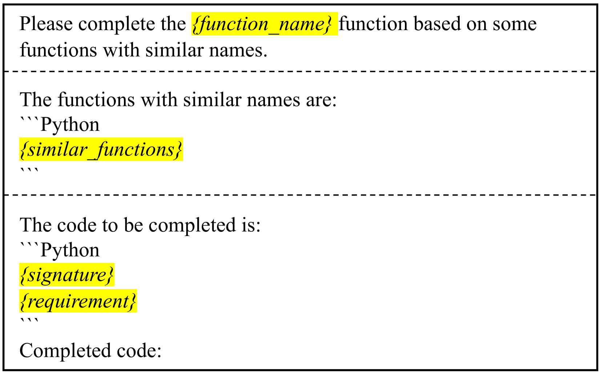

# EvoCodeBench：一款与时俱进、与真实代码库同步的代码生成基准测试工具。

发布时间：2024年03月31日

`LLM应用` `代码生成` `软件工程`

> EvoCodeBench: An Evolving Code Generation Benchmark Aligned with Real-World Code Repositories

# 摘要

> 如何准确评估大型语言模型（LLMs）在代码生成任务上的表现，至今仍是个难题。目前的标准测试与实际代码库的契合度不高，也难以充分评估LLMs的编程技能。为此，我们提出了一项新的基准测试——EvoCodeBench，它在三个方面取得了突破：首先，EvoCodeBench在多个层面与真实代码库保持同步，如代码和依赖项的分布；其次，它提供了详尽的注释（如需求说明、参考代码和依赖关系）以及健全的评估指标（如Pass@k和Recall@k）；第三，EvoCodeBench是一个动态发展的基准，防止数据泄露问题。我们构建了自动更新系统，确保EvoCodeBench能及时反映最新代码库的变化。首个版本EvoCodeBench-2403已发布，包含25个真实代码库的275个样本。在此基础上，我们进行了仓库级别的代码生成实验，并评估了10种主流LLMs（如gpt-4、gpt-3.5等）。实验结果显示，这些模型在实际代码库中的表现参差不齐，以gpt-4为例，其最高Pass@1得分仅为20.73%。我们还对失败案例进行了分析，指出了现有LLMs在EvoCodeBench中的不足。为了促进社区的进一步研究，我们公开了EvoCodeBench、所有的提示以及LLMs的完成结果。

> How to evaluate Large Language Models (LLMs) in code generation is an open question. Existing benchmarks demonstrate poor alignment with real-world code repositories and are insufficient to evaluate the coding abilities of LLMs. This paper proposes a new benchmark - EvoCodeBench to address the preceding problems, which has three primary advances. (1) EvoCodeBench aligns with real-world repositories in multiple dimensions, e.g., code distributions and dependency distributions. (2) EvoCodeBench offers comprehensive annotations (e.g., requirements, reference code, and reference dependencies), and robust evaluation metrics (e.g., Pass@k and Recall@k). (3) EvoCodeBench is an evolving benchmark to avoid data leakage. We build an automatic pipeline to update EvoCodeBench from the latest repositories. We release the first version - EvoCodeBench-2403, containing 275 samples from 25 real-world repositories. Based on EvoCodeBench, we propose repository-level code generation and evaluate 10 popular LLMs (e.g., gpt-4, gpt-3.5, DeepSeek Coder, StarCoder 2, CodeLLaMa, Gemma, and Qwen 1.5). Our experiments reveal the coding abilities of these LLMs in real-world repositories. For example, the highest Pass@1 of gpt-4 only is 20.73% in our experiments. We also analyze failed cases and summarize the shortcomings of existing LLMs in EvoCodeBench. We release EvoCodeBench, all prompts, and LLMs' completions for further community analysis.

[Arxiv](https://arxiv.org/abs/2404.00599)