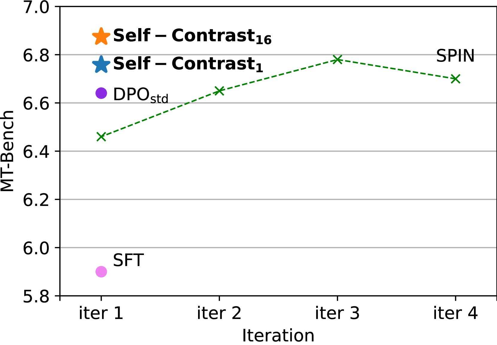
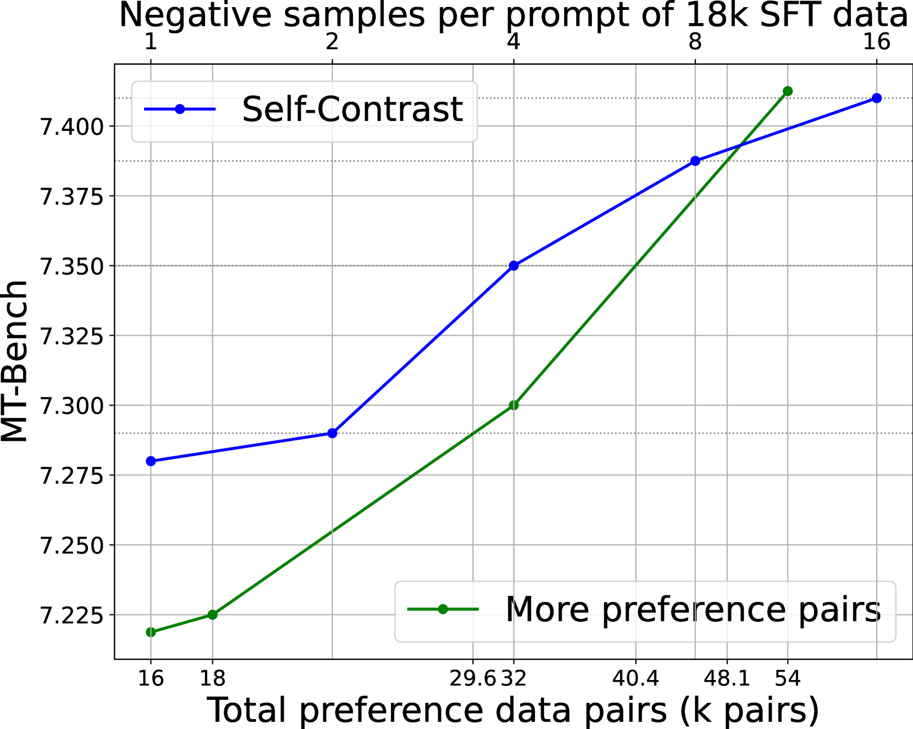
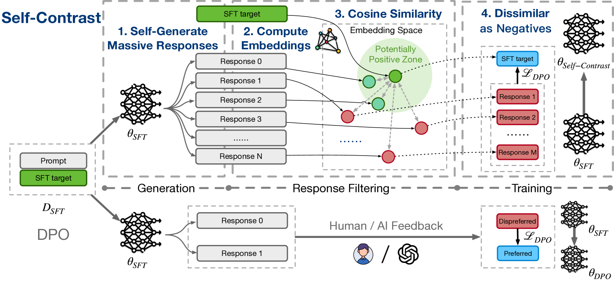
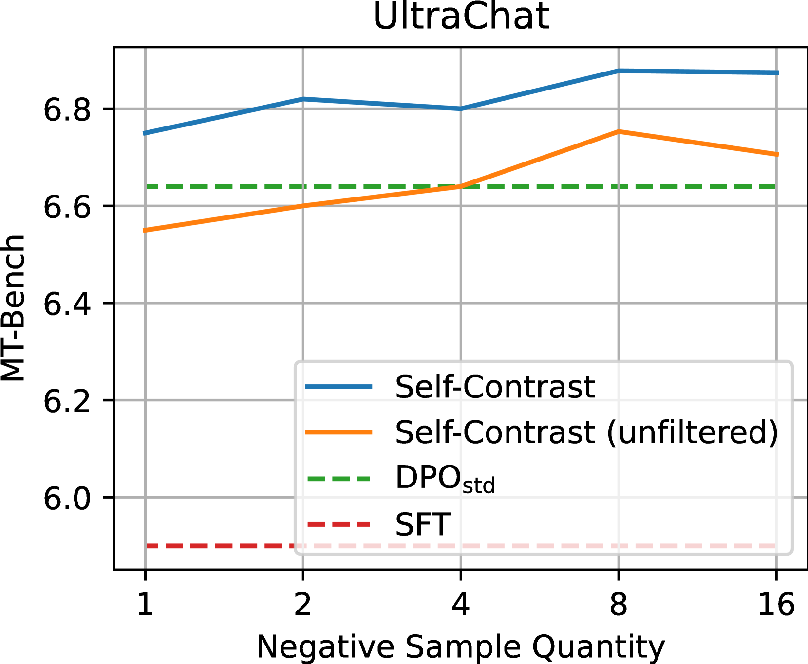
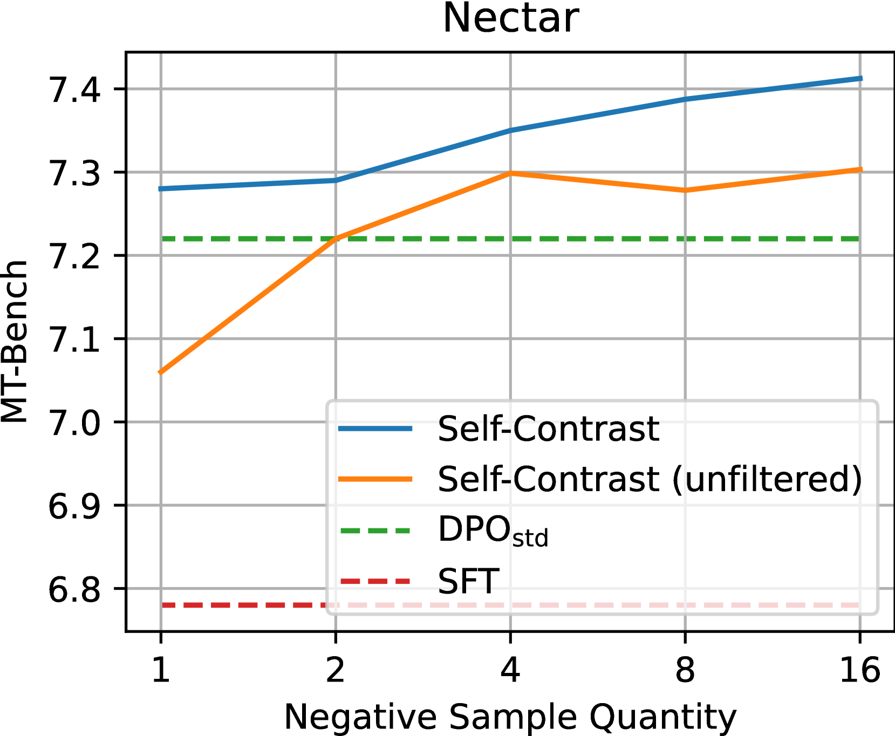
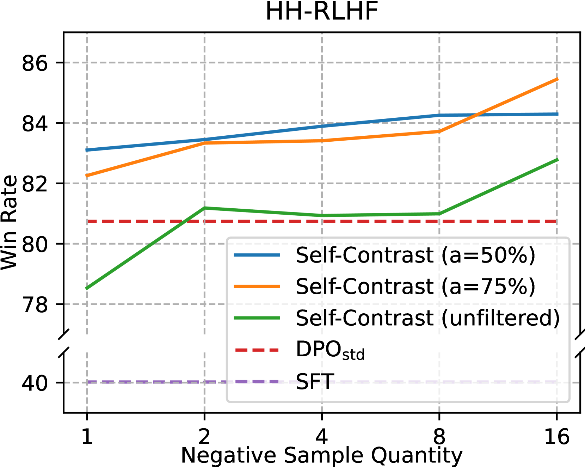
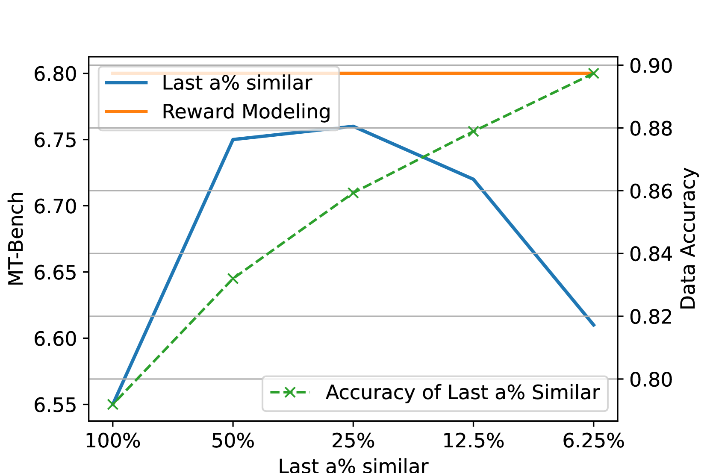
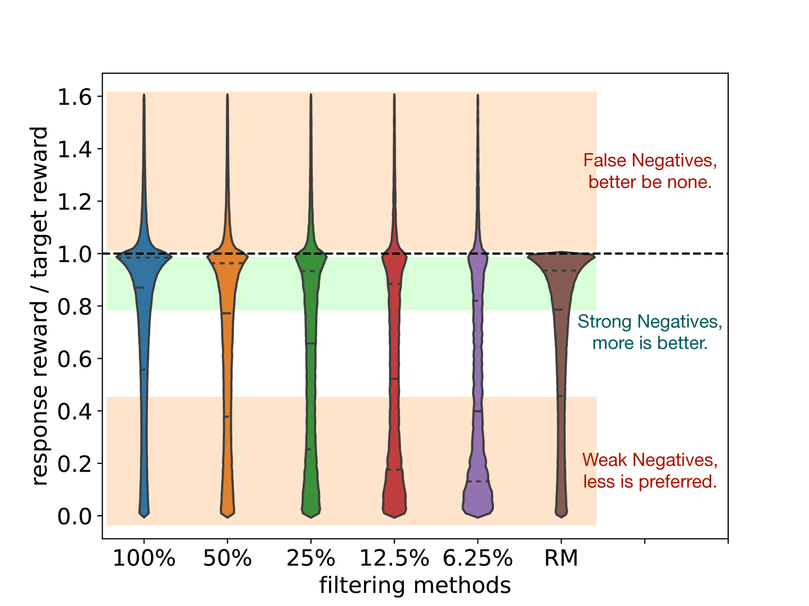
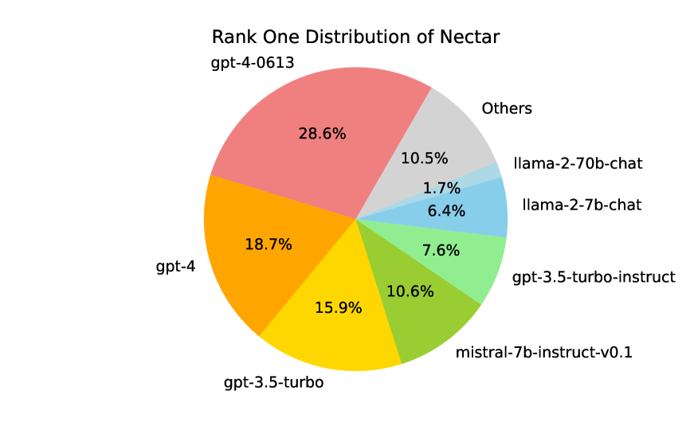

# 通过广泛的自对比学习，我们可以在不依赖反馈的情况下实现语言模型的精准对齐。

发布时间：2024年03月31日

`LLM应用` `人工智能`

> Extensive Self-Contrast Enables Feedback-Free Language Model Alignment

# 摘要

> 在大型语言模型（LLM）对齐领域，人类反馈强化学习（RLHF）一直是核心技巧。但其对昂贵的人类反馈或LLM评判者偏好的过度依赖，可能限制了其广泛应用。本研究提出了Self-Contrast方法，这是一种无需外部反馈，通过大量自产负面样本实现LLM对齐的新技术。仅依靠监督微调（SFT）目标，Self-Contrast便能借助LLM生成众多多样化候选，并运用预训练嵌入模型，根据文本相似度筛选出多个负面样本。理论上，我们证明了即便只有负面样本的增加，也能有效地模拟出平衡的正负偏好标注场景。通过在三个数据集上实施直接偏好优化（DPO），实验结果显示Self-Contrast在性能上始终显著超越SFT和传统DPO训练。随着自产负面样本数量的上升，Self-Contrast的性能也持续提升。相关代码和数据已在https://github.com/THUDM/Self-Contrast上公开。

> Reinforcement learning from human feedback (RLHF) has been a central technique for recent large language model (LLM) alignment. However, its heavy dependence on costly human or LLM-as-Judge preference feedback could stymie its wider applications. In this work, we introduce Self-Contrast, a feedback-free large language model alignment method via exploiting extensive self-generated negatives. With only supervised fine-tuning (SFT) targets, Self-Contrast leverages the LLM itself to generate massive diverse candidates, and harnesses a pre-trained embedding model to filter multiple negatives according to text similarity. Theoretically, we illustrate that in this setting, merely scaling negative responses can still effectively approximate situations with more balanced positive and negative preference annotations. Our experiments with direct preference optimization (DPO) on three datasets show that, Self-Contrast could consistently outperform SFT and standard DPO training by large margins. And as the number of self-generated negatives increases, the performance of Self-Contrast continues to grow. Code and data are available at https://github.com/THUDM/Self-Contrast.

[Arxiv](https://arxiv.org/abs/2404.00604)