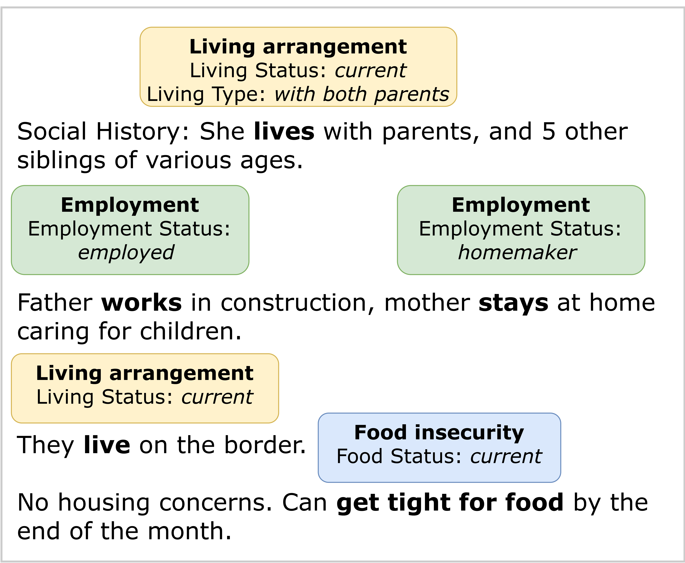
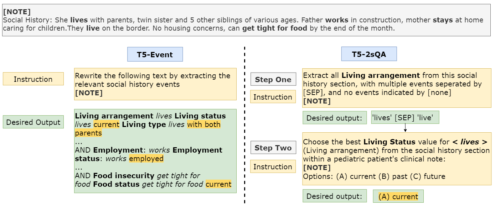

# 借助大型语言模型，本文提出了一种新颖的语料库和方法，用以从儿科病历中挖掘健康社会决定因素。

发布时间：2024年03月31日

`LLM应用` `儿童健康` `电子健康记录`

> Extracting Social Determinants of Health from Pediatric Patient Notes Using Large Language Models: Novel Corpus and Methods

# 摘要

> 社会健康决定因素（SDOH）对塑造儿童群体的健康成果至关重要，因为早期干预可能带来深远的影响。我们通过电子健康记录（EHR）这一数据宝库，深入研究了SDOH。本研究推出了儿童社会历史注释语料库（PedSHAC），这是一个新颖的注释语料库，我们利用大型语言模型（LLMs）的微调和上下文学习方法，自动提取详尽的SDOH信息。该语料库整合了来自华盛顿大学医院系统儿科患者的1260份临床笔记中的社会历史部分。通过基于事件的精细注释，PedSHAC覆盖了生活稳定、经济状况、过往创伤、教育获取、物质滥用史和心理健康等十项关键健康决定因素，注释者间一致性达到81.9 F1分数。我们设计的微调LLM提取器在事件参数提取上取得了78.4 F1的优异成绩。GPT-4的上下文学习方法在样本有限的情况下，展现了可靠提取SDOH的潜力，事件触发器的提取准确率达到了82.3 F1。

> Social determinants of health (SDoH) play a critical role in shaping health outcomes, particularly in pediatric populations where interventions can have long-term implications. SDoH are frequently studied in the Electronic Health Record (EHR), which provides a rich repository for diverse patient data. In this work, we present a novel annotated corpus, the Pediatric Social History Annotation Corpus (PedSHAC), and evaluate the automatic extraction of detailed SDoH representations using fine-tuned and in-context learning methods with Large Language Models (LLMs). PedSHAC comprises annotated social history sections from 1,260 clinical notes obtained from pediatric patients within the University of Washington (UW) hospital system. Employing an event-based annotation scheme, PedSHAC captures ten distinct health determinants to encompass living and economic stability, prior trauma, education access, substance use history, and mental health with an overall annotator agreement of 81.9 F1. Our proposed fine-tuning LLM-based extractors achieve high performance at 78.4 F1 for event arguments. In-context learning approaches with GPT-4 demonstrate promise for reliable SDoH extraction with limited annotated examples, with extraction performance at 82.3 F1 for event triggers.

[Arxiv](https://arxiv.org/abs/2404.00826)