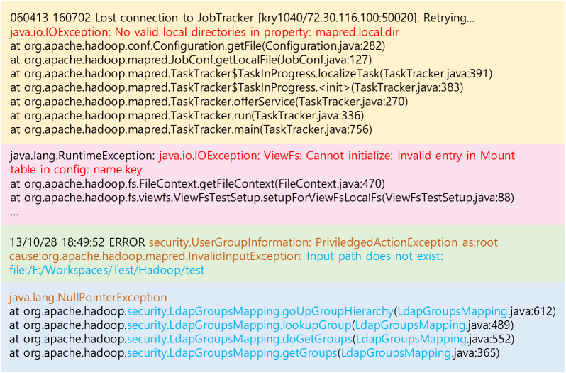
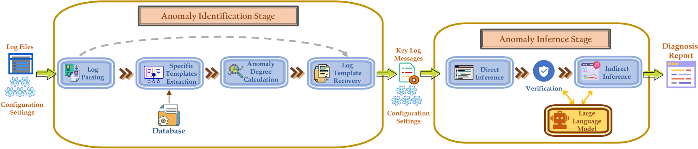
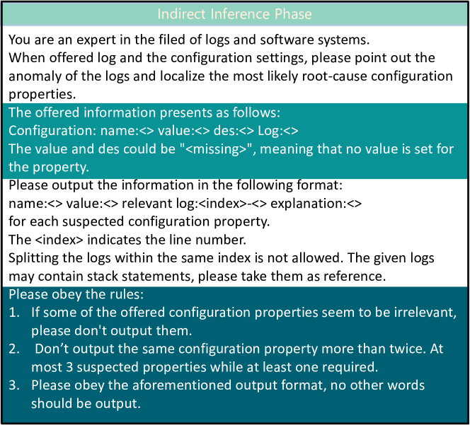
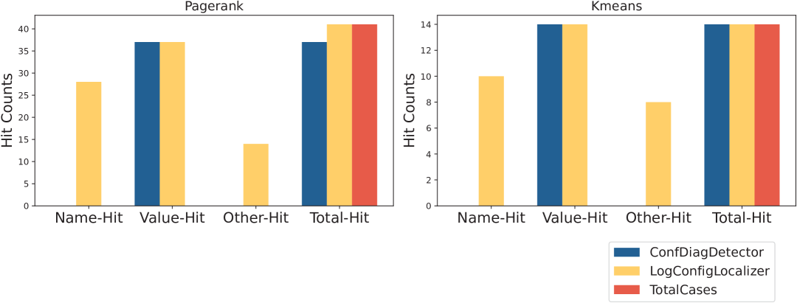
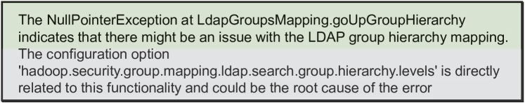

# 直面问题：利用大型语言模型实施的分两步策略，通过日志来精确识别配置错误。

发布时间：2024年03月31日

`RAG` `软件维护` `日志分析`

> Face It Yourselves: An LLM-Based Two-Stage Strategy to Localize Configuration Errors via Logs

# 摘要

> 配置错误的定位一直是软件系统维护中的难题，尤其是对于那些无法接触源代码的用户。我们的初步研究发现，日志分析为这一问题提供了新的解决思路。因此，我们提出了一种结合大型语言模型和日志的两阶段定位策略，开发了LogConfigLocalizer工具，旨在帮助用户精准识别配置错误的根本原因。在Hadoop环境下的测试中，我们的策略展现出高达99.91%的平均准确率，并通过与其他方法的对比，证明了其有效性和必要性。通过实际案例分析，我们进一步证实了这一方法的实用性和可行性。

> Configurable software systems are prone to configuration errors, resulting in significant losses to companies. However, diagnosing these errors is challenging due to the vast and complex configuration space. These errors pose significant challenges for both experienced maintainers and new end-users, particularly those without access to the source code of the software systems. Given that logs are easily accessible to most end-users, we conduct a preliminary study to outline the challenges and opportunities of utilizing logs in localizing configuration errors. Based on the insights gained from the preliminary study, we propose an LLM-based two-stage strategy for end-users to localize the root-cause configuration properties based on logs. We further implement a tool, LogConfigLocalizer, aligned with the design of the aforementioned strategy, hoping to assist end-users in coping with configuration errors through log analysis.
  To the best of our knowledge, this is the first work to localize the root-cause configuration properties for end-users based on Large Language Models~(LLMs) and logs. We evaluate the proposed strategy on Hadoop by LogConfigLocalizer and prove its efficiency with an average accuracy as high as 99.91%. Additionally, we also demonstrate the effectiveness and necessity of different phases of the methodology by comparing it with two other variants and a baseline tool. Moreover, we validate the proposed methodology through a practical case study to demonstrate its effectiveness and feasibility.

[Arxiv](https://arxiv.org/abs/2404.00640)